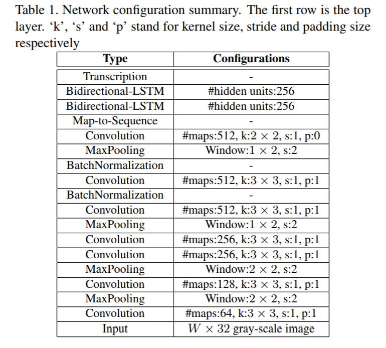
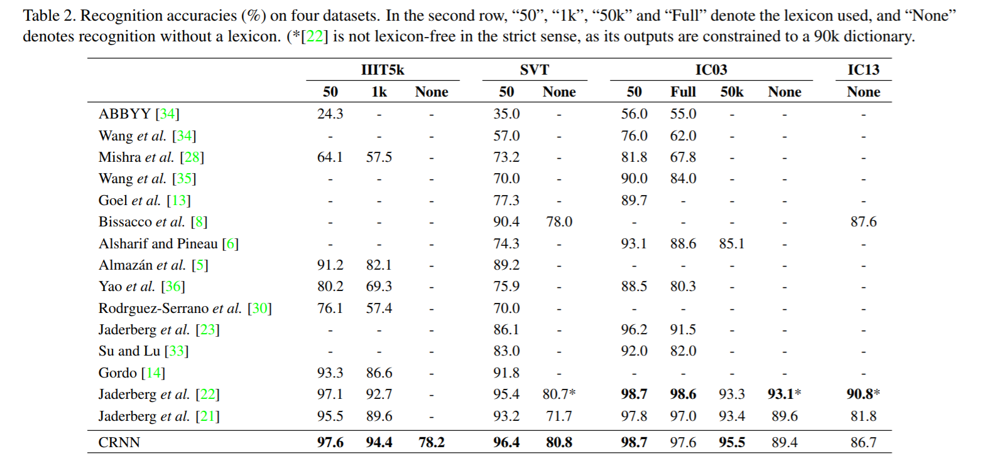
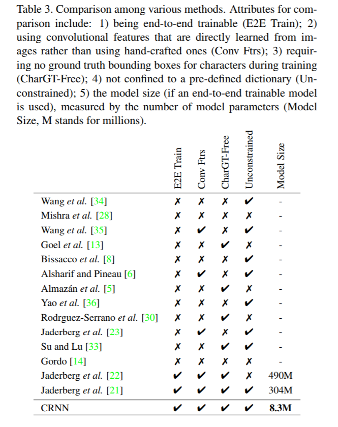
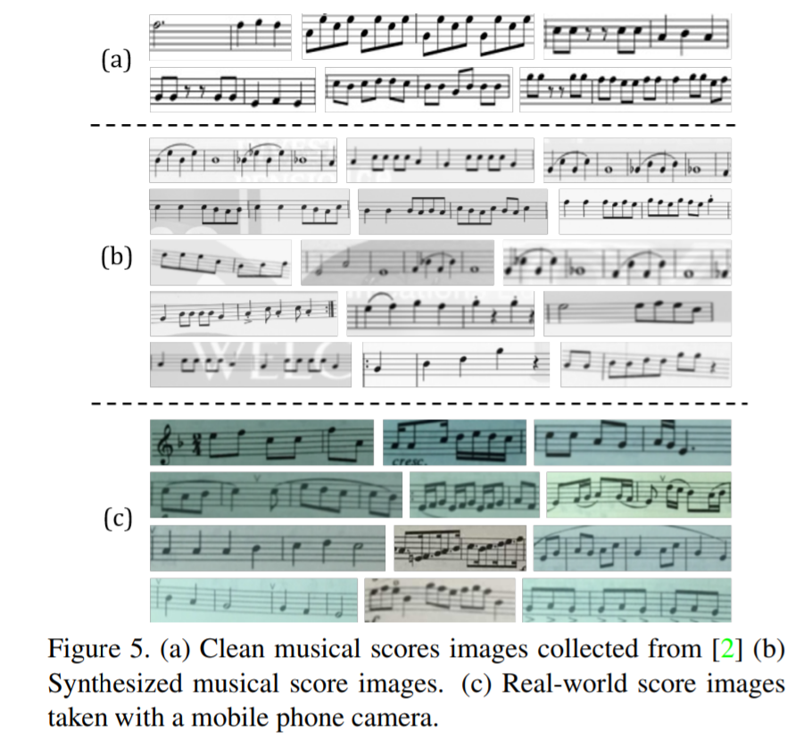

# An End-to-End Trainable Neural Network for Image-based Sequence Recognition and Its Application to Scene Text Recognition

[TOC]

## 摘要

​        **基于图像的序列识别**一直是计算机视觉中长期存在的研究课题。在本文中，我们研究了**场景文本识别**的问题，这是基于图像的序列识别中**最重要和最具挑战性**的任务之一。提出了一种整合 **特征提取，序列建模和转录**到**统一框架**中的新型神经网络架构。与以前的场景文本识别系统相比，所提出的架构具有四个不同的特性：(1)它是**端到端训练**的，与大多数现有算法相比，**它们的组件需要单独训练和调整**。(2)它**自然地处理任意长度的序列**，不涉及字符分割或水平尺度归一化。(3)它**不限于任何预定义的词典**，并且在**无词典**和**基于词典**的**场景文本识别任务**中都取得了**显著的表现**。(4)它产生了一个**有效且更小的模型**，这对于现实世界的应用场景更为实用。在包括IIIT-5K，Street View Text和ICDAR数据集在内的标准基准数据集上的实验，证明了提出的算法比现有技术的更有优势。此外，提出的算法在基于图像的**乐谱识别**任务中表现良好，这显然证实了它的**通用性**。

论文地址：https://arxiv.org/pdf/1507.05717.pdf

## 1. 引言

​        最近，社区已经看到神经网络的强大复兴，这主要受到深度神经网络模型，特别是**深度卷积神经网络(DCNN)**在各种视觉任务中的巨大成功的推动。然而，最近大多数与深度神经网络相关的工作主要致力于**检测或分类**对象类别[12,25]。在本文中，我们关注计算机视觉中的一个经典问题：**基于图像的序列识别**。在现实世界中，固有的视觉对象，如**场景文字**，**手写字符**和**乐谱**，往往**以序列的形式出现**，而不是孤立地出现。与一般的对象识别不同，识别这样的类序列对象通常需要系统预测一系列对象标签，而不是单个标签。因此，可以自然地将这样的对象的识别作为序列识别问题。**类序列(sequence-like)**对象的另一个特性在于它们的**长度可能会有很大变化**。例如，英文单词可以由2个字符组成，如“OK”，或由15个字符组成，如“congratulations”。因此，最流行的深度模型像DCNN[25,26]不能直接应用于序列预测，因为DCNN模型通常对**固定维度的输入和输出**进行操作，因此**不能产生可变长度**的**标签序列**。

​         已经有一些尝试，来解决针对**特定的** **类序列的对象**(例如场景文本)的问题。例如，[35,8]中的算法**首先检测单个字符**，然后**用DCNN模型识别**这些检测到的字符，并使用**标注字符的图像**进行训练。这些方法通常**需要训练强字符检测器**，以便从原始单词图像中**准确地检测和裁剪每个字符**。一些其他方法(如[22])将场景文本识别视为**图像分类问题**，并为每**个英文单词**(总共9万个词)**分配一个类标签**。结果是一个大的训练模型中有很多类，这**很难泛化**到其它类型的类序列对象，如中文文本，乐谱等，因为这种序列的**基本组合数目可能大于100万**。总之，目前**基于DCNN的系统** **不能直接**用于**基于图像的序列识别**。

​        **循环神经网络(RNN)**模型是深度神经网络家族中的另一个重要分支，主要是设计来处理序列。RNN的优点之一是在训练和测试中**不需要序列目标图像**中**每个元素的位置**。然而，将输入**目标图像**转换成**图像特征序列**的**预处理步骤**通常是必需的。例如，Graves et al.[16]从手写文本中提取一系列几何或图像特征，而Su和Lu[33]将字符图像转换为**连续的HOG特征**。**预处理步骤独立**于流程中的**后续组件**，因此基于RNN的现有系统**不能以端到端**的方式进行**训练和优化**。

​        一些不是基于神经网络的**传统场景文本识别**方法也为这一领域带来了有**见地的想法**和**新颖的表现形式**。例如，Almaza`n et al[5]和Rodriguez-Serrano et al[30]提出将**单词图像**和**文本字符串** **嵌入到公共向量子空间中**，并将词识别转换为检索问题。Yao et al[36]和Gordo et al[14]使用**中间层特征**进行场景文本识别。虽然在**标准的基线上**取得了可观的性能，但是前面的**基于神经网络的算法**[8,22]以及**本文提出的方法**通常都**优于这些方法**。

​        本文的主要贡献是一种新颖的神经网络模型，其网络架构设计**专门用于识别**图像中的**类序(suquece-like)列对象**。所提出的神经网络模型被称为**卷积循环神经网络(CRNN)**，因为它是DCNN和RNN的组合。对于类序列对象，CRNN与传统神经网络模型相比具有一些独特的优势：1)可以**直接从序列标签(例如单词)学习**，**不需要详细的标注(例如字符)**；2)与DCNN相同的特性，可以**直接**从图像数据**学习信息表示**，**既不需要手工特征** **也不需要预处理步骤**，包括二值化/分割，组件定位等；3)具有与RNN相同的特性，能够**产生标签序列**；4)对**类序列对象的长度无约束**，**只需要**在训练阶段和测试阶段对**高度进行归一化**；5)与现有技术[23,8]相比，它在**场景文本(词识别)**上获得更好或**更具竞争力的表现**。6)它比标准DCNN模型包含的**参数要少得多**，**占用更少的存储空间**。

## 2. 提出的网络架构

​        如图Firgure 1所示，CRNN的网络架构由三部分组成，从底向上包括卷积层，循环层和转录层。

​         在CRNN的底部，卷积层自动从每个输入图像中**提取特征序列**。在卷积网络之上，构建了一个**循环网络**，用于对卷积层输出的特征序列的**每一帧进行预测**。CRNN顶部的**转录层**将循环层的**每帧的预测**转化为**标签序列**。虽然CRNN由不同类型的网络架构(如CNN和RNN)组成，但可以**通过一个损失函数**进行**联合训练**。

### 2.1. 特征序列提取

​        在CRNN模型中，**卷积层组件**，通过采用标准CNN模型(去除全连接层)中的**卷积层**和**最大池化层**来**构造**。这样的组件用于从输入图像中**提取序列特征表示**。在进入网络之前，所有的图像需要**缩放到相同的高度**。然后从卷积层组件产生的特征图中 提取**特征向量序列**，这些特征向量序列作为**循环层的输入**。具体地，特征序列的每一个特征向量在**特征图**上**按列从左到右生成**。这意味着**第i个特征向量**是**所有特征图(所有通道)第i列的连结**。在我们的设置中**每列的宽度**固定为**单个像素**。

​       由于卷积层，最大池化层和逐元素的激活函数在**局部区域上执行**，因此它们是**平移不变的**。因此，**特征图的每列** 与**原始图像的一个矩形区域**(称为感受野)相关联，并且从左到右，这些**矩形区域**与关联的**特征图上的列**有**相同的顺序**。如图2所示，特征序列中的**每个向量关联一个感受野**，并且可以被认为是**该区域**的**图像描述符**。

​        由于鲁棒性、可提取丰富的特征能力、可训练，**深度卷积特征**在不同的视觉任务中[25,12]**被广泛采用**。一些之前的方法采用CNN学习**类序列对象**的**鲁棒表示**，如场景文本[22]；但是，这些方法使用CNN来提取整个图像的整体表示，然后**收集局部深度特征**来识别类序列对象的每个**组成部分**。由于CNN接收固定的输入，因而输入图像需要缩放到固定的尺寸，这对于**类序列对象不适用**，因为它们的**长度变化大**。在CRNN中，我们**将深度特征转为序列表示**，来达到对于类序列对象**长度变化**的**不变性**。

### 2.2. 序列标注

​        一个深度**双向循环神经网络**是构建在卷积层的顶部，作为循环层。**循环层预测**特征序列$x = x_1,...,x_T$中每一帧$x_t$的**标签分布$y_t$**。循环层的**优点**是三重的。首先，RNN具有**很强的捕获序列内上下文信息的能力**。对于**基于图像的序列识别使**用**上下文提示**比**独立处理每个符号** **更稳定且更有帮助**。以场景文本识别为例，**宽字符**可能**需要一些连续的帧**来**完全地描述**(参见图Figure 2)。此外，一些**模糊的字符**在观察其上下文时**更容易区分**，例如，通过**比对字符高度**更容易识别“il”而不是**分别识别**它们中的每一个。其次，RNN可以将**误差反向传播到其输入**，即卷积层，从而允许我们在**统一的网络中联合训练**循环层和卷积层。第三，RNN能够从头到尾对**任意长度的序列进行操作**。

​        传统的RNN单元在其输入和输出层之间具有**自连接的隐藏层**。每次接收到序列中的一帧$x_t$时，它将使用非线性函数来**更新其内部状态$h_t$**，该非线性函数同时接收当前输入$x_t$和过去状态$h_{t−1}$作为其输入：$h_t = g(x_t, h_{t−1})$。那么预测$y_t$是基于$h_t$的。以这种方式，过去的上下文$\lbrace x_{t\prime} \rbrace _{t \prime < t}$被捕获并用于预测。然而，传统的RNN单元有**梯度消失**的问题[7]，这限制了其可以存储的上下文范围，并给训练过程增加了负担。**长短期记忆**[18,11]是一种专门设计用于解决这个问题的RNN单元。LSTM(图Figure 3所示)由**一个存储单元**和**三个门**组成，即**输入门，输出门和遗忘门**。在概念上，存储单元存储过去的上下文，并且**输入门和输出门**允许单元**长时间地存储上下文**。同时，**单元中的存储可以被遗忘门清除**。LSTM的特殊设计允许它捕**获长距离依赖**，这经常发生在基于图像的序列中。

​        LSTM是定向的，它**只使用过去的上下文**。然而，在基于图像的序列中，**两个方向的上下文**是**相互有用且互补的**。因此，我们遵循[17]，将两个LSTM，一个向前和一个向后**组合到一个双向LSTM中**。此外，可以**堆叠多个双向LSTM**，得到如图Figure 3.b所示的**深度双向LSTM**。深层结构允许比浅层抽象**更高层次的抽象**，并且在**语音识别任务**中取得了显著的性能改进[17]。

​        在循环层中，误差在图Figure 3.b所示箭头的相反方向传播，即**通过时间反向传播(BPTT)**。在循环层的底部，传播差异的序列被**连接成图**(maps)，**反转**了**特征图转换为特征序列**的操作，并反馈到卷积层。实际上，我们创建一个称为“**Map-to-Sequence**”的**自定义网络层**，作为**卷积层和循环层之间的桥梁**。

### 2.3. 转录

​        转录是将RNN所做的**逐帧预测转换成标签序列**的过程。数学上，转录是根据每帧预测找到具有**最高概率的标签序列**。在实践中，存在两种转录模式，即**无词典转录**和**基于词典的转录**。**词典是一组标签序列**，预测受拼写检查字典约束。在无词典模式中，预测时没有任何词典。在基于词典的模式中，通过选择具有最高概率的标签序列进行预测。

#### 2.3.1 标签序列的概率

​        我们采用Graves et al[15]提出的**联接时序分类(CTC)**层中定义的条件概率。**标签序列$l$的概率**, 定义在每帧预测$y=y_1,...,y_T$ 的条件上 ，并**忽略$l$中每个标签所在的位置**。因此，当我们使用这种概率的**负对数似然**作为训练网络的**目标函数**时，我们只需要**图像及其相应的标签序列**，**避免了标注单个字符位置的劳动**。

​       条件概率的公式简要描述如下：输入是序列$y = y_1,...,y_T$，其中$T$是序列长度。这里，每个$y_t \in\Re^{|{\cal L}'|}$是在集合${\cal L}' = {\cal L} \cup$上的概率分布，其中${\cal L}$包含了任务中的所有标签(例如，所有英文字符)，以及由`-`表示的“空白”标签。序列到序列的映射函数${\cal B}$定义在序列$\boldsymbol{\pi}\in{\cal L}'^{T}$上，其中$T$是长度。${\cal B}$将$\boldsymbol{\pi}$映射到$\mathbf{l}$上，**首先删除重复的标签**，**然后删除`blank`**。例如，${\cal B}$将“--hh-e-l-ll-oo--”(`-`表示`blank`)映射到“hello”。然后，**条件概率**被定义为由${\cal B}$映射到$\mathbf{l}$上的所有$\boldsymbol{\pi}$的概率之和：
$$
\begin{equation}

p(\mathbf{l}|\mathbf{y})=\sum_{\boldsymbol{\pi}:{\cal B}(\boldsymbol{\pi})=\mathbf{l}}p(\boldsymbol{\pi}|\mathbf{y}),\tag{1}

\end{equation}
$$
$\boldsymbol{\pi}$的概率定义为$p(\boldsymbol{\pi}|\mathbf{y})=\prod_{t=1}^{T}y_{\pi_{t}}^{t}$，$y_{\pi_{t}}^{t}$是时刻$t$时有标签$\pi_{t}$的概率。由于存在**指数级数量的求和项**，直接计算公式 1**在计算上是不可行的**。然而，使用[15]中描述的**前向-后向算法**可以有效计算公式 1。

#### 2.3.2 无字典转录

​        在这种模式下，将具有公式 1中定义的最高概率的序列$\mathbf{l}^{*}$作为预测。由于不存在用于精确找到解的可行方法，我们采用[15]中的策略。序列$\mathbf{l}^{*}$通过$\mathbf{l}^{*}\approx{\cal B}(\arg\max_{\boldsymbol{\pi}}p(\boldsymbol{\pi}|\mathbf{y}))$近似发现，即在**每个时间戳$t$采用最大概率的标签$\pi_{t}$**，并将结果序列映射到$\mathbf{l}^{*}$。

#### 2.3.3 基于词典的转录

​        在基于字典的模式中，每个测试采样与**词典${\cal D}$相关联**。基本上，通过选择词典中具有公式 1中定义的**最高条件概率的序列来识别标签序列**，即$\mathbf{l}^{*}=\arg\max_{\mathbf{l}\in{\cal D}}p(\mathbf{l}|\mathbf{y})$。然而，对于大型词典，例如5万个词的Hunspell拼写检查词典[1]，**对词典进行详尽的搜索是非常耗时的**，即对词典中的所有序列计算公式 1，并选择概率最高的一个。为了解决这个问题，我们观察到，2.3.2中描述的通过**无词典转录预测的标签序列**通常在**编辑距离**度量下**接近于实际结果**。这表示我们可以**将搜索限制在最近邻候选目标${\cal N}_{\delta}(\mathbf{l}')$**，其中$\delta$是最大编辑距离，$\mathbf{l}'$是在无词典模式下从$\mathbf{y}$转录的序列：

$$
\begin{equation}
\mathbf{l}^{*}=\arg\max_{\mathbf{l}\in{\cal N}_{\delta}(\mathbf{l}')}p(\mathbf{l}|\mathbf{y}).\tag{2}
\end{equation}
$$

​        可以使用**BK-树**数据结构[9]有效地找到候选目标${\cal N}_{\delta}(\mathbf{l}')$，这是一种专门适用于**离散度量空间**的**度量树**。BK-树的搜索时间复杂度为$O(\log|{\cal D}|)$，其中$|{\cal D}|$是词典大小。因此，这个方案很容易扩展到非常大的词典。在我们的方法中，一个词典离线构造一个BK-树。然后，我们使用树执行快速在线搜索，通过查找具有小于或等于$\delta$编辑距离来查询序列。

### 2.4. 网络训练

​       ${\cal X}= \lbrace I_i,\mathbf{l}_i \rbrace _i $表示训练集，$I_{i}$是训练图像，$\mathbf{l}_{i}$是真实的标签序列。目标是最小化真实条件概率的负对数似然：
$$
\begin{equation}

{\cal O}=-\sum_{I_{i},\mathbf{l}_{i}\in{\cal X}}\log p(\mathbf{l}_{i}|\mathbf{y}_{i}),\tag{3}

\end{equation}
$$
$\mathbf{y}_{i}$是循环层和卷积层从$I_{i}$生成的序列。目标函数**直接从图像和它的ground truth标签序列**计算代价值。因此，网络可以在**成对的图像和序列上**进行**端到端训练**，去除了在训练图像中手动标记所有单独组件的过程。

​        网络使用随机梯度下降(SGD)进行训练。梯度由反向传播算法计算。特别地，在**转录层**中，如[15]所述，误差使用**前向-后向算法**进行反向传播。在**循环层**中，应用**随时间反向传播(BPTT)**来计算误差。

​        为了优化，我们使用ADADELTA[37]自动计算每维的学习率。与传统的动量[31]方法相比，**ADADELTA不需要手动设置学习率**。更重要的是，我们发现使用ADADELTA的优化收敛速度比动量方法快。

## 3. 实验

​        为了评估提出的CRNN模型的有效性，我们在**场景文本识别**和**乐谱识别**的标准基准数据集上进行了实验，这些都是具有挑战性的视觉任务。数据集和训练测试的设置见3.1小节，场景文本图像中CRNN的详细设置见3.2小节，综合比较的结果在3.3小节报告。为了进一步证明CRNN的泛化性，在3.4小节我们在乐谱识别任务上验证了提出的算法。

### 3.1. 数据集

​       对于场景文本识别的所有实验，我们使用Jaderberg et al[20]发布的合成数据集(Synth)作为训练数据。数据集包含**8百万训练图像**及其对应的**ground truth单词**。这样的图像由**合成文本引擎**生成,是非常现实的。我们的网络在**合成数据**上进行了**一次训练**，并在所有其它**真实世界的测试数据集**上进行了**测试**，而**没有**在其训练数据上进行任何**微调**。**即使CRNN模型是在纯合成文本数据上训练**，但它在标准文本识别基准数据集的**真实图像上工作良好**。

​       有四个流行的基准数据集用于场景文本识别的性能评估，即ICDAR 2003(IC03)，ICDAR 2013(IC13)，IIIT 5k-word(IIIT5k)和Street View Text (SVT)。

**IC03**[27]测试数据集包含251个具有**标记文本边框**的场景图像。遵循王 et al[34]，我们**忽略**包含**非字母数字字符**或**少于三个字符**的图像，并获得**860个裁剪的文本图像**测试集。每张测试**图像**与由Wang et al[34]定义的**50词的词典相关联**。通过组合所有的每张图像词汇构建完整的词典。此外，我们使用由Hunspell拼写检查字典[1]中的单词组成的5万个词的词典。

**IC13**[24]测试数据集继承了IC03中的大部分数据。它包含**1015**个ground truth的裁剪单词图像。

**IIIT5k**[28]包含从互联网收集的**3000张**裁剪的词测试图像。每张图像关联一个50词的词典和一个1000词的词典。

**SVT**[34]测试数据集由从Google街景视图收集的**249张街景**图像组成。从它们中裁剪出了**647张词图像**。每张单词图像都有一个由Wang et al[34]定义的50个词的词典。

### 3.2. 实现细节

​        在实验中我们使用的网络配置总结在表Table 1中。卷积层的架构是基于VGG-VeryDeep的架构[32]。为了使其适用于识别英文文本，对其进行了调整。在第3和第4个最大池化层中，我们采用**1×2**大小的**矩形池化窗口**而不是传统的正方形。这种调整产生**宽度较大的特征图**，因此具有更长的特征序列。例如，包含10个字符的图像通常为大小为**100×32**，可以从其**生成25帧的特征序列**。这个**长度超过了大多数英文单词的长度**。最重要的是，**矩形池窗口**产生**矩形感受野**(如图Figure 2所示)，这**有助于识别**一些具有**窄形状的字符**，例如`i`和`l`。

​       网络不仅有深度**卷积层**，而且还有**循环层**。众所周知**两者都难以训练**。我们发现**批标准化**[19]技术对于训练这种深度网络非常有用。**两个批标准化层**分别在**第5和第6卷积层之后插入**。使用批标准化层训练过程大大加快。

​       我们在Torch7[10]框架内实现了网络，使用定制实现的LSTM单元(Torch7/CUDA)，**转录层(用C++)**和**BK-树数据结构(用C++)**。实验在具有2.50 GHz Intel(R)Xeon E5-2609 CPU，64GB RAM和NVIDIA(R) Tesla(TM) K40 GPU的工作站上进行。网络用**ADADELTA训练**，将**参数ρ设置为0.9**。在**训练期间**，所有**图像都被缩放为100×32**，以加快训练过程。训练过程大约需要50个小时才能达到收敛。**测试图像缩放到高度为32** ，**宽度与高度成比例地缩放**，但**至少为100像素**。在的IC03上，**没有词典**，平均测试时间为**0.16s/样本**，**近似词典搜索**应用于IC03的50k词典，参数δ设置为3。测试每个样本平均花费**0.53s**。

### 3.3. 比较评估

​        提出的CRNN模型以及以及最近的state-of-the-art技术,包括基于深度模型[23,22,21]的方法;在上述四个公共数据集上获得的所有识别精度，如表Table 2所示。

​        在**有约束词典**的情况中，我们的方法始终**优于大多数state-of-the-art的方法**，并且**平均精度**打败了[22]中提出的**最佳文本阅读器**。具体来说，与[22]相比，我们在IIIT5k和SVT上获得了卓越的性能，仅在IC03上通过“Full”词典实现了较低性能。请注意，**[22]中的模型是在特定字典上训练的**，即**每个单词**都**与一个类标签相关联**。与[22]不同，CRNN不限于识别已知字典中的单词，并且能够处理随机字符串(例如电话号码)，句子或其他诸如中文单词的脚本。 因此，CRNN的结果在所有测试数据集上都具有竞争力。

​        在**无约束词典**的情况下，我们的方法**在SVT上仍取得了最佳性能**，但在IC03和IC13上仍然落后于一些方法[8,22]。注意，表Table 2的“none”列中的空白表示这种方法不能应用于没有词典的识别，或者在无约束的情况下不能报告识别精度。我们的方法**只使用**具有**单词级标签**的**合成文本**作为训练数据，与**PhotoOCR**[8]非常不同，后者使用**790万个**具有**字符级标注**的**真实单词图像**进行训练。[22]中报告的最佳性能是在无约束词典的情况下，受益于它的大字典，然而，**它不是**前面提到的**严格的无约束词典模型**。在这个意义上，我们在无限制词典表中的结果仍然是有前途的。

​        为了进一步了解与其它文本识别方法相比，我们所提出算法的优点，我们提供了在一些特性上的综合比较，这些特性名称为E2E Train，Conv Ftrs，CharGT-Free，Unconstrained和Model Size，如表Table 3所示。

**E2E Train**：这一列是为了显示某种文字阅读模型**是否可以进行端到端的训练**，无需任何预处理或经过几个分离的步骤，这表明这种方法对于训练是优雅且干净的。从表Table 3可以看出，只有基于深度神经网络的模型，包括[22,21]以及CRNN具有这种性质。

**Conv Ftrs**：这一列表明一个方法是否使用从训练图像**直接学习到的卷积特征**或**手动特征**作为基本的表示。

**CharGT-Free**：这一列用来表明**字符级标注**对于训练模型**是否是必要的**。由于CRNN的输入和输出标签是序列，因此字符级标注是不必要的。

**Unconstrained**：这一列用来表明训练模型是**否受限于一个特定的字典**，是否**不能处理字典之外的单词或随机序列**。注意尽管最近通过标签嵌入[5, 14]和增强学习[22]学习到的模型取得了非常有竞争力的性能，但它们受限于一个特定的字典。

**Model Size**：这一列报告了学习**模型的存储空间**。在CRNN中，所有的层有权重共享连接，不需要全连接层。因此，CRNN的参数数量远小于CNN变体[22,21]所得到的模型，导致与[22,21]相比，模型要小得多。**我们的模型有830万个参数**，只有**33MB RAM**(每个参数使用4字节单精度浮点数)，因此可以轻松地移植到移动设备上。

​       表Table 3详细列出了不同方法之间的差异，**充分展示了CRNN**与其它竞争方法的**优势**。

​       另外，为了测试参数$\delta$的影响，我们在公式 2中**实验了$\delta$的不同值**。在图Figure 4中，我们将识别精度绘制为$\delta$的函数。**更大的$\delta$导致更多的候选目标**，从而**基于词典的转录更准确**。另一方面，由于更长的BK-树搜索时间，以及更大数量的候选序列用于测试，**计算成本随着$\delta$的增大而增加**。实际上，我们**选择$\delta=3$**作为精度和速度之间的折衷。

### 3.4. 乐谱识别

​        **乐谱**通常由排列在五线谱上的**音符序列**组成。识别图像中的乐谱被称为**光学音乐识别(OMR)**问题。以前的方法通常需要**图像预处理**(主要是二值化)，**五线谱检测**和**单个音符识别**[29]。我们将OMR作为序列识别问题，直接用CRNN从图像中预测音符的序列。为了简单起见，我们**仅识别音调**，**忽略所有和弦**，并假定所有乐谱具有相同的大调音阶(C大调)。

​       据我们所知，**没有**用于评估音调识别算法的**公开数据集**。为了准备CRNN所需的训练数据，我们从[2]中**收集了2650张图像**。每个图像中有一个包含3到20个音符的乐谱片段。我们**手动标记**所有图像的ground truth标签序列(不是ezpitches的序列)。收集到的图像通过**旋转，缩放和用噪声损坏** 增强到了**265k**个训练样本，并**用自然图像替换它们的背景**。对于测试，我们创建了三个数据集：1)“纯净的”，其中包含从[2]收集的260张图像。实例如图Figure 5.a所示；2)“合成的”，使用“纯净的”创建的，**使用了上述的增强策略**。它包含200个样本，其中一些如图Figure 5.b所示；3)“现实世界”，其中包含用手机相机拍摄的音乐书籍中的200张图像。例子如图Figure 5.c所示。

​        由于我们的**训练数据有限**，因此我们使用**简化的CRNN配置**来减少模型容量。与表Table 1中指定的配置不同，我们**移除了第4和第6卷积层**，**将2层双向LSTM替换为2层单向LSTM**。网络在**图像**和**对应的标签序列** 的**对(pairs)**上进行训练。使用两种方法来评估识别性能：1)**片段准确度**，即正确识别的乐谱片段的百分比；2)**平均编辑距离**，即**预测音调序列**与**ground truths**之间的**平均编辑距离**。为了比较，我们评估了**两种商用OMR引擎**，即Capella Scan[3]和PhotoScore[4]。

​        表Table 4总结了结果。**CRNN大大优于两个商业系统**。Capella Scan和PhotoScore系统在**干净的数据集上表现相当不错**，但是它们的性能在**合成和现实世界数据**方面**性能显著下降**。主要原因是它们**依赖**于强大的**二值化来检五线谱**和**音符**，但是由于**光照条件**，**噪音破坏**和**杂乱的背景**，二值化步骤经常会在合成数据和现实数据上失败。另一方面，CRNN使用的**卷积特征**对噪声和扭曲具有**鲁棒性**。此外，CRNN中的**循环层可以利用乐谱中的上下文信息**。每个音符不仅自身被识别，而且被附近的音符识别。因此，通过将一些音符**与附近的音符进行比较** **可以识别它们**，例如:对比他们的垂直位置。

​        结果显示了**CRNN的泛化能力**，因为它可以很容易地应用于其它的基于图像的序列识别问题，需要极少的领域知识。与Capella Scan和PhotoScore相比，我们的基于CRNN的系统仍然是初步的，并且缺少许多功能。但它为OMR提供了一个新的方案，并且在音高识别方面表现出有前途的能力。

## 4. 总结

​        在本文中，我们提出了一种新颖的神经网络架构，称为**卷积循环神经网络(CRNN)**，其集成了卷积神经网络(CNN)和循环神经网络(RNN)的优点。CRNN能够获取**不同尺寸的输入图像**，并**产生不同长度的预测**。它直接在**粗粒度的标签**(例如单词)上运行，在训练阶段**不需要详细标注每一个单独的元素**(例如字符)。此外，由于CRNN**放弃了**传统神经网络中使用的**全连接层**，因此得到了**更加紧凑和高效的模型**。所有这些属性使得CRNN成为一种基于图像序列识别的极好方法。

​        在**场景文本识别基准数据集上**的实验表明，与传统方法以及其它基于CNN和RNN的算法相比，CRNN实现了优异或极具竞争力的性能。这证实了所提出的算法的优点。此外，CRNN在**光学音乐识别(OMR)**的基准数据集上显著优于其它的竞争者，这验证了**CRNN的泛化能力**。

​        实际上，**CRNN是一个通用框架**，因此可以应用于其它的涉及**图像序列**预测的领域和问题(如汉字识别)。**进一步加快CRNN**，使其在现实应用中更加实用，是未来**值得探索的另一个方向**。

## 致谢

​       这项工作主要是由中国国家自然科学基金(NSFC)支持 (No. 61222308)。

## 引用

[1] http://hunspell.sourceforge.net/. 4, 5
[2] https://musescore.com/sheetmusic. 7, 8
[3] http://www.capella.de/us/index.cfm/products/capella-scan/info-capella-scan/. 8
[4] http://www.sibelius.com/products/photoscore/ultimate.html. 8

[5] J. Almaza ́n, A. Gordo, A. Forne ́s, and E. Valveny. Word spotting and recognition with embedded attributes. PAMI, 36(12):2552–2566, 2014. 2, 6, 7

[6] O. Alsharif and J. Pineau. End-to-end text recognition with hybrid HMM maxout models. ICLR, 2014. 6, 7

[7] Y. Bengio, P. Y. Simard, and P. Frasconi. Learning long-term dependencies with gradient descent is difficult. NN, 5(2):157–166, 1994. 3

[8] A. Bissacco, M. Cummins, Y. Netzer, and H. Neven. Photoocr: Reading text in uncontrolled conditions. In ICCV, 2013. 1, 2, 6, 7

[9] W. A. Burkhard and R. M. Keller. Some approaches to best-match file searching. Commun. ACM, 16(4):230–236, 1973.4

[10] R. Collobert, K. Kavukcuoglu, and C. Farabet. Torch7: A matlab-like environment for machine learning. In BigLearn, NIPS Workshop, 2011. 6

[11] F. A. Gers, N. N. Schraudolph, and J. Schmidhuber. Learning precise timing with LSTM recurrent networks. JMLR, 3:115–143, 2002. 3

[12] R. B. Girshick, J. Donahue, T. Darrell, and J. Malik. Rich feature hierarchies for accurate object detection and semantic segmentation. In CVPR, 2014. 1, 3

[13] V. Goel, A. Mishra, K. Alahari, and C. V. Jawahar. Whole is greater than sum of parts: Recognizing scene text words. In ICDAR, 2013. 6, 7

[14] A. Gordo. Supervised mid-level features for word image representation. In CVPR, 2015. 2, 6, 7

[15] A. Graves, S. Ferna ́ndez, F. J. Gomez, and J. Schmidhuber. Connectionist temporal classification: labelling unseg- mented sequence data with recurrent neural networks. In ICML, 2006. 4, 5

[16] A. Graves, M. Liwicki, S. Fernandez, R. Bertolami, H. Bunke, and J. Schmidhuber. A novel connectionist system for unconstrained handwriting recognition. PAMI, 31(5):855–868, 2009. 2

[17] A. Graves, A. Mohamed, and G. E. Hinton. Speech recognition with deep recurrent neural networks. In ICASSP, 2013. 3

[18] S. Hochreiter and J. Schmidhuber. Long short-term memory. Neural Computation, 9(8):1735–1780, 1997. 3

[19] S. Ioffe and C. Szegedy. Batch normalization: Accelerating deep network training by reducing internal covariate shift. In ICML, 2015. 6

[20] M. Jaderberg, K. Simonyan, A. Vedaldi, and A. Zisserman. Synthetic data and artificial neural networks for natural scene text recognition. NIPS Deep Learning Workshop, 2014. 5

[21] M. Jaderberg, K. Simonyan, A. Vedaldi, and A. Zisserman. Deep structured output learning for unconstrained text recognition. In ICLR, 2015. 6, 7

[22] M. Jaderberg, K. Simonyan, A. Vedaldi, and A. Zisserman. Reading text in the wild with convolutional neural networks. IJCV (Accepted), 2015. 1, 2, 3, 6, 7

[23] M. Jaderberg, A. Vedaldi, and A. Zisserman. Deep features for text spotting. In ECCV, 2014. 2, 6, 7

[24] D. Karatzas, F. Shafait, S. Uchida, M. Iwamura, L. G. i Bigorda, S. R. Mestre, J. Mas, D. F. Mota, J. Almaza ́n, and L. de las Heras. ICDAR 2013 robust reading competition. In ICDAR, 2013. 5

[25] A. Krizhevsky, I. Sutskever, and G. E. Hinton. Imagenet classification with deep convolutional neural networks. In NIPS, 2012. 1, 3

[26] Y. LeCun, L. Bottou, Y. Bengio, and P. Haffner. Gradient-based learning applied to document recognition. Proceedings of the IEEE, 86(11):2278–2324, 1998. 1

[27] S. M. Lucas, A. Panaretos, L. Sosa, A. Tang, S. Wong, R. Young, K. Ashida, H. Nagai, M. Okamoto, H. Yamamoto, H. Miyao, J. Zhu, W. Ou, C. Wolf, J. Jolion, L. Todoran, M. Worring, and X. Lin. ICDAR 2003 robust reading competitions: entries, results, and future directions. IJDAR, 7(2-3):105–122, 2005. 5

[28] A. Mishra, K. Alahari, and C. V. Jawahar. Scene text recognition using higher order language priors. In BMVC, 2012. 5, 6, 7

[29] A. Rebelo, I. Fujinaga, F. Paszkiewicz, A. R. S. Marc ̧al, C. Guedes, and J. S. Cardoso. Optical music recognition: state-of-the-art and open issues. IJMIR, 1(3):173–190, 2012. 7

[30] J. A. Rodr ́ıguez-Serrano, A. Gordo, and F. Perronnin. Label embedding: A frugal baseline for text recognition. IJCV, 113(3):193–207, 2015. 2, 6, 7

[31] D. E. Rumelhart, G. E. Hinton, and R. J. Williams. Neurocomputing: Foundations of research. chapter Learning Representations by Back-propagating Errors, pages 696–699. MIT Press, 1988. 5

[32] K. Simonyan and A. Zisserman. Very deep convolu- tional networks for large-scale image recognition. CoRR, abs/1409.1556, 2014. 5

[33] B. Su and S. Lu. Accurate scene text recognition based on recurrent neural network. In ACCV, 2014. 2, 6, 7

[34] K. Wang, B. Babenko, and S. Belongie. End-to-end scene text recognition. In ICCV, 2011. 5, 6, 7

[35] T. Wang, D. J. Wu, A. Coates, and A. Y. Ng. End-to-end text recognition with convolutional neural networks. In ICPR, 2012. 1, 6, 7

[36] C. Yao, X. Bai, B. Shi, and W. Liu. Strokelets: A learned multi-scale representation for scene text recognition. In CVPR, 2014. 2, 6, 7

[37] M. D. Zeiler. ADADELTA: anadaptive learning rate method. CoRR, abs/1212.5701, 2012. 5

## 疑问点

1：第一节中“One of the advantages of RNN is that it does not need the position of each element in a sequence object image in both training and testing.”？RNN不要元素的位置信息，啥意思？

## 关于我们

我司正招聘文本挖掘、计算机视觉等相关人员，欢迎加入我们；也欢迎与我们在线沟通任何关于数据挖掘理论和应用的问题；

在长沙的朋友也可以线下交流, 坐标: 长沙市高新区麓谷新长海中心 B1栋8A楼09室

公司网址：http://www.embracesource.com/

Email: mick.yi@embracesource.com 或 csuyzt@163.com

