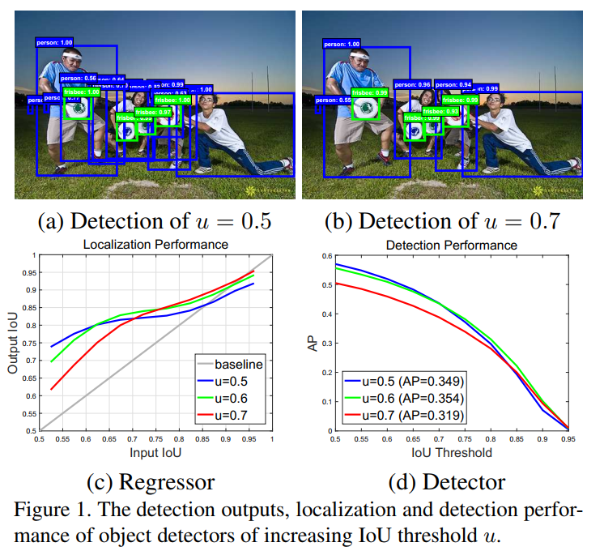
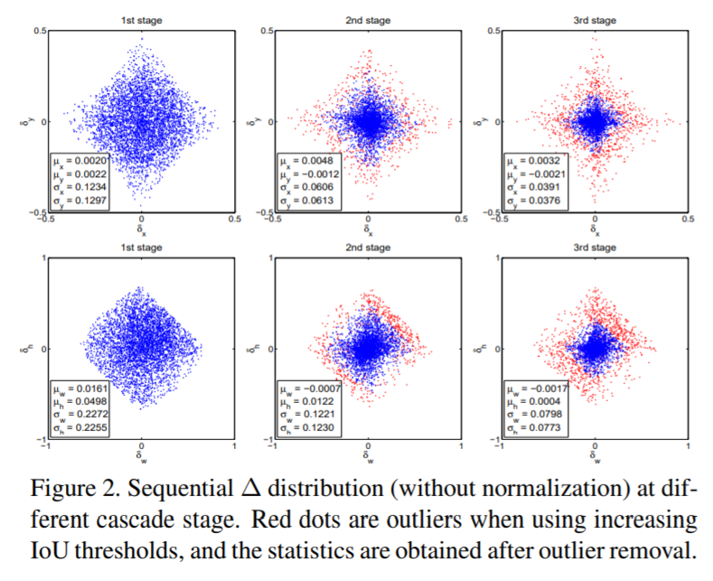
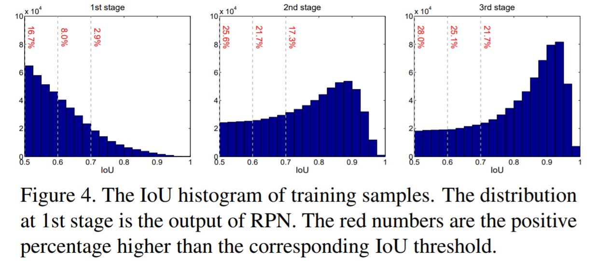
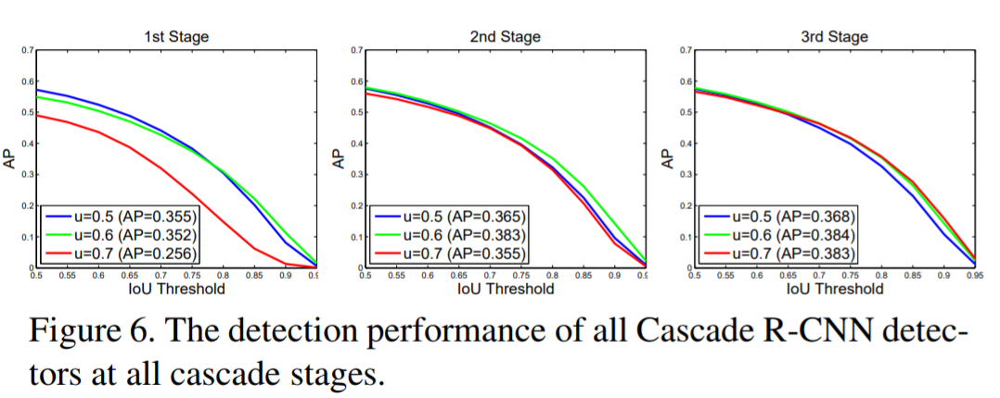
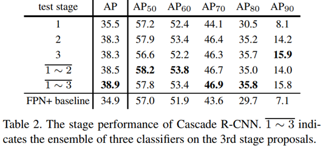
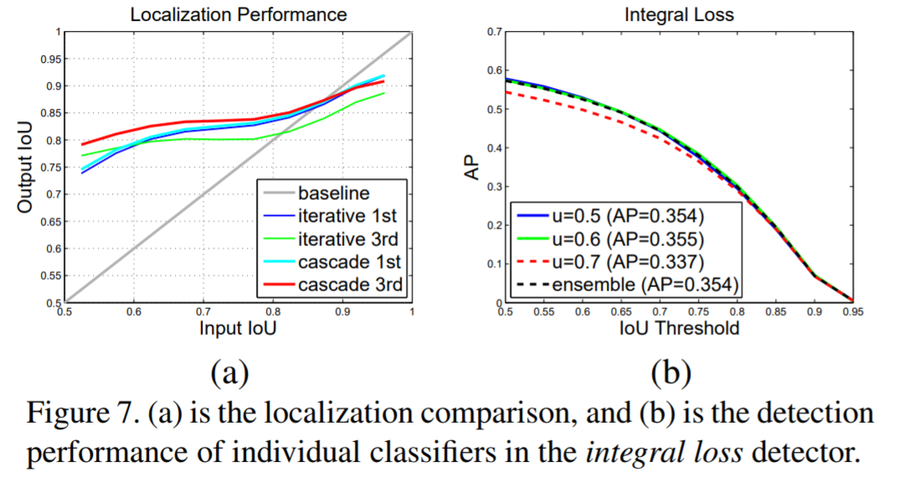
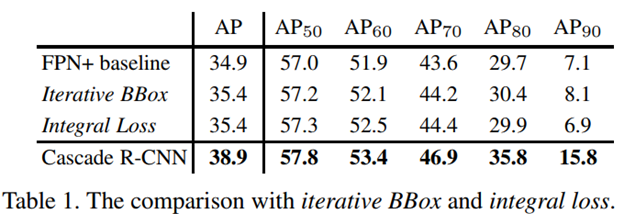

# Cascade R-CNN

[TOC]

概述
----

本文主要针对的是目标检测问题中IoU阈值选择的问题，提出了一种muti-stage的architecture，称之为Cascade，主要思路为：在R-CNN结构系列的train和inference阶段，利用不断提高的IoU阈值，在保证样本数不减少的情况下，用一个stage的输出去训练下一个stage
，每个stage做重采样保证高质量低噪声的数据样本，提高检测器的训练质量。

      IoU阈值*u*设置的对抗性：

1）*u*设置得太高，虽然正样本proposals包含较少的background，但是相应的训练样本的数量也会减少，容易引发过拟合；

2）*u*设置得太低，虽然样本数量有了保证，但是正样本proposals包含更多的background，这部分噪声信息对特征训练有影响，使得false
positives不易区分；

论文地址：<https://arxiv.org/abs/1712.00726>

源码地址：<https://github.com/zhaoweicai/cascade-rcnn>

相关工作
--------

   由于R-CNN的成功，proposal detector 和 region-wise classifier
的two-stage检测网络越来越主流，出现的region-wise feature
extraction,像SPP-NET和Fast-RCNN提高了检测速度，后来提出了RPN的Faster-RCNN则进一步提高了检测速度与精度。最近，在多层feature
layer做detection后进行特征融合也在精度上有了进一步改善，像MS-CNN和FPN等等。同时one-stage的检测网络也有最新的一些进展，像SSD、YOLO等虽然速度上有优势，但是它们的精度一直不如two-stage的主流检测网络，直到Retinanet（focalloss）的出现，才有所改善。所以multi-stage目标检测是一个趋势，这篇文章的muti-stage的architecture-cascade，可以说比目前任何one-stage和two-stage的检测网络在检测精度上都有明显提升（coco数据集上将近5个百分点）。

IoU及阈值关系
-------------

那么如何才能解决proposals的高质量和保证训练样本的数量之间的矛盾呢？作者通过研究proposal的Input
IoU、Output
IoU以及设置的IoU阈值3者之间的关系，给出了相应的答案和思路，如下图所示：

   **Quality：**涉及到proposal quality和detector quality两个方面，proposal
quality就是说proposal与ground
truth的IoU大小（越大quality越高，越小quality越低），detector
quality就是detector设置的IoU阈值大小（越大quality越高，越小quality越低）

   **Match：**当proposal quality和detector
quality比较接近的时候，就是match的情况，如上(d)图，u=0.5的检测器对IoU在0.5\~0.65区段上的proposals检测效果较好，u=0.6的检测器对IoU在0.65\~0.9区段上的proposals检测效果较好，u=0.7对IoU在0.9以上区段上的proposals检测效果较好；

   **Mismatch：**当proposal quality和detector
quality不接近时产生mismatch，如上(d)图，u=0.5的检测器对IoU在0.7以上区段的proposals检测效果就不及u=0.6、0.7，u=0.6的检测器对IoU在0.6以下区段上的proposals检测效果也不及u=0.5；

所以，检测器对那些跟自身quality比较接近的proposals，其正负样本的辨别能力就较强，AP
performance也更好。

1）3个IoU阈值样本线条都在y=x标准线的上方，说明样本proposals经过detector的训练过程之后，Output
IoU是一般都会有提升的，这样一来，我们把训练过程分为多个stages并采用不断提升的IoU阈值，每次重采样不仅不会刷掉太多样本，而且正样本proposals的IoU都会**更高即质量更高**；

Cascade R-CNN 级联结构分析
--------------------------

    既然确定了stage by stage
IoU阈值递增的训练过程，可以解决上述提出来的几个问题，那么作者进一步设计了Cascade
R-CNN 的具体级联结构，如下图Figure3的(d)图所示，并列出了其他一些典型结构做比较：

 1）Figure 3（a）是典型的two-stage Faster R-CNN结构，RPN
proposal子网络（H0）和ROI检测子网络（H1），每个子网络有各自cls_score（C）和BBox（B）；

 2）Figure
3（b）是采用了3个完全相同的级联结构，也是分为了多个stages，但是IoU阈值不变，主要是为BBox定位准确，缺点明显：单一的IoU阈值；

 3）Figure
3（c）实际上级联结构不典型，只是ensemble了不同的阈值来进行分类，然后融合结果进行推理，并没有同时进行BBox
reg，缺点也明显：训练依然采用单一的IoU阈值且H1、H2、H3 share 同一个regressor；

 4）Figure 3（d）与two-stage的Faster
R-CNN相比是采用了3个不同stages的级联结构做cls_score（C）和BBox（B），最开始的RPN，加上H1、H2、H3每个stage检测器使用递增的IoU阈值（0.5/0.6/0.7），即Cascade
R-CNN

 所以，近几年来研究的几个典型multi-stage结构，只有Figure 3（b）的Iterative
BBox和我们的Cascade R-CNN结构类似。但是，Cascade R-CNN对Iterative
BBox的如下几个问题做了改进：

-    每个stage的单一IoU阈值0.5，是无法对所有proposal取得良好效果的

-    每个stage的detector过程会改变**样本的分布**，这时再使用完全相同的级联结构，训练效果不会好

Stage过程的分布变化
-------------------

训练Detector过程能改变样本的分布，所以不同stages之间应采用不同的级联结构，那么分布情况具体是怎么变化的呢？使用完全相同的级联结构具体是怎样影响到训练的效果的？下图2和图4是作者研究的结果：

 

    **其中**：Figure 2 上面3张图是样本位置偏移量随3-stage的分布情况的统计量
，Figure 2 下面3张图是样本尺寸偏差量随3-stage的分布情况的统计量，计算公式为，

   $\delta_x = (g_x - b_x)/b_w, \    \delta_y = (g_y - b_y)/b_h $

   $\delta_w = log(g_w/b_w), \  \delta_h = log(g_h/b_h). $

     Figure 2
中每个BBox样本4个值，多个BBox的偏移量和缩放量的值不同一起组成4个向量。图中的**红点**是outliers-离群值，离群值就是说，基于统计判断的方法，分析的与其他数值相比差异较大的那部分测定值，而不是直接根据阈值u的大小关系界定的正负样本点，所以2nd
stage和3rd
stage有一个先重采样再基于统计剔除离群值的过程，进一步保证了proposals样本的质量，此外从1st-2nd-3rd这些偏移量或偏差量越来越集中的分布变化来看，确实结合设定递增的IoU阈值是越来越match的。

    1）Figure 2
从左到右3个stages的图中，横轴分别代表x方向偏移量（上）、w宽度偏差量（下），纵轴分别代表y方向偏移量（上）、h高度偏差量（下）；

    3）Figure 4
比较直观地反映了，stages从1\~3，样本proposals在各IoU区段上的分布变化，以及各IoU区段样本proposals的数量情况，1st
stage大于0.5的，到2nd stage大于0.6的，到3rd
stage大于0.7的，可以发现各stage的proposal的样本数量确实没有特别大的改变，甚至还有稍许提升。

    所以，总结起来，

-   cascaded
    regression不断改变了proposal的分布，单一IoU阈值难以对所有样本生效，考虑通过调整IoU阈值的方式做重采样和剔除离群值，保证样本质量

-   cascaded重采样后的每个检测器，都对重采样后的样本是最优的，没有mismatch问题

**注：**由于这些偏移量或偏差量在训练调整的过程中取值较小，作者依照均值与标准差情况对其进行了标准化处理如：$\delta^‘_x = (\delta_x - \mu_x)/\sigma_x $

，反应在了Figure 2的图例中。

Cascade R-CNN Detection实现
---------------------------

​     $ f(x, {\bf b}) = f_T \circ f_{T-1} \circ \cdot \cdot \cdot \circ f_1(x, {\bf b}),$

  （T代表cascade
stages的总体数量，很明显的特征：t-stage的样本分布取决于前一次(t-1)-stage，也就是用前一个stage的BBox输出去训练下一个stage的BBox，是个类似于递归的过程，x代表某单个样本BBox，b是该BBox
regression过程中的参数）

    每个t-stage，都有R-CNN Detection的实现，包括 classifier_ht 和
regressor_ft，Loss函数情况如下：

​     $L(x^t, g) = L_{cls}(h_t(x^t), y^t) + \lambda [y^t >= 1]L_{loc}(f_t(x^t,{\bf b}^t), {\bf g}), $

    其中，$ {\bf b}^t = f_{t-1}(x^{t-1}, {\bf b}^{t-1}) $   

；**g**是对象xt所对应的ground
truth；**λ**是折衷系数用来区别背景类；**yt**是对象xt所在proposal被确定为正样本后的类别标签，其取值情况参考：

$$
y = \begin{cases} g_y, \  IoU(x, g) >= u  \\ \ 0, \ otherwise \end{cases}
$$
    **注：**虽然stage by
stage地jointly训练detectors，检测质量也逐步提高，但是不可避免地每个stage有独立的全连接层参数需要计算和更新，增加了计算量。

实验分析
--------

Cascade思路是建立在R-CNN基本网络结构基础之上，所以作者选取了目前检测效果较好的3种R-CNN的改进检测模型作为cascade实施的baseline
detectors，分别为：

Faster-RCNN_VGG-Net 、R-FCN_ResNet、 FPN_ResNet

框架：Caffe

训练方式：End-to-end

**1）Faster-RCNN**

|      | **learning rate** | **learning rate decay** | **iterations** | **N images per iterations** | **N RoIs per image** | **tricks**                       |
| ---- | ----------------- | ----------------------- | -------------- | --------------------------- | -------------------- | -------------------------------- |
|      | 0.002             | 60k、90k a factor of 10  | 100k           | 4                           | 128                  | prune less important connections |

**2）R-FCN**

|      | **learning rate** | **learning rate decay**  | **iterations** | **N images per iterations** | **N RoIs per image** | **trick**                                |
| ---- | ----------------- | ------------------------ | -------------- | --------------------------- | -------------------- | ---------------------------------------- |
|      | 0.003             | 160k、240k a factor of 10 | 280k           | 1                           | 256                  | Online hard negative mining was not used |

**3）FPN**

|      | **learning rate** | **learning rate decay**          | **iterations** | **N images per iterations** | **N RoIs per image** | **tricks**                               |
| ---- | ----------------- | -------------------------------- | -------------- | --------------------------- | -------------------- | ---------------------------------------- |
|      | 0.005             | 0.005-120k & 0.0005-the next 60k | 180k           | 4                           | 256                  | ROIAlign used for baseline and be denoted as FPN+ |

接下来的试验情况，都是以上述这些baseline detectors为基础，从Quality
Mismatch、Ablation Experiments 2个对比实验对Cascade进行实现，以及Comparison
with Figure 3（b）and Figure 3（c）和 Comparison with the
state-of-the-art的实验情况。

### Quality Mismatch

     之前提到的Quality涉及到proposal和detector两个方面。Figure 5（a）到Figure
5（b）的3条实线是在proposal set 中人工添加了ground truth
BBox的结果，相当于提高了proposal quality。Figure 5 到 Figure 6
是**某个baseline**的individually training和实现了Cascade jointly
training的区别。

    **注：**Figure
5中的两条虚线，是将原始u=0.6、u=0.7的检测proposals样本替换为了Cascade
RCNN的高质量样本之后的performance，所以AP均是有提升的。

    1）人工添加了ground truth BBox，提高了proposal
quality之后，对{0.5，0.6，0.7}所有detectors的AP表现都有提升作用，其中u=0.7的detector提升最为显著；

2）u=0.5的detector不适用于高精度检测，只是对低质量的proposals比较鲁棒；想要获取高精度的检测结果，需要testing proposal
quality和detector quality更加接近和match；

    3）Figure 6 的实验跟
1）的结果类似：随着cascade更加deeper的stage和更高的proposal
quality，每个detector都会有更好的AP表现，其中u=0.7的detector提升最为显著；

    4）Figure 5 到 Figure 6 的实验结果表明：使用相同的样本proposals，Cascade
jointly training比individually
training在任何IoU阈值区段上的检测效果都要更好。（人工添加了ground truth
BBox的实验结果一般实际检测中难碰到，这里不考虑）

### Ablation Experiments

     ablation
experiments这里翻译为对比实验，主要是为了研究模型中所提出的一些结构是否有效而设计的实验，反映在取消或添加一些模块后的性能影响。这里从cascade3个stages的stage-wise、IoU阈值、Regression
Statistics以及n-stage的stages的数量几个方面做了控制变量的对比实验（baseline采用的是FPN+）。

  1）Table 2
中，越是later的stage，其综合的performance一般就越好，同时，多个stages的classifiers做ensemble，能让综合AP进一步提高；

  2）Table 3
中，第一行到第二行、第三行到第四行，控制stat不变，进一步说明了根据相关样本的分布变化，做stages的IoU阈值调整提升的重要性；

  3）Table 3
中，第一行到第三行、第二行到第四行，控制IoU的设置情况不变，说明了在2nd
stage和3rd stage剔除离散值之后再做偏移量和偏差量的statitics的重要性；

  4）Table 4
中，three-stage的cascade结构检测效果是最好的，新增一个u=0.75的4th-stage，综合AP有些许下降，但是在高IoU\>90%的阈值条件下的效果还是不错。

**注：**这里AP50、AP60...是不同IoU阈值条件下的精度情况，IoU↑代表使用递增的IoU阈值，stat代表剔除离散值的统计行为。

### Comparison with *Iterative BBox* and *Intergral Loss*

*      Iterative BBox*和 *Intergral Loss*
    的结构在没有级联结构，3个classifiers虽然采用不同的IoU阈值，但是share同一个regressor，所以作者这里拿Cascade
    R-CNN分别跟 Iterative BBox 的Localization&AP、Intergral Loss
    的AP情况做了比较（baseline采用的是FPN+）。

 

    1）Figure 7（a）中，Iterative BBox
regressor随着更加deeper的stage（iterations），其localization
performance是越来越差的，这与Cascade的regressor的表现正好相反；

    2）Figure 7（b）中，Intergral Loss
中间的u=0.6的classifier，AP效果是最好的，u=0.7的classifier效果最差，同时，classifiers
ensemble之后也不见效果有提升；

    3）Table1 中，所有的IoU阈值水平上，Cascade均比Iterative BBox和Intergral
Loss的performance要好，而且越高的IoU阈值AP提升地就越显著。

### Comparison with the state-of-the-art

    注：baseline采用的是FPN+，并对参数情况做了如下修改，

|      | **learning rate** | **learning rate decay**  | **iterations** | **N images per iterations** | **N RoIs per image** | **tricks**                               |
| ---- | ----------------- | ------------------------ | -------------- | --------------------------- | -------------------- | ---------------------------------------- |
|      | 0.005             | 160k、240k a factor of 10 | 280k           | 4                           | 512                  | ROIAlign used for baseline and be denoted as FPN+ |

**1、baseline detectors 外部比较**

**2、baseline detectors 内部比较**

 **注：**虽然parameters的数量跟stages的数量是正相关关系，而且每个stage都涉及到全连接层参数的更新，但是stage的计算成本相比之前的RPN网络来说还是小巫见大巫，所以检测速度的影响并没有想象中的那么大，如上图使用和不使用cascade的train
speed和test speed并没有太大差别。

总结
----

红色字体部分解析
----------------

1、Prune less important connections

注：跟dropout类似，但比dropout更加粗暴，就是说某个权重被裁剪后，与其相连的前一层或者后一层的所有连接也自动失效了。如何判断哪些connections重要或不重要？通过设置一个threshold（相关于这一层权重的标准差），小于该阈值的low-weight的connection就是不重要需要被修剪掉的，和dropout相比，它是在激活函数之前进行的随机去连接，都是一种神经网络的压缩。

2、Online hard negative mining was not used

首先是negative，即负样本，其次是hard，说明是困难样本，也就是说在对负样本分类时候，loss比较大的那些样本，也可以说是本来不是目标类别被模型误判断为了目标类别而且loss比较大的这部分样本。为什么这么做**我理解**涉及到coco数据集里正负样本的比例算是比较正常，所以不需要采用困难负样本挖掘对较多的困难负样本进行挑选。

3、ROIAlign used for baseline and be denoted as FPN+

注：FPN好理解，就是利用不同层的特征图进行不同尺寸的目标预测（一般2倍上采样加1×1卷积改变channels做特征融合），FPN+就是把predict预测的ROI
pooling
layer替换为了ROIAligin（用双线性内插来替换两次量化操作，保留空间位置的精度），FPN+结合了cascade之后的**理解**就是相对proposals
set来说把FPN当作一个检测网络的整体，3-stage就是proposals3次递归进入该网络做detection的过程，每次的proposals都是Cascade
RCNN处理后，分布发生变化的更高质量样本。

