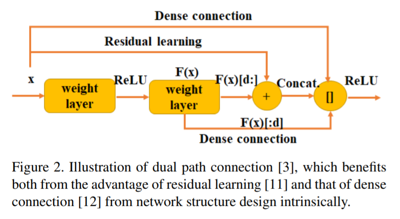
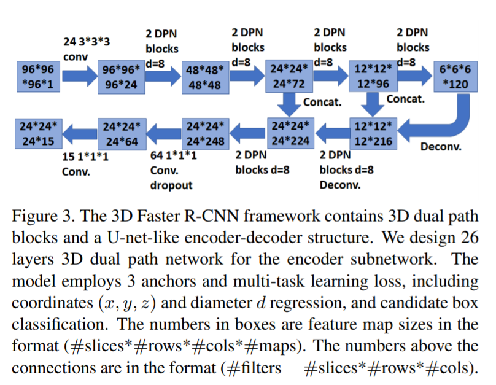
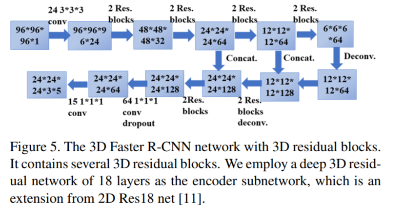
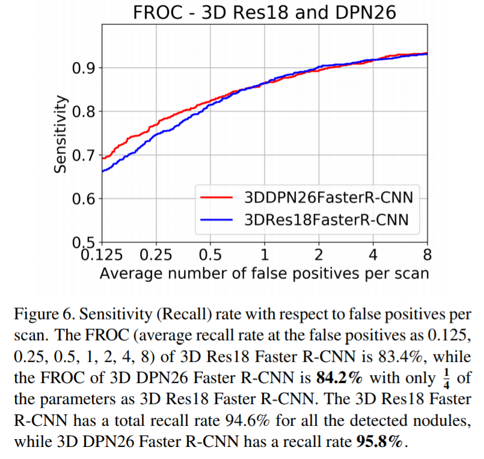
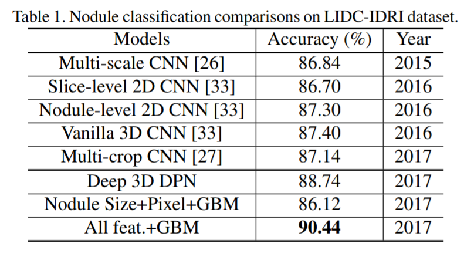
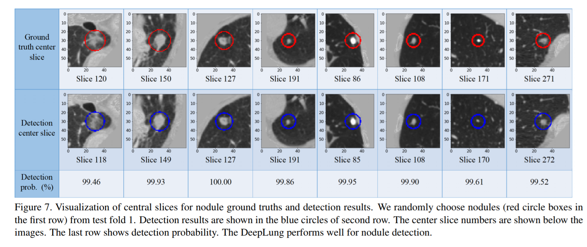
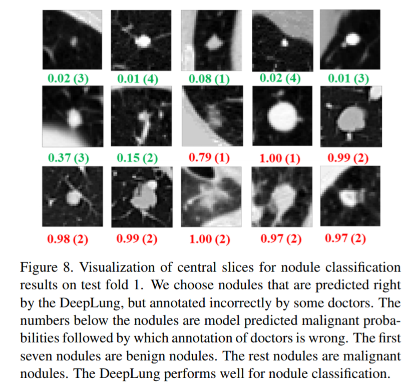

# DeepLung: Deep 3D Dual Path Nets for Automated Pulmonary Nodule Detection and Classification

[TOC]

​       In this work, we present a fully automated lung computed  tomography (CT) cancer diagnosis system, DeepLung.  DeepLung consists of two components, nodule detection  (identifying the locations of candidate nodules) and classification  (classifying candidate nodules into benign or malignant).  Considering the 3D nature of lung CT data and  the compactness of dual path networks (DPN), two deep  3D DPN are designed for nodule detection and classification  respectively. Specifically, a 3D Faster Regions with  Convolutional Neural Net (R-CNN) is designed for nodule  detection with 3D dual path blocks and a U-net-like  encoder-decoder structure to effectively learn nodule features.  For nodule classification, gradient boosting machine  (GBM) with 3D dual path network features is proposed.  The nodule classification subnetwork was validated on a  public dataset from LIDC-IDRI, on which it achieved better  performance than state-of-the-art approaches and surpassed  the performance of experienced doctors based on  image modality. Within the DeepLung system, candidate  nodules are detected first by the nodule detection subnetwork,  and nodule diagnosis is conducted by the classification  subnetwork. Extensive experimental results demonstrate  that DeepLung has performance comparable to experienced  doctors both for the nodule-level and patient-level  diagnosis on the LIDC-IDRI dataset.1  

​         本文提出一个全自动的肺部CT癌症诊断系统DeepLung。DeepLung包括两部分，结节检测(识别候选结节位置)和分类（将候选结节分类为良性或恶性）。考虑到肺部CT数据的3D特性和双路径网络（DPN)的压缩性，设计了两个深度3D DPN分别用于结节检测和回归。特别地，一个带3D双路径块和U-net型编码-解码结构的Faster RCNN来高效的学习结节特征。对于结节分类，提出一个带3D双路径网络特征的梯度提升机（GBM)。在LIDC-IDRI的公开数据集络验证了结节分类子网，取得了比state-of-the-art更好的性能，并且在基于图像模式上超过了有经验医生。在DeepLung系统中，首先通过结节检测子网络检测出候选结节，然后使用分类子网络做结节诊断。广泛的实验结果表明，DeepLung在LIDC-IDRI数据集上的结节级别和患者级别诊断方面的性能均与经验丰富的医生相当。

## 1. 引言

Lung cancer is the most common cause of cancer-related
death in men. Low-dose lung CT screening provides an effective
way for early diagnosis, which can sharply reduce
the lung cancer mortality rate. Advanced computer-aided
diagnosis systems (CADs) are expected to have high sensitivities
while at the same time maintaining low false positive
rates. Recent advances in deep learning enable us to rethink
the ways of clinician lung cancer diagnosis.

​         肺癌是男性因癌致死最常见的情况，低剂量的肺部CT扫描提供一个有效的早期诊断，可以极大减少肺癌死亡率。先进的计算机辅助诊断系统（CADs)被期望有很高的灵敏度同时保持低的假阳性。深度学习的最新进展使我们能够重新思考临床医生肺癌诊断的方法。

Current lung CT analysis research mainly includes nodule
detection [6, 5], and nodule classification [26, 25, 14,
33]. There is few work on building a complete lung CT
cancer diagnosis system for fully automated lung CT cancer
diagnosis using deep learning, integrating both nodule
detection and nodule classification. It is worth exploring a
whole lung CT cancer diagnosis system and understanding
how far the performance of current deep learning technology
differs from that of experienced doctors. To our best
knowledge, this is the first work for a fully automated and
complete lung CT cancer diagnosis system using deep nets.

​        当前肺部CT分析研究主要包括结节检测[6,5],和结节分类[26,25,14,33]；很少使用深度学习构建一个集成结节检测和结节分类的完整肺部CT癌症诊断系统，来全自动化肺部CT癌症诊断的工作。值得探索整个肺部CT癌症诊断系统，并了解当前深度学习技术的表现与经验丰富的医生的差异程度。据我们所知，这是第一个时候用深度网络全自动化整个肺部CT癌症诊断系统。

The emergence of large-scale dataset, LUNA16 [24],  accelerated the nodule detection related research. Typically,  nodule detection consists of two stages, region proposal  generation and false positive reduction. Traditional  approaches generally require manually designed features  such as morphological features, voxel clustering and pixel  thresholding [20, 15]. Recently, deep ConvNets, such as  Faster R-CNN [21, 17] and fully ConvNets [18, 37, 31, 30,  29], are employed to generate candidate bounding boxes  [5, 6]. In the second stage, more advanced methods or complex  features, such as carefully designed texture features,  are used to remove false positive nodules. Because of the  3D nature of CT data and the effectiveness of Faster R-CNN  for object detection in 2D natural images [13], we design a  3D Faster R-CNN for nodule detection with 3D convolutional  kernels and a U-net-like encoder-decoder structure to  effectively learn latent features [22]. The U-Net structure is  basically a convolutional autoencoder, augmented with skip  connections between encoder and decoder layers [22]. Although  it has been widely used in the context of semantic  segmentation, being able to capture both contextual and local  information should be very helpful for nodule detections  as well. Because 3D ConvNet has too large a number of parameters  and is difficult to train on public lung CT datasets  of relatively small sizes, 3D dual path network is employed  as the building block since deep dual path network is more  compact and provides better performance than deep residual  network at the same time [3].

​        大规模数据集LUNA16 [24]的出现加速了结节检测的相关研究。通常，结节检测包括两个阶段，区域提议框生成和假阳性消减。 传统方法通常需要手动设计的特征，如形态特征，三位像素聚类和像素阈值[20,15]。最近，深度卷积网络，如Faster R-CNN [21,17]和全卷积网络 [18,37,31,30,29]，被用来生成候选边界框[5,6]。在第二阶段，使用更先进的方法或复杂的特征，例如精心设计的纹理特征，来消除假阳性结节。由于CT数据的3D特性和Faster R-CNN在2D自然图像在目标检测的有效性[13]，我们设计了一个3D Faster R-CNN用于结节检测，带3D卷积核和U-net型编码器  - 解码器结构，有效地学习潜在特征[22]。尽管它已被广泛用于语义分割，能够捕获上下文和局部信息对于结节检测也应该非常有用。由于3D 卷积网络具有过多的参数并且难以在相对较小规模的公开肺部CT数据集上进行训练，因此采用3D双路径网络作为构建块(block)，因为深度双路径网络更紧凑并且同时提供比深度残差网络更好的性能[3]。

Before the era of deep learning, manual feature engineering followed by classifiers was the general pipeline for  nodule classification [10]. After the large-scale LIDC-IDRI  [2] dataset became publicly available, deep learning-based  methods have become the dominant framework for nodule  classification research [25, 35]. Multi-scale deep ConvNet  with shared weights on different scales has been proposed  for the nodule classification [26]. The weight sharing  scheme reduces the number of parameters and forces the  multi-scale deep ConvNet to learn scale-invariant features.  Inspired by the recent success of dual path network (DPN)  on ImageNet [3, 4], we propose a novel framework for CT  nodule classification. First, we design a deep 3D dual path  network to extract features. As gradient boosting machines  (GBM) are known to have superb performance given effective  features, we use GBM with deep 3D dual path features,  nodule size, and cropped raw nodule CT pixels for the nodule  classification [8]. 

​       在深度学习时代之前，手工特征工程和分类器是结节分类的一般流程[10]，在大规模LIDC-IDRI [2]数据集公开后，基于深度学习的方法已成为结核分类研究的主要框架[25,35]。已经提出了在不同尺寸共享权重的尺寸度深度ConvNet [26]用于结节分类。权重共享方案减少了参数量，并迫使多尺度深度ConvNet学习尺寸不变的特征。受双路径网络（DPN）最近在ImageNet上成功的启发[3,4]，我们提出了一种新的CT结节分类框架。首先，我们设计一个深度3D 双路径网络来提取特征，由于已知梯度提升机（GBM）具有出色的性能，因此我们使用带深度3D双路径特征，结节尺寸和裁剪的原始结节CT像素[8]的GBM用于结节分类。

Finally, we built a fully automated lung CT cancer diagnosis  system, henceforth called DeepLung, by combining  the nodule detection network and nodule classification  network together, as illustrated in Fig. 1. For a CT image,  we first use the detection subnetwork to detect candidate  nodules. Next, we employ the classification subnetwork  to classify the detected nodules into either malignant  or benign. Finally, the patient-level diagnosis result can be  achieved for the whole CT by fusing the diagnosis result of  each nodule. 

​         最后，我们通过将结节检测网络和结节分类网络结合在一起，构建了一个全自动肺癌CT诊断系统，因此称为DeepLung，如图Fig 1所示。对于CT图像，我们首先使用检测子网来检测候选结节。 接下来，我们使用分类子网将检测到的结节分类为恶性或良性。 最后，通过融合每个结节的诊断结果，可以实现整个CT的患者级别诊断结果。

​          

Our main contributions are as follows: 1) To fully exploit  the 3D CT images, two deep 3D ConvNets are designed  for nodule detection and classification respectively.  Because 3D ConvNet contains too many parameters and is  difficult to train on relatively small public lung CT datasets,  we employ 3D dual path networks as the neural network  architecture since DPN uses less parameters and obtains  better performance than residual network [3]. Specifically,  inspired by the effectiveness of Faster R-CNN for object  detection [13], we propose 3D Faster R-CNN for nodule  detection based on 3D dual path network and U-net-like encoder-decoder structure, and deep 3D dual path network  for nodule classification. 2) Our classification framework  achieves better performance compared with state-of-the-art  approaches, and surpasses the performance of experienced  doctors on the public dataset, LIDC-IDRI. 3) Our fully automated  DeepLung system, nodule classification based on  detection, is comparable to the performance of experienced  doctors both on nodule-level and patient-level diagnosis.  

​          我们的主要贡献如下：1）为了充分利用3D CT图像，分别设计了两个深度3D ConvNets用于结节检测和分类。由于3D ConvNet包含太多参数且难以在相对较小的公开肺部CT数据集上进行训练，因此我们采用3D双路径网络作为神经网络架构，因为DPN使用较少的参数并获得比残差网络更好的性能[3]。具体来说，受到Faster R-CNN对物体检测有效性的启发[13]，我们提出了基于3D双路径网络和U-net型编码器 - 解码器结构的3D Faster R-CNN用于结节检测，和深度3D双路径网络用于结节分类。 2）与最先进的方法相比，我们的分类框架实现了更好的性能，并且在公共数据集LIDC-IDRI上超过了有经验的医生的表现。 3）我们的全自动DeepLung系统，基于检测的结节分类，与经验丰富的医生在结节水平和患者水平诊断性能相当。

## 2. 相关工作

Traditional nodule detection involves hand-designed features  or descriptors [19] requiring domain expertise. Recently,  several works have been proposed to use deep ConvNets  for nodule detection to automatically learn features,  which is proven to be much more effective than handdesigned  features. Setio et al. proposes multi-view ConvNet  for false positive nodule reduction [23]. Due to the  3D nature of CT scans, some work proposed 3D ConvNets  to handle the challenge. The 3D fully ConvNet (FCN) is  proposed to generate region candidates, and deep ConvNet  with weighted sampling is used for false positive reduction  [6]. Ding et al. and Liao et al. use the Faster R-CNN to  generate candidate nodules followed by 3D ConvNets to remove  false positive nodules [5, 17]. Due to the effective  performance of Faster R-CNN [13, 21], we design a novel  network, 3D Faster R-CNN with 3D dual path blocks, for  the nodule detection. Further, a U-net-like encoder-decoder  scheme is employed for 3D Faster R-CNN to effectively  learn the features [22].

​        传统的结节检测涉及手工设计的特征或描述符[19]，需要领域专业知识。最近，已经提出了几项工作来使用深度ConvNets进行结节检测以自动学习特征，这被证明比手工设计的特征更有效。 Setio et al. 提出多视图ConvNet用于假阳性结节消减[23]。由于CT扫描的3D特性，一些工作提出3D ConvNets来应对挑战。提出使用3D全卷积网络（FCN）来生成候选区域，并且使用带加权采样的深度ConvNet进行假阳性消减[6]。Ding et al. 和Liao et al.使用Faster R-CNN生成候选结节，然后使用3D ConvNets去除假阳性结节[5,17]。由于Faster R-CNN [13,21]的高效性能，我们设计了一种新的网络，带3D双路径块的3D Faster R-CNN，用于结节检测。此外，U-net型的编码器 - 解码器方案被用于3D Faster R-CNN以有效地学习特征[22]。

Nodule classification has traditionally been based on  segmentation [7] and manual feature design [1]. Several  works designed 3D contour feature, shape feature and texture  feature for CT nodule diagnosis [32, 7, 10]. Recently,  deep networks have been shown to be effective for medical  images. Artificial neural network was implemented for CT  nodule diagnosis [28]. More computationally effective network,  multi-scale ConvNet with shared weights for different  scales to learn scale-invariant features, is proposed for nodule classification [26]. Deep transfer learning and multi instance  learning is used for patient-level lung CT diagnosis  [25, 36]. A comparative study on 2D and 3D ConvNets  is conducted and 3D ConvNet is shown to be better than  2D ConvNet for 3D CT data [33]. Furthermore, a multitask  learning and transfer learning framework is proposed  for nodule diagnosis [14]. Different from their approaches,  we propose a novel classification framework for CT nodule  diagnosis. Inspired by the recent success of deep dual  path network (DPN) on ImageNet [3], we design a novel  3D DPN to extract features from raw CT nodules. In part to  the superior performance of GBM with complete features,  we employ GBM with different levels of granularity ranging  from raw pixels, DPN features, to global features such  as nodule size for the nodule diagnosis. Patient-level diagnosis  can be achieved by fusing the nodule-level diagnosis.

​       结节分类传统上基于分割[7]和手动特征设计[1]。 几项工作为CT结节诊断设计了3D轮廓特征，形状特征和纹理特征[32,7,10]。最近，深度网络已被证明对医学图像有效。 人工神经网络用于CT结节诊断[28]。 为结节分类提出了更具计算效率的网络，具有不同尺寸间权重共享以学习尺寸不变特征[26]的多尺寸ConvNet。深度迁移学习和多实例学习用于患者级别肺部CT诊断[25,36]。对2D和3D ConvNets进行的比较研究，显示对于3D CT数据[33] 3D ConvNet优于2D ConvNet。进一步，提出了一个多任务学习和迁移学习框架用于结节诊断[14]。与他们的方法不同，我们提出了一种新颖的CT结节诊断框架。 受最近深度双路径网络（DPN）在ImageNet成功的的启发[3]，我们设计了一种新颖的3D DPN，用于从原始CT结节中提取特征。 部分由于带完整特征的GBM的卓越性能，我们对结节诊断采用带不同粒度级别特征，从原始像素，DPN特征到结节大小等全局特征的GBM。 通过融合结节级别诊断可以实现患者级别的诊断。

​         

## 3. DeepLung框架

Our fully automated lung CT cancer diagnosis system
consists of two parts: nodule detection and classification.
We design a 3D Faster R-CNN for nodule detection, and
propose GBM with deep 3D DPN features, raw nodule CT
pixels and nodule size for nodule classification.

​        我们的全自动肺部CT癌症诊断系统包括两部分：肺部检测和分类；我们为结节检测设计了3D Faster R-CNN ，并为结节分类提出了带深度3D DPN特征、原始结节CT像素和结节大小的GBM。

### 3.1. 用于结节检测的带深度3D双路径网络的3D Faster R-CNN 

Inspired by the success of dual path network on the ImageNet  [3, 4], we design a deep 3D DPN framework for lung  CT nodule detection and classification in Fig. 3 and Fig.  4. Dual path connection benefits both from the advantage  of residual learning and that of dense connection [11, 12].  The shortcut connection in residual learning is an effective  way to eliminate vanishing gradient phenomenon in very  deep networks. From a learned feature sharing perspective,  residual learning enables feature reuse, while dense connection  has an advantage of exploiting new features [3]. Additionally,  densely connected network has fewer parameters  than residual learning because there is no need to relearn  redundant feature maps. The assumption of dual path con nection is that there might exist some redundancy in the exploited
features. And dual path connection uses part of feature maps for dense connection and part of them for residual learning. In implementation, the dual path connection splits its feature maps into two parts. One part, F(x)[d :], is used for residual learning, the other part, F(x)[: d], is used for dense connection as shown in Fig. 2. Here d is a hyper-parameter for deciding how many new features to be exploited. The dual path connection can be formulated as

​        受双路径网络在ImageNet上成功的启发[3,4]，我们在图Fig 3和图Fig 4中设计了一个用于肺部CT结节检测和分类的深度3D DPN框架。双路连接受益于残差学习和密集连接的优势[11,12]。 残差学习中的快捷连接是消除深度网络中梯度消失现象的有效方法。 从学习的特征共享角度来看，残差学习可以实现特征重用，而密集连接则具有利用新功能的优势[3]。此外，密集连接的网络比残差学习具有更少的参数，因为不需要重新学习冗余特征图。 双路径连接假设在被利用的特征中可能存在一些冗余。并且双路径连接使用部分特征进行密集连接，部分用于残差学习。 在实现中，双路径连接将其特征分成两部分。 一部分F（x）[d：]用于残差学习，另一部分F（x）[：d]用于密集连接，如图Fig 2所示。这里d是超参数 用于决定要采用的新功能的数量。 双路径连接可以表示为

$$
y = \bf G(x[:d], \bf F(x) [:d], \bf F(x)[d:] + x[d:]),  \tag 1
$$
where y is the feature map for dual path connection, G is  used as ReLU activation function, F is convolutional layer  functions, and x is the input of dual path connection block.  Dual path connection integrates the advantages of the two  advanced frameworks, residual learning for feature reuse  and dense connection for the ability to exploit new features,  into a unified structure which obtained success on the ImageNet  dataset[4]. We design deep 3D neural nets based on  3D DPN because of its compactness and effectiveness 。

​        y是双路径连接的特征，G是ReLU激活函数，F是卷积层函数，x是双路径连接块的输入。双路径连接集成了两个高级框架的优势，将残差学习的特征重用和密集连接的新特征利用的集成到一个统一的结构中，该结构在ImageNet数据集上取得了成功[4]。 由于其紧凑性和有效性，我们设计了基于3D DPN的深度3D神经网络。

The 3D Faster R-CNN with a U-net-like encoderdecoder  structure and 3D dual path blocks is illustrated in  Fig. 3. Due to the GPU memory limitation, the input of 3D  Faster R-CNN is cropped from 3D reconstructed CT images  with pixel size 96 × 96 × 96. The encoder network  is derived from 2D DPN [3]. Before the first max-pooling,  two convolutional layers are used to generate features. After  that, eight dual path blocks are employed in the encoder  subnetwork. We integrate the U-net-like encoder-decoder  design concept in the detection to learn the deep nets efficiently  [22]. In fact, for the region proposal generation, the  3D Faster R-CNN conducts pixel-wise multi-scale learning  and the U-net is validated as an effective way for pixel-wise  labeling. This integration makes candidate nodule generation  more effective. In the decoder network, the feature  maps are processed by deconvolution layers and dual path  blocks, and are subsequently concatenated with the corresponding  layers in the encoder network [34]. Then a convolutional  layer with dropout (dropout probability 0.5) is used  in the second to the last layer. In the last layer, we design 3  anchors, 5, 10, 20, for scale references which are designed  based on the distribution of nodule sizes. For each anchor,  there are 5 parts in the loss function, classification loss Lcls  for whether the current box is a nodule or not, regression  loss Lreg for nodule coordinates x, y, z and nodule size d.

​        具有U-net型编码器解码器结构和3D双路径块的3D Faster R-CNN如图Fig 3所示。由于GPU内存限制，3D Faster R-CNN的输入是从3D重建CT图像中裁剪出来的，像素大小为96×96×96。编码器网络源自2D DPN [3]。 在第一个最大池化之前，使用两个卷积层来生成特征。之后，在编码器子网中使用8个双路径块。我们在检测中集成了U-net型的编码器 - 解码器设计概念，以便有效地学习深度网络[22]。实际上，对于区域提议生成，3D Faster R-CNN进行像素方式的多尺度学习，并且U-net被验证为用于像素标注的有效方式。这种集成使候选结节的产生更加有效。在解码器网络中，特征图由反卷积层和双路径块处理，并随后与编码器网络中的相应层拼接[34]。然后在第二层到最后一层使用带dropout（丢弃概率0.5）的卷积层。在最后一层，我们基于结节尺寸分布设计了3个anchor，5,10,20，用做参考尺寸。对于每个anchor，损失函数中有5个部分，当前边框是否为结节的分类损失$L_{cls}$，结节坐标x，y，z和结节大小d的回归损失$L_{reg}$。

If an anchor overlaps a ground truth bounding box with  the intersection over union (IoU) higher than 0.5, we consider  it as a positive anchor (p  ? = 1). On the other hand,  if an anchor has IoU with all ground truth boxes less than  0.02, we consider it as a negative anchor (p  ? = 0). The  multi-task loss function for the anchor i is defined as

​        如果anchor和ground truth边框的交并比（IoU)大于0.5，则为正anchor($p^*=1$), 另一方面,如果一个anchor与所有ground truth边框的IoU都小于0.02，则作为负anchor($p^*=0$)。对于anchor $i$的多任务损失函数定义为：
$$
L(p_i, t_i) = λL_{cls}(p_i, p^*
_i) + p^*_i L_{reg}(t_i
, t_i^*),  \tag 2
$$
where pi is the predicted probability for current anchor i being a nodule, ti is the predicted relative coordinates for nodule position, which is defined as

​        $p_i$ 当前anchor $i$ 预测为结节的概率，$t_i$ 是相应的结节位置坐标预测，定义为：
$$
t_i = (\frac {x-x_a} {d_a}, \frac {y-y_b} {d_a}, \frac {z- z_a} {d_a}, log(\frac {d} {d_a})) \tag 3
$$
 where (x, y, z, d) are the predicted nodule coordinates and diameter in the original space, (xa, ya, za, da) are the coordinates and scale for the anchor i. For ground truth nodule position, it is defined as

​          $ (x, y, z, d) $ 是预测的原空间中结节坐标和直径， $(x_a, y_a, z_a, d_a) $ 是anchor $i$ 的坐标和尺寸，对于ground truth结节位置，定义如下：
$$
t_i^* = (\frac {x^*-x_a} {d_a}, \frac {y^*-y_b} {d_a}, \frac {z^*- z_a} {d_a}, log(\frac {d^*} {d_a})) \tag 3
$$
where (x?, y?, z?, d?) are nodule ground truth coordinatesand diameter. The λ is set as 0.5. For Lcls, we used binary cross entropy loss function. For Lreg, we used smooth l1 regression loss function [9].

​         $(x^*, y^*, z^*, d^*)$ 是结节的实际坐标和直径， λ 为0.5; 对于$L_{cls}$ 使用二分类交叉熵损失函数，对于$L_{reg}$ 使用平滑L1回归损失函数[9].

### 3.2 用于结节分类的带3D 双路径网络特征的GBM

For CT data, advanced method should be effective to extract  3D volume feature [33]. We design a 3D deep dual  path network for the 3D CT lung nodule classification in Fig. 4. The main reason we employ dual modules for detection  and classification is that classifying nodules into benign  and malignant requires the system to learn finer-level  features, which can be achieved by focusing only on nodules.  In addition, it allows to introduce extra features in the  final classification. We first crop CT data centered at predicted  nodule locations with size 32 × 32 × 32. After that,  a convolutional layer is used to extract features. Then 30  3D dual path blocks are employed to learn higher level features.  Lastly, the 3D average pooling and binary logistic  regression layer are used for benign or malignant diagnosis.

​        对于CT数据，高级方法应该可以有效地提取3D体积特征[33]。 在图Fig 4中，我们为3D CT肺结节分类设计了一个3D深度双路径网络。我们采用双模块进行检测和分类的主要原因是，将结节分为良性和恶性，需要系统学习更精细的特征， 这可以通过仅聚焦到结节上实现。 此外，它允许在最终分类中引入额外的特征。 我们首先以预测的结节位置为中心裁剪CT数据，其大小为32×32×32。之后，使用卷积层提取特征。 然后使用30个3D双路径块来学习更高级别的特征。 最后，3D平均池化和二分类逻辑回归层用于良性或恶性诊断。

The deep 3D dual path network can be used as a classifier  for nodule diagnosis directly and it can also be employed  to learn effective features. We construct feature by  concatenating the learned deep 3D DPN features (the second  from the last layer (2,560 dimension)), nodule size, and  raw 3D cropped nodule pixels. Given complete and effective  features, GBM is a superb method to build an advanced  classifier [8]. We validate the feature combining nodule size  with raw 3D cropped nodule pixels in combination with the  GBM classifier and obtained 86.12% average test accuracy.  Lastly, we employ GBM with the constructed feature and  achieve the best diagnosis performance.

​        深度3D双路径网络可以直接用作结节诊断的分类器，也可以用于学习有效特征。 我们通过拼接学习的深3D DPN特征（最后一层（2,560维）），结节大小和原始3D裁剪结节像素来构建特征。 给定完整有效的特征，GBM是构建高级分类器的极好方法[8]。 我们验证了组合结节大小与原始3D裁剪结节像素的GBM分类器，并获得了86.12％的平均测试精度。 最后，我们采用带构造特征的GBM，并实现最佳诊断性能。

### 3.3. DeepLung系统: 全自动肺部CT癌症诊断

The DeepLung system includes the nodule detection using the 3D Faster R-CNN and nodule classification using GBM with constructed feature (deep 3D dual path features, nodule size and raw nodule CT pixels) as shown in Fig. 1.

​          DeepLung系统包括使用3D Faster R-CNN的结节检测和使用GBM的结节分类，带有构造特征（深度3D双路径特征，结节尺寸和原始结节CT像素），如图Fig 1所示。

Due to the GPU memory limitation, we first split the  whole CT into several 96 × 96 × 96 patches, process them  through the detector, and combine the detected results together.  We only keep the detected boxes of detection probabilities  larger than 0.12 (threshold as -2 before sigmoid  function). After that, non-maximum suppression (NMS) is  adopted based on detection probability with the intersection  over union (IoU) threshold as 0.1. Here we expect to not  miss too many ground truth nodules.

​        由于GPU内存限制，我们首先将整个CT分成几个96×96×96补丁，通过检测器处理它们，并将检测到的结果组合在一起。 我们只保留检测到的检测概率大于0.12的阈值（在sigmoid函数之前阈值为-2）。 之后，基于检测概率采用非最大抑制（NMS），其中交并比（IoU）阈值为0.1。 在这里，我们希望不要错过太多的ground truth结节。

After we get the detected nodules, we crop the nodule  with the center as the detected center and size of 32 × 32 ×  32. The detected nodule size is kept as a feature input for  later downstream classification. The deep 3D DPN is employed  to extract features. We use the GBM and construct  features to conduct diagnosis for the detected nodules. For  pixel feature, we use the cropped size of 16 × 16 × 16  and center as the detected nodule center in the experiments.  For patient-level diagnosis, if one of the detected nodules is  positive (cancer), the patient is classified as having cancer.  Conversely, if all detected nodules are negative, the patient  is considered non-cancer.

​         在我们得到检测到的结节后，我们裁剪结节，中心为检测中心，大小为32×32×32。检测到的结节大小作为特征输入保留，供给之后的下游分类。 深度3D DPN用于提取特征。 我们使用GBM，并构建特征来对检测到的结节进行诊断。 对于像素特征，我们使用16×16×16的裁剪尺寸，中心为实验中检测到的结节中心。 对于患者水平的诊断，如果检测到的结节之一是阳性（癌症），则患者被归类为患有癌症。 相反，如果所有检测到的结节均为阴性，则该患者被认为是非癌症。

## 4.实验

We conduct extensive experiments to validate the DeepLung system. We perform 10-fold cross validation using the detector on LUNA16 dataset. For nodule classification, we use the LIDC-IDRI annotation, and employ the LUNA16’s patient-level dataset split. Finally, we also validate the whole system based on the detected nodules both on patient-level diagnosis and nodule-level diagnosis.

​        我们通过实验验证DeepLung系统，在LUNA16数据集上使用检测器进行10-折交叉验证。对于结节分类，我们使用LIDC-IDRI标注，并使用LUNA16的患者级数据集分割。最后，我们在患者级别诊断和结节级别诊断上基于检测结的节验证了整个系统。

In the training, for each model, we use 150 epochs in total with stochastic gradient descent optimization and momentum as 0.9. The batch size parameter is limited by GPU memory. We use weight decay as 1 × 10−4 . The initial learning rate is 0.01, 0.001 after half the total number of epoch, and 0.0001 after epoch 120。

​        在训练中，对于每个模型，我们总共训练150轮，使用随机梯度下降优化和动量为0.9。 批大小参数受GPU内存限制。 我们使用权重衰减为$1 × 10^{-4} $。 初始学习率为0.01，在总轮数的一半之后为0.001，在120轮之后为0.0001。

​           

### 4.1. 数据集

LUNA16 dataset is a subset of the largest publicly available dataset for pulmonary nodules, LIDC-IDRI [2, 24]. LUNA16 dataset only has the detection annotations, while LIDC-IDRI contains almost all the related information for low-dose lung CTs including several doctors’ annotations on nodule sizes, locations, diagnosis results, nodule texture, nodule margin and other informations. LUNA16 dataset removes CTs with slice thickness greater than 3mm, slice spacing inconsistent or missing slices from LIDC-IDRI dataset, and explicitly gives the patient-level 10-fold cross validation split of the dataset. LUNA16 dataset contains 888 low-dose lung CTs, and LIDC-IDRI contains 1,018 low-dose lung CTs. Note that LUNA16 dataset removes the annotated nodules of size smaller than 3mm。

​         LUNA16数据集是最大的公共可用肺结节数据集的子集，LIDC-IDRI [2,24]。 LUNA16数据集仅有检测标注，而LIDC-IDRI几乎包含低剂量肺CT的所有相关信息，包括几个医生对结节大小，位置，诊断结果，结节质地，结节边缘和其他信息的标注。 LUNA16数据集从LIDC-IDRI数据集中移除切片厚度小于于3mm，切片间距不一致或缺少切片的CT，并明确给出数据集的患者级10-折交叉验证分割(split)。 LUNA16数据集包含888个低剂量肺CT，LIDC-IDRI包含1,018个低剂量肺CT。 注意，LUNA16数据集删除大小小于3毫米的结节。

For nodule classification, we extract nodule annotations from LIDC-IDRI dataset, find the mapping of different doctors’ nodule annotations with the LUNA16’s nodule annotations, and obtained the ground truth of nodule diagnosis by averaging different doctors’ diagnosis (discarding 0 score for diagnosis which corresponds to N/A.). If the final average score is equal to 3 (uncertain about malignant or benign), we remove the nodule. For the nodules with score greater than 3, we label them as positive. Otherwise, we label them as negative. Because CT slides were annotated by anonymous doctors, the identities of doctors (referred to as Drs 1-4 as the 1st-4th annotations) are not strictly consistent. As such, we refer them as “simulated” doctors. To make our results reproducible, we only keep the CTs within LUNA16 dataset, and use the same cross validation split as LUNA16 for classification.

​          对于结节分类，我们从LIDC-IDRI数据集中提取结节标注，找到不同医生的结节标注与LUNA16结节标注的对应关系，并通过平均不同医生的诊断获得结节诊断的ground truth（丢弃0分为诊断结果,对应于N / A.）。 如果最终平均分数等于3（不确定恶性或良性），我们删除这个结节。 对于评分大于3的结节，我们将其标记为阳性。 否则，我们将它们标记为阴性。 由于CT切片由匿名医生标注，医生的身份（称为Drs1-4作为第1至第4标注）并不严格一致。 因此，我们将他们称为“模拟”医生。 为了使我们的结果可重现，我们将只保留LUNA16数据集中CT，并使用与LUNA16相同的交叉验证分割进行分类。

### 4.2. 预处理

Three automated preprocessing steps are employed for the input CT images. First, we clip the raw data into [−1200, 600]. Second, we transform the range linearly into [0, 1]. Finally, we use LUNA16’s given segmentation ground truth and remove the background.

​       输入CT图像采用了三个自动预处理步骤。 首先，我们将原始数据剪辑为[-1200,600]。 其次，我们将值范围线性转换到[0,1]。 最后，我们使用LUNA16给出的分割ground-truth并删除背景。

### 4.3. DeepLung结节检测

We train and evaluate the detector on LUNA16 dataset  following 10-fold cross validation with given patient-level  split. In training, we augment the dataset by randomly flipping  the image and use cropping scale betweeb 0.75 to 1.25.  The evaluation metric, FROC, is the average recall rate at  the average number of false positives at 0.125, 0.25, 0.5,  1, 2, 4, 8 per scan, which is the official evaluation metric  for LUNA16 dataset [24]. In the test phase, we use detection  probability threshold as -2 (before sigmoid function),  followed by NMS with IoU threshold as 0.1.

​        我们在给定患者级别分割(split)的LUNA16数据集上使用10-折交叉验证法训练和评估的检测器。 在训练中，我们通过随机翻转图像来做数据集增强，并使用0.75到1.25的比例裁剪。 评估指标FROC是每个扫描假阳性为0.125,0.25,0.5,1,2,4,8的平均召回率，这是LUNA16数据集的官方评估指标[24]。 在测试阶段，我们使用检测概率阈值-2（在sigmoid函数之前），然后使用IoU阈值为0.1的NMS。

To validate the performance of proposed deep 3D dual  path network for detection, we employ a deep 3D residual  network as a comparison in Fig. 5. The encoder part of  this baseline network is a deep 3D residual network of 18  layers, which is an extension from 2D Res18 net [11]. Note  that the 3D Res18 Faster R-CNN contains 5.4M trainable  parameters, while the 3D DPN26 Faster R-CNN employs  1.4M trainable parameters, which is only 1/4  of 3D Res18  Faster R-CNN.

​        为了验证所提出的深度3D双路径网络的检测性能，在图Fig 5中，我们采用深度3D残差网络作比较。该基线网络的编码器部分是18层的深度3D残差网络，扩展自2D Res18 net [11]。 请注意，3D Res18 Faster R-CNN包含5.4M可训练参数，而3D DPN26 Faster R-CNN使用1.4M可训练参数，这仅是3D Res18 Faster R-CNN的1/4。

The FROC performance on LUNA16 is visualized in  Fig. 6. The solid line is interpolated FROC based on true  prediction. The 3D DPN26 Faster R-CNN achieves a FROC  score of 84.2% without any false positive nodule reduction  stage, which is better than the previous 83.9% using  two-stage training [6]. The 3D DPN26 Faster R-CNN using  only 1/4  of the parameters performs better than the 3D  Res18 Faster R-CNN, which demonstrates the superior suitability  of the 3D DPN for detection. Ding et al. obtains  89.1% FROC using 2D Faster R-CNN followed by extra  false positive reduction classifier [5], while we only employ  enhanced Faster R-CNN with deep 3D dual path for detection.  We have recently applied the 3D model to Alibaba  Tianchi Medical AI on nodule detection challenge and were  able to achieve top accuracy on a hold-out dataset.

​         LUNA16上的FROC性能可视化在图Fig 6中。实线是基于真实预测的内插FROC。 3D DPN26 Faster R-CNN获得了84.2％的FROC评分，没有任何假阳性结节消减阶段，这比之前使用两阶段训练的83.9％更好[6]。 仅使用1/4参数的3D DPN26 Faster R-CNN比3D Res18 Faster R-CNN表现更好，这证明了3D DPN对于检测的出色适用性。 Ding et al. 使用2D Faster R-CNN 接一个额外的假阳性消减分类器[5]获得89.1％的FROC，而我们只采用带深度3D双路径的增强版Faster R-CNN进行检测。 我们最近将3D模型应用于阿里巴巴天池医疗AI对结核检测的挑战，并且能够在保留的数据集上达到最高精度。

### 4.4. DeepLung结节分类

We validate the nodule classification performance of the DeepLung system on the LIDC-IDRI dataset with the LUNA16’s split principle, 10-fold patient-level cross vali-dation. There are 1,004 nodules of which 450 are positive. In the training, we first pad the nodules of size 32×32×32 into 36 × 36 × 36, randomly crop 32 × 32 × 32 from the padded data, horizontal flip, vertical flip, z-axis flip the data for augmentation, randomly set 4 × 4 × 4 patch to zero, and normalize the data with the mean and standard deviation obtained from training data. The total number of epochs is 1,050. The initial learning rate is 0.01, and reduce to 0.001 after epoch 525, and finally to 0.0001 after epoch 840. Due to time and resource limitation for training, we use the fold 1, 2, 3, 4, 5 for test, and the final performance is the average performance on the five test folds. The nodule classification performance is concluded in Table 1.

​         我们在LIDC-IDRI数据集上使用LUNA16的分割原则，10折患者级别的交叉验证，验证DeepLung系统的结节分类性能。 有1,004个结节，其中450个是阳性的。 在训练中，我们首先将尺寸为32×32×32的结节填充到36×36×36，从填充数据中随机裁剪32×32×32，水平翻转，垂直翻转，z轴翻转数据进行增强， 将4×4×4的patch随机设置为零，并用训练数据得到的均值和标准差对数据进行归一化。训练总轮数为1,050。 初始学习率为0.01，在525轮之后减少到0.001，最终在840轮之后减少到0.0001。由于训练的时间和资源限制，我们使用1,2,3,4,5折进行测试，并且 最终性能是五折测试的平均性能。 结核分类性能见表Table 1。

From the table 1, our deep 3D DPN achieves better performance than those of Multi-scale CNN [26], Vanilla 3D CNN [33] and Multi-crop CNN [27], because of the strong power of 3D structure and deep dual path network. GBM with nodule size and raw nodule pixels with crop size as 16 × 16 × 16 achieves comparable performance as multiscale CNN [26] because of the superior classification performance of GBM. Finally, we construct feature with deep 3D dual path network features, 3D Faster R-CNN detected nodule size and raw nodule pixels, and obtain 90.44% accuracy, which shows the effectiveness of deep 3D dual path network features.

​        从表1可以看出，我们的深度3D DPN比多尺度CNN [26]，Vanilla 3D CNN [33]和多裁剪CNN [27]具有更好的性能，因为3D结构的强大功能和深度双路径 网络。 由于GBM的优越分类性能，带结节尺寸和裁剪尺寸为16×16×16的原始结节像素的GBM实现了与多尺度CNN相当的性能[26]。 最后，我们使用深度3D双路网络特征，3D Faster R-CNN检测到的结节大小和原始结节像素来构建特征，并获得90.44％的准确度，这表明了深度3D双路网络特征的有效性。

#### 4.4.1 与经验丰富的医生在他们各自置信结节比较

We compare our predictions with those of four “simulated” experienced doctors on their individually confident nodules (with individual score not 3). Note that about 1/3 annotations are 3. Comparison results are concluded in Table 2.  

​       我们将我们的预测与四名“模拟”经验丰富的医生的各自置信结节进行比较（个体得分不为3）。 注意，约1/3标注是3. 比较结果在表2中得出。

From Table 2, these doctors’ confident nodules are easy to be diagnosed nodules from the performance comparison between our model’s performances in Table 1 and Table 2. To our surprise, the average performance of our model is 1.5% better than that of experienced doctors even on their individually confident diagnosed nodules. In fact, our model’s performance is better than 3 out of 4 doctors (doctor 1, 3, 4) on the confident nodule diagnosis task. The result validates deep network surpasses human-level performance for image classification [11], and the DeepLung is better suited for nodule diagnosis than experienced doctors.

​        从表Table 2中可以看出，这些医生确信的结节很容易诊断的结节，在表Table 1和表Table 2中有我们的模型的性能比较。令我们惊讶的是，在他们各自确信的诊断结节上，我们的模型的平均表现比经验丰富的医生好1.5％ 。 事实上，在确信的结节诊断任务而言，我们的模型的性能优于4名医生中的3名（医生1,3,4）。 结果验证了深层网络超越了人类的图像分类性能[11]，而DeepLung比经验丰富的医生更适合结节诊断。

We also employ Kappa coefficient, which is a common approach to evaluate the agreement between two raters, to test the agreement between DeepLung and the ground truth [16]. The kappa coefficient of DeepLung is 85.07%, which is significantly better than the average kappa coefficient of doctors (81.58%). To evaluate the performance for all nodules including borderline nodules (labeled as 3, uncertain between malignant and benign), we compute the log likelihood (LL) scores of DeepLung and doctors’ diagnosis. We randomly sample 100 times from the experienced doctors’ annotations as 100 “simulated” doctors. The mean LL of doctors is -2.563 with a standard deviation of 0.23. By contrast, the LL of DeepLung is -1.515, showing that the performance of DeepLung is 4.48 standard deviation better than the average performance of doctors, which is highly statistically significant. It is important to analysis the sta-tistical property of predictions for borderline nodules that cannot be conclusively classified by doctors. Interestingly, 64.98% of the borderline nodules are classified to be either malignant (with probability > 0.9) or benign (with probability < 0.1) in Table 3. DeepLung classified most of the borderline nodules of malignant probabilities closer to zero or closer to one, showing its potential as a tool for assisted diagnosis.

​       我们还使用Kappa系数，这是评估两个评估者之间一致性的常用方法，用于测试DeepLung与ground truth之间的一致性[16]。 DeepLung的kappa系数为85.07％，明显优于医生的平均kappa系数（81.58％）。为了评估包括临界结节（记为3，不确定恶性或良性）的所有结节的表现，我们计算了DeepLung的对数似然（LL）评分和医生的诊断。我们从经验丰富的医生标注中随机抽取100次作为100名“模拟”医生。医生的平均LL为-2.563，标准差为0.23。相比之下，DeepLung的LL为-1.515，表明DeepLung在标准差上性能比医生的平均性能好4.48倍，具有显著的统计学意义。分析医生无法确信的分类临界结节的预测统计特性非常重要。有趣的是，表Table 3中有64.98％的临界结节被分类为恶性（概率> 0.9）或良性（概率<0.1）.DeepLung将大多数恶性概率的临界结节分类为接近于0或接近于1，显示其作为辅助诊断工具的潜力。

### 4.5.  DeepLung全自动肺部CT癌症诊断

We also validate the DeepLung for fully automated lung CT cancer diagnosis on the LIDC-IDRI dataset with the same protocol as LUNA16’s patient-level split. Firstly, we employ our 3D Faster R-CNN to detect suspicious nodules. Then we retrain the model from nodule classification model on the detected nodules dataset. If the center of detected nodule is within the ground truth positive nodule, it is a positive nodule. Otherwise, it is a negative nodule. Through this mapping from the detected nodule and ground truth nodule, we can evaluate the performance and compare it with the performance of experienced doctors. We adopt the test fold 1, 2, 3, 4, 5 to validate the performance the same as that for nodule classification.

我们还使用与LUNA16患者级别相同的分割(split)方案，在LIDC-IDRI数据集上验证DeepLung全自动肺癌CT诊断。 首先，我们使用3D Faster R-CNN来检测可疑的结节。 然后我们在检测到的结节数据集上的训练结节分类模型。 如果检测到的结节的中心位于ground truth的结节内，则它是一个阳性结节。 否则，它是一个阴性结节。 通过检测到的结节和ground truth结节的映射，我们可以评估性能并将其与经验丰富的医生的性能进行比较。与结节分类一样，我们采用测试的1,2,3,4,5折(fold)来验证性能,。

Different from pure nodule classification, the fully automated lung CT nodule diagnosis relies on nodule detection. We evaluate the performance of DeepLung on the detection true positive (TP) set and detection false positive (FP) set individually in Table 4. If the detected nodule of center within one of ground truth nodule regions, it is in the TP set. If the detected nodule of center out of any ground truth nodule regions, it is in FP set. From Table 4, the DeepLung system using detected nodule region obtains 81.42% accuracy for all the detected TP nodules. Note that the experienced doctors obtain 78.36% accuracy for all the nodule diagnosis on average. The DeepLung system with fully automated lung CT nodule diagnosis still achieves above average performance of experienced doctors. On the FP set, our nodule classification subnetwork in the DeepLung can reduce 97.02% FP detected nodules, which guarantees that our fully automated system is effective for the lung CT cancer diagnosis.

​       与单纯的结核分类不同，全自动肺CT结节诊断依赖于结节检测。 我们在表Table 4中单独评估DeepLung对检测真阳性（TP）组和检测假阳性（FP）组的性能。如果检测到中心在一个ground truth结节区域内，则它在TP组中。 如果检测到的中心结节不在任何ground truth结节区域中，则它在FP集中。 从表Table 4中，对所有检测到的TP结节DeepLung系统获得了的81.42％的准确度。 注意到，经验丰富的医生在所有结节上平均诊断准确率为78.36％。 全自动肺CT结节诊断系统DeepLung仍然超过了经验丰富的医生的平均水平。 在FP组中，我们在DeepLung中的结节分类子网可以减少97.02％FP检测到的结节，这保证了我们的全自动系统对肺部CT癌症诊断有效。

#### 4.5.1 与经验丰富的医生在他们各自确信的CT比较

We employ the DeepLung for patient-level diagnosis further. If the current CT has one nodule that is classified aspositive, the diagnosis of the CT is positive. If all the nodules are classified as negative for the CT, the diagnosis of the CT is negative. We evaluate the DeepLung on the doctors’ individually confident CTs for benchmark comparison in Table 5

我们使用DeepLung进一步进行患者级诊断。 如果当前CT有一个分类为阳性的结节，则CT的诊断为阳性。 如果CT的所有结节都分类为阴性，则CT的诊断结果为阴性。 我们在医生的各自确信CT上对DeepLung进行评估，以进行表Table 5中的基准比较.

From Table 5, DeepLung achieves 81.41% patient-level diagnosis accuracy. This is 99% of the average performance of four experienced doctors and better than Dr 4 altogether. This performance gives confidence that DeepLung can be a useful tool to assist doctors’ in their diagonsis. We further validate our method against the four doctors’ individual confidential CTs. The Kappa coefficient of DeepLung is 63.02%, while the average Kappa coefficient of the doctors is 64.46%. It implies the predictions of DeepLung are of good agreement with ground truths for patient-level diagnosis, and are comparable with those of experienced doctors

​        表Table 5中，DeepLung达到81.41％的患者水平诊断准确性。 这是四位经验丰富的医生平均表现的99％，并且优于第4位医生。 这种表现让人相信DeepLung可以成为帮助医生解决问题的有用工具。 我们进一步验证了我们针对四位医生的各自确信的CT。 DeepLung的Kappa系数为63.02％，而医生的平均Kappa系数为64.46％。 这意味着DeepLung的预测与患者级诊断的ground truth非常吻合，并且与经验丰富的医生相当.

## 5. 讨论

In this section, we will argue the utility of DeepLung by visualizing the nodule detection and classification results.

​        在本节中，我们将通过可视化结节检测和分类结果来论证DeepLung的实用性。

### 5.1. 结节检测

We randomly pick nodules from test fold 1 and visualize them in red circles in the first row of Fig. 7. Detected nodules are visualized in blue circles of the second row. Because CT is 3D voxel data, we can only plot the central slice for visualization. The third row shows the detection probabilities for the detected nodules. The central slice number is shown below each slice. The diameter of the circle is relative to the nodule size.

​        我们从测试集第1折(fold)中随机挑取结节，并在图Fig 7的第一行中以红色圆圈显示它们。检测到的结节在第二行的蓝色圆圈中可视化。 因为CT是3D体素数据，所以我们只能绘制中心切片以进行可视化。 第三行显示检测到的结节的检测概率。 中心切片编号显示在每个切片下方。 圆的直径与结节大小相关。

From the central slice visualizations in Fig. 7, we observe the detected nodule positions including central slice numbers are consistent with those of ground truth nodules. The circle sizes are similar between the nodules in the first row and the second row. The detection probability is also very high for these nodules in the third row. It shows 3D Faster R-CNN works well to detect the nodules from test fold 1.

​      从图Fig 7中的中心切片可视化，我们观察到检测到的结节位置，包括中心切片数与ground truth结节的结果一致。 第一行和第二行中的结节之间的圆形大小相似。 第三行中的这些结节检测概率也非常高。 它显示3D Faster R-CNN可以很好地检测测试集第1折中的结节。

### 5.2. 结节分类

We also visualize the nodule classification results from test fold 1 in Fig. 8. We choose nodules that is predicted right, but annotated incorrectly by some doctors. The first seven nodules are benign nodules, and the remaining nodules are malignant nodules. The numbers below the figures are the DeepLung predicted malignant probabilities followed by which annotation of doctors is wrong. For the DeepLung, if the probability is larger than 0.5, it predicts malignant. Otherwise, it predicts benign. For an experienced doctor, if a nodule is large and has irregular shape, it has a high probability to be a malignant nodule.

​       我们还可以看到图Fig 8中测试集第1折的结节分类结果。我们选择预测正确的结节，但是一些医生标注不正确。 前七个结节是良性结节，其余结节是恶性结节。 图下方的数字是DeepLung预测的恶性概率，随后是医生的错误标注。 对于DeepLung，如果概率大于0.5，则预测恶性。 否则，它预测良性。 对于有经验的医生来说，如果结节很大并且形状不规则，则很可能是恶性结节。    

From Fig. 8, we can observe that doctors mis-diagnose some nodules. The reason may be be that humans are not fit to process 3D CT data which are of low signal to noise ratio. Perhaps some doctors cannot find some weak irregular boundaries or erroraneously consider some normal tissues as nodule boundaries leading to false negatives or false positives. In addition, doctors’ own internal bias may play a role in how confident he/she predicts these scans while being limited to observing only one slice at a time. Machine learning-based methods can overcome these limitations and are able to learn complicated rules and high dimensional features while utilizing all input slices at once without much problem. From this perspective, DeepLung can potentially be of great use to doctors in their effort to make consistent and accurage diagonsis.

​        图8中，我们可以观察到医生误诊了一些结节。 原因可能是人类不适合处理具有低信噪比的3D CT数据。 也许一些医生找不到一些弱的不规则边界或错误地认为一些正常组织为结节边界导致假阴性或假阳性。 此外，医生自身的内在偏差可能会影响他/她预测这些扫描的确信度，当仅一次仅观察一个切片。 基于机器学习的方法可以克服这些限制，并且能够在一次利用所有输入切片的同时学习复杂的规则和高维特征而没有太多问题。 从这个角度来看，DeepLung可能对医生有很大的用处，他们努力做出一致和准确的诊断。

## 6.总结

In this work, we propose a fully automated lung CT cancer diagnosis system based on deep learning. DeepLung consists of two parts, nodule detection and classification. To fully exploit 3D CT images, we propose two deep 3D convolutional networks based on 3D dual path networks, which is more compact and can yield better performance than residual networks. For nodule detection, we design a 3D Faster R-CNN with 3D dual path blocks and a U-netlike encoder-decoder structure to detect candidate nodules. The detected nodules are subsequently fed to nodule classification network. We use a deep 3D dual path network to extract classification features. Finally, gradient boosting machine with combined features are trained to classify candidate nodules into benign or malignant. Extensive experimental results on public available large-scale datasets, LUNA16 and LIDC-IDRI datasets, demonstrate the superior performance of the DeepLung system. 

​        在本项工作中，我们提出了一种基于深度学习的全自动肺癌CT诊断系统。 DeepLung由结节检测和分类两部分组成。 为了充分利用3D CT图像，我们提出了两种基于3D双路径网络的深度3D卷积网络，这种网络更加紧凑，可以产生比残差网络更好的性能。 对于结节检测，我们设计了带3D双路径块的3D Faster R-CNN和用于检测候选结节的U-net型编码器 - 解码器结构。 随后将检测到的结节喂入结节分类网络。 我们使用深度3D双路径网络来提取分类特征。 最后，训练具有组合特征的GBM将候选结节分类为良性或恶性。 在公开可用的大型数据集LUNA16和LIDC-IDRI上广泛实验结果证明了DeepLung系统的卓越性能。