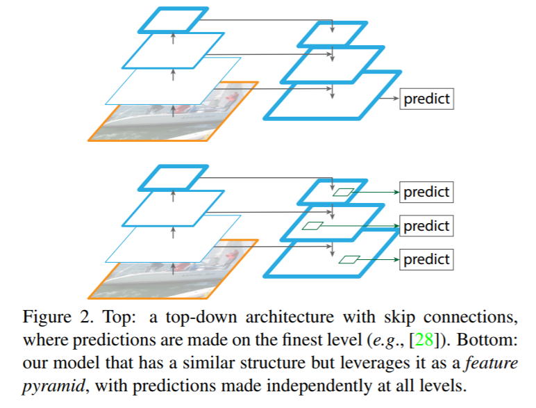

# Feature Pyramid Networks for Object Detection

[TOC]

## 摘要

​        **特征金字塔**是识别系统中用于检测**不同尺寸**目标的基本组件。但最近的深度学习目标检测器已经避免了金字塔表示，部分因为它们是**计算和内存** **密集型**的。在本文中，我们利用深度卷积网络**内在的多尺寸**、**金字塔分层**来构造具有很少额外成本的特征金字塔。开发了一种具有**侧向连接**的**自顶向下**(top-down)架构，用于在**所有尺寸**上构建**高级语义特征图**。这种架构,称为特征金字塔网络(FPN); 在几个应用程序中作为**通用特征提取器**表现出了显著的提升。在一个基本的Faster R-CNN系统中使用FPN，没有花里胡哨，我们的方法可以在COCO检测基准数据集上取得state-of-the-art单模型结果，**超过了所有现有的单模型记录**，包括COCO 2016挑战赛的获奖者。此外，我们的方法可以在**单GPU**上以**6FPS**运行，因此是**多尺寸目标检测**的实用和准确的解决方案。代码将公开发布。

论文地址： <https://arxiv.org/pdf/1612.03144.pdf>

## 1. 引言

​       识别不同尺寸的目标是计算机视觉中的一个基本挑战。建立在**图像金字塔**之上的特征金字塔(我们简称为**特征化图像金字塔**-featurized image pyramids)构成了标准解决方案的基础[1] (图Figure 1(a))。这些金字塔是尺寸不变的，因而**目标的尺寸变化**是通过**在金字塔中移动它的层级**来弥补的。直观地说，该属性使模型能够通过在**位置**和**金字塔层级**上扫描,来检测**很大范围尺寸**的目标。

​        特征化图像金字塔在手工设计的时代被大量使用[5，25]。它们非常关键，以至于像DPM[7]这样的目标检测器需要**密集的尺寸采样**才能获得好的结果(例如每组10个尺寸)。对于识别任务，工程特征大部分已经被深度卷积网络(ConvNets)[19，20]计算的特征所取代。除了能够表示更高级别的语义，ConvNets对于尺寸变化也更加鲁棒，从而有助于从**单一输入尺寸上计算的特征**进行识别[15,11,29] (图Figure 1(b))。但即使有这种鲁棒性，**获取最准确的结果**，仍**需要金字塔**。在ImageNet[33]和COCO[21]检测挑战中，最近的所有排名靠前的记录，都使用了**特征化图像金字塔** 上的 **多尺寸测试**(例如[16,35])。对图像金字塔的每个层次进行特征化的主要优势在于它产生了**多尺寸的特征表示**，其中**所有层上的语义都很强**，包括高分辨率层。

​       尽管如此，**特征化**图像金字塔的**每个层**有**明显的局限性**。**预测时间显著增加**(例如，四倍[11])，使得这种方法在实际应用中不可行。此外，在图像金字塔上端到端地训练深度网络在**内存**而言是**不可行的**，所以如果采用该方法，图像金字塔**仅在测试时使用**[15，11，16，35]，这造成了**训练/测试**时预测的**不一致性**。出于这些原因，Fast和Faster R-CNN[11，29]选择**默认不使用特征化图像金字塔**。

​        但是，图像金字塔并不是计算多尺寸特征表示的唯一方法。深层ConvNet逐层计算特征层级，**通过下采样层**，特征层级具有**内在的多尺寸** **金字塔形状**。这种网内特征层级产生不同空间分辨率的特征图，但引入了由不同深度引起的较大的**语义差异**。高分辨率特征图有**低级特征**，**影响了其目标识别表示能力**。

​       Single Shot Detector(SSD)[22]是首先尝试使用ConvNet的金字塔特征层级中的一个，就像它是一个特征化的图像金字塔(图Figure 1(c))。理想情况下，SSD类的金字塔将**重用**前向传播中计算的**不同层中的多尺寸特征图**，因此是**零成本**的。但为了避免使用低级特征，SSD放弃重用已经计算好的特征图，而从网络的**高层开始构建金字塔**(例如，VGG网络的conv4_3[36])，然后**添加几个新层**。因此它**错过了重用** 特征层级中**高分辨率特征图**的机会。我们证明这对于**检测小目标很重要**。

​        本文的目标是**自然地利用**ConvNet特征层级的金字塔形状，同时创建一个在**所有尺寸上**都具有**强大语义信息**的特征金字塔。为了实现这个目标，我们依赖于一种结构，它将**低分辨率、强语义**的特征 和 **高分辨率、弱语义**的特征 通过**自顶向下**的路径和**侧向连接** 组合在一起(图Figure 1(d))。其结果是一个特征金字塔，在**所有层级**都具**有丰富的语义信息**，并且可以从**单尺寸的输入图像**上进行快速构建。换句话说，我们展示了如何创建**网络内**(in-network)的**特征金字塔**，可以用来代替 **特征化图像金字塔**，而**不牺牲表示能力，速度或内存**。

​        最近的研究[28，17，8，26]中流行采用**自顶向下**和跳跃连接(skip connetion)的类似架构。他们的目标是生成**单个**有**高级特征**的**高分辨率特征图**，并在其上进行预测(图Figure 2顶部)。相反，我们的方法利用这个架构作为特征金字塔，其中预测(例如目标检测)在每个级别上独立进行(图2底部)。我们的模型反映了一个特征化的图像金字塔，这在这些研究中还没有探索过。

​        我们评估了我们的方法:称为特征金字塔网络(FPN)，其在各种用于检测和分割[11，29，27]系统中。没有任何花里胡哨，我们在具有挑战性的COCO检测基准数据集上报告了最新的单模型结果，仅仅基于FPN和基本的Faster R-CNN检测器[29]，就超过了所有现存的严重工程化的单模型的**竞赛获奖者的记录**。在消融实验中，我们发现对于**提议边框**，FPN将**平均召回率**(AR)显著的提升了**8个百分点**；对于目标检测，它将COCO类的**精度**(AP)提高了2.3个百分点，PASCAL类AP提高了3.8个百分点，超过了较强的**单尺寸模型**基线: 基于ResNet[16]的Faster R-CNN。我们的方法也很容易扩展到掩码提议框(mask proposals)，改进实例分隔AR, 并且速度超过 严重依赖图像金字塔的state-of-the-art方法。

另外，我们的金字塔结构可以通过所有尺寸进行端到端培训，并且在训练/测试时一致地使用，这在使用图像金字塔时是内存不可行的。因此，FPN能够比所有现有的state-of-the-art方法获得更高的准确度。此外，这种改进是在不增加单尺寸基准测试时间的情况下实现的。我们相信这些进展将有助于未来的研究和应用。我们的代码将公开发布。

## 关于我们

我司正招聘文本挖掘、计算机视觉等相关人员，欢迎加入我们；也欢迎与我们在线沟通任何关于数据挖掘理论和应用的问题；

在长沙的朋友也可以线下交流, 坐标: 长沙市高新区麓谷新长海中心 B1栋8A楼09室

公司网址：http://www.embracesource.com/

Email: mick.yi@embracesource.com 或 csuyzt@163.com

