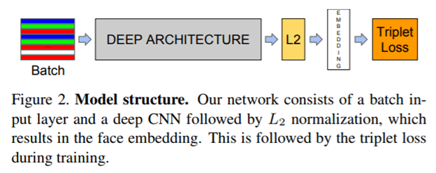
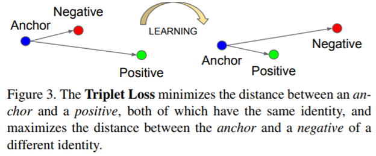
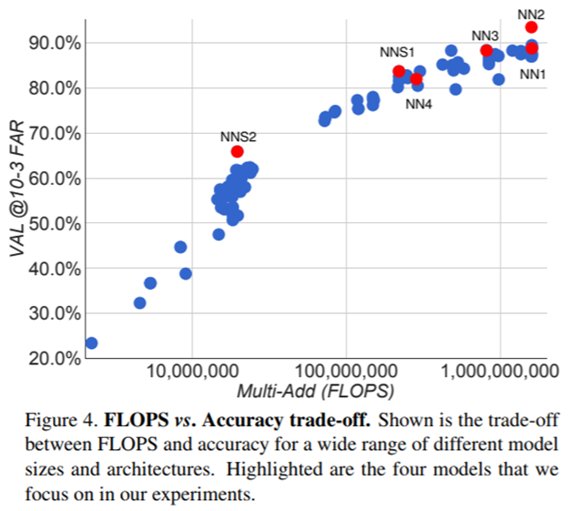
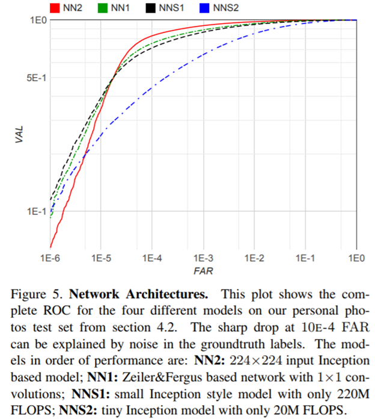
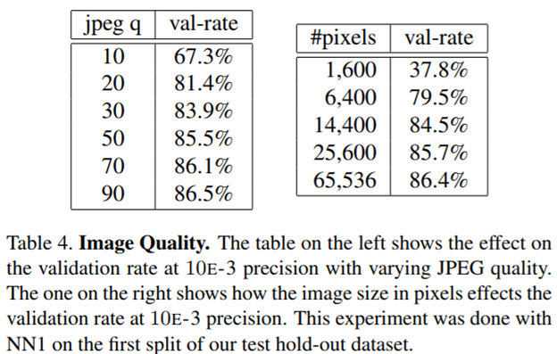
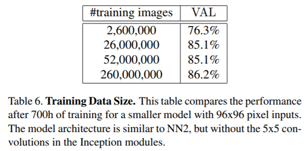
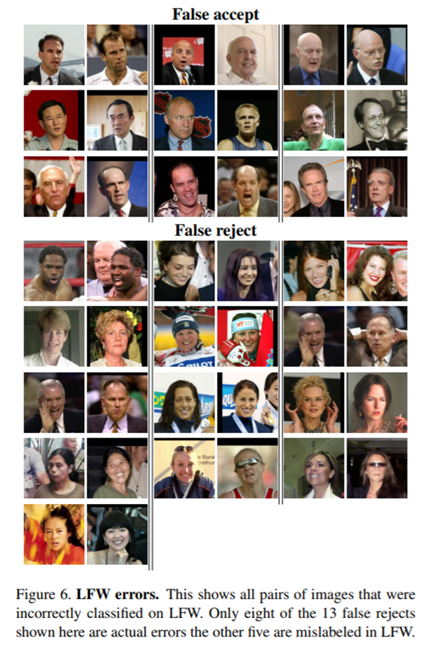
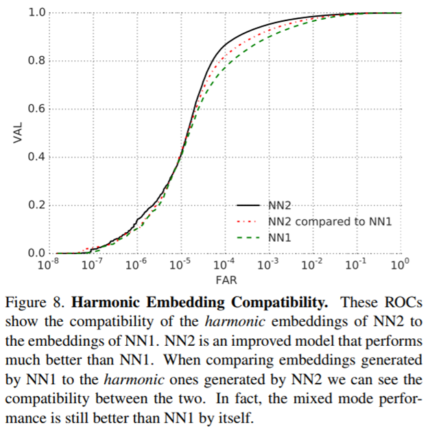
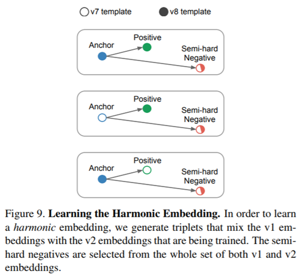
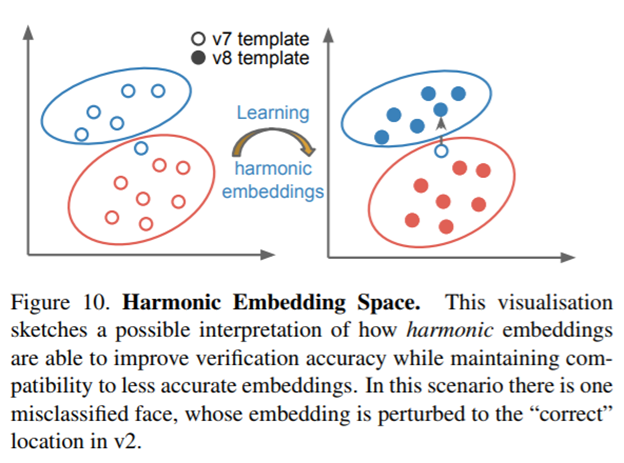

FaceNet: A Unified Embedding for Face Recognition and Clustering
================================================================

-   [简介](#FaceNet:AUnifiedEmbeddingforFaceRecogni)

-   [相关工作](#FaceNet:AUnifiedEmbeddingforFaceRecogni)

-   [方法](#FaceNet:AUnifiedEmbeddingforFaceRecogni)

    -   [Triplet 损失](#FaceNet:AUnifiedEmbeddingforFaceRecogni)

    -   [Triplet选择](#FaceNet:AUnifiedEmbeddingforFaceRecogni)

    -   [深度卷积网络](#FaceNet:AUnifiedEmbeddingforFaceRecogni)

-   [数据集和评估](#FaceNet:AUnifiedEmbeddingforFaceRecogni)

    -   [保留测试集](#FaceNet:AUnifiedEmbeddingforFaceRecogni)

    -   [私人照片](#FaceNet:AUnifiedEmbeddingforFaceRecogni)

    -   [学术数据集](#FaceNet:AUnifiedEmbeddingforFaceRecogni)

-   [实验](#FaceNet:AUnifiedEmbeddingforFaceRecogni)

    -   [计算和精度权衡](#FaceNet:AUnifiedEmbeddingforFaceRecogni)

    -   [CNN模型效果](#FaceNet:AUnifiedEmbeddingforFaceRecogni)

    -   [图像质量敏感](#FaceNet:AUnifiedEmbeddingforFaceRecogni)

    -   [嵌入维度](#FaceNet:AUnifiedEmbeddingforFaceRecogni)

    -   [训练集大小](#FaceNet:AUnifiedEmbeddingforFaceRecogni)

    -   [LFW上性能](#FaceNet:AUnifiedEmbeddingforFaceRecogni)

    -   [Youtube Faces DB上性能](#FaceNet:AUnifiedEmbeddingforFaceRecogni)

    -   [人脸聚类](#FaceNet:AUnifiedEmbeddingforFaceRecogni)

-   [总结](#FaceNet:AUnifiedEmbeddingforFaceRecogni)

-   [附录：Harmonic嵌入](#FaceNet:AUnifiedEmbeddingforFaceRecogni)

    -   [Harmonic Triplet 函数函数](#FaceNet:AUnifiedEmbeddingforFaceRecogni)

    -   [总结](#FaceNet:AUnifiedEmbeddingforFaceRecogni)

-   [参考文章](#FaceNet:AUnifiedEmbeddingforFaceRecogni)

        尽管人脸识别领域最近有显著进步[10, 14, 15,
17]，有效的实施大规模的人脸验证和识别对当前的方法存在严重的挑战。本文提出一个系统，叫FaceNet，直接学习**人脸图像**到紧密**欧式空间**的一个**映射**，欧式空间中的**距离直接度量**人脸的**相似度**。一旦这个空间产生，诸如人脸识别、验证、聚类任务可以使用标准方法轻易实现，该方法用FaceNet **embeddings**作为**特征向量**。

我们的方法使用深度卷积网络训练，**直接优化embedding本身**；而不是像之前深度学习方法，**优化**一个中间的**bottleneck层**。训练时，使用新颖的**在线triplet挖掘方法**生成大致的匹配/不匹配人脸的triplets。我们方法的好处是更有效的表示：每个人脸**仅仅使用128-bytes**，人脸识别达到了state-of-the-art性能。

        在广泛使用的**LFW**数据集上，精确性达到一个新纪录**99.63%**；在YouTube
Faces
DB上达到**95.12%**。与最好的结果[15]相比，两个数据集上**错误率**都**减少了30%**。

        我们同样会介绍harmonic embeddings和harmonic triplet
loss概念，描述不同的face embeddings版本(使用不同的网络),它们彼此兼容并可以互相直接比较。

论文地址：<https://arxiv.org/pdf/1503.03832.pdf>

简介
----

 本文提出一个统一的系统；对于**人脸认证**(是否同一个人)，**识别**(哪个人)和**聚类**(在人脸中找出相同的人)。我们的方法基于使用深度卷积网络对每张图像学习一个**欧式嵌入**。训练网络使得嵌入空间中的**L2平方距离**直接与人脸**相似性**相关：属于**同一个人**的人脸**距离小**，属于**不同人**的人脸**距离大**。

一旦嵌入产生，先前的任务变得简单：**人脸验证**就是两个嵌入之间距离的**阈值**问题；**人脸识别**变为一个**K-NN分类**问题；**人脸聚类**可用现成的**k-means**或者**层次聚类**。

以前基于深度网络人脸识别方法，使用一个分类层[15,17]，在已知人脸身份的数据集上训练，然后使用中间的**bottleneck层作为表示**来泛化到训练集之外的人脸识别。这种方法的缺点是不够直接和有效：首先**寄希望**于bottleneck表示能**足够好**的**泛化**到新的人脸；其次使用bottleneck层表示每个人脸通常需要**很大的空间**(数千维)。最近一些方法[15]使用**PCA降维**，但是这是一个**线性变换**，网络中的某层可以轻易的学到。

        与这些方法相对，FaceNet 基于LMNN
[19]中一个**triplet损失函数**直接训练输出一个**紧凑的128维嵌入**。我们的triplets
包含**两个匹配**的人脸缩略图和**一个不匹配**的人脸缩略图；损失函数的目标是通过一个距离间隔分离正样本对和负样本。缩略图是脸部区域的紧密裁剪，没有2D或3D对齐；**除了缩放**和**平移**。

  **选择哪些triplets**对于好的性能非常重要，受递进学习[1]的启发，我们采用一个新的**在线负样本挖掘**策略，确保网络训练时连续的增加triplets
的难度。为提高聚类准确度，探索困难正样本技术；促进单个人的嵌入形成球状群。

        图 Figure 1显示我们的方法可以处理难以置信的变化情况。图像对 来自PIE
[13]，先前被认为对于人脸验证系统来说**非常困难**。

        接下来的段落2回顾这个领域的文献；段落3.1定义triplet
loss，段落3.2描述triplet的选择和训练过程，段落3.3描述模型结构。段落4和5，呈现嵌入的一些定量结果，并定性地探讨了一些聚类结果。

相关工作
--------

         与最近其他使用深度网络[15,
17]的方法相似；我们的方法是一个**纯数据驱动**的方法，直接从人脸的像素学习它的表示；而**不使用工程特征**，我们使用了大量的标注人脸数据集来获得对姿态、光照以及其它情况发现变化下的合适的**不变性**。

本文探索了最近在计算机视觉社区非常成功的两个不同的深度网络架构。都是深度卷积网络[8,
11]，第一个架构基于**Zeiler&Fergus**
[22]模型，包括多个交错的卷积层，非线性激活，局部响应归一化和最大池化层。受[9]的工作启发，我们额外增加一些1×1×d卷积层。第二个架构基于Szegedy等的**Inception模型**，它最近赢得ImageNet
2014
[16]比赛。这些网络使用混合层，同时并行的跑多个不同的卷积和池化层，然后连结它们的输出结果。这些模型可以**减少参数20倍**，同时对于相当的性能，可以潜在的减少FLOPS。

 有大量的人脸验证和识别工作，回顾它们不是本文的范畴，我们仅仅简单的讨论下最相关的工作。

        [15, 17,
23]都采用一个**多阶段**的复杂系统，对于深度卷积网络的输出组合了PCA降维和SVM分类。  

        Zhenyao
等[23]使用一个深度网络将人脸“变形“为一个标准的正面视角，然后再学习一个CNN用于分类人脸到已知的人。对于人脸验证，在网络输出端使用PCA结合一个集成的SVM。

 Taigman  等[17]提出一个**多阶段**方法，对齐人脸到一个通用的3D模型。在超过4千个人上训练一个多类网络来执行人脸识别。作者同样试验了一个所谓的孪生网络，直接优化两个人脸特征之间的L1距离。LFW最好的性能(97.35)来源于一个组合了3个集成网络，使用了不同对齐和色彩通道。这些网络的预测使用非线性SVM组合。

        Sun等[14,
15]提出一个紧凑的，因而相对廉价的计算网络。集成25个这种网络，每个网络操作不同的人脸patch。最终性能在LFW(99.47%[15]),作者组合了50个响应(常规的和翻转的）。使用了对线性变换有效的PCA和联合Bayesian模型[2]。它们的方法不需要显示的2D/3D对齐。组合分类和验证的损失来训练网络，验证损失类似于我们使用的[12,19]triplet损失，最小化同一个人的人脸之间的L2距离，保证不同人的人脸之间距离间隔。主要的不同点是，**只**比较了**图像对**，而triplet损失则鼓励**相对距离**约束。

         Wang 等[18]在语义和视觉相似性排序中探索了一个类似的损失函数。

方法
----

       FaceNet使用了深度卷积网络，我们讨论两种不同的核心架构：**Zeiler&Fergus**
[22]类型网络和最近的**Inception** [16]类型网络，细节部分在段落3.3会讨论。

       给定模型细节，将它当做黑箱(见图Figure
2),我们方法最重要的部分在于**端到端**的**学习整个系统**。为此我们采用triplet损失函数，它直接影响我们在人脸验证、识别和聚类中想达到的目的。也就是说，我们使用个嵌入f(x)，将**图片x**映射到**特征空间** $\Bbb R^d$

，使得所有人脸的平方**距离**独立于**成像条件**，**同一个人**的人脸**距离小**，来自**不同人**的人脸**距离大**。

 虽然没有直接比较其他的损失函数，例如[14]中使用的样本对；我们相信triplet损失函数对于人脸验证更加合适。[14]中的损失函数动机是将同一个人的人脸投影到**嵌入空间**中的**一个点**。triplet损失函数，则试图**加强**同一人的人脸距离和不同人的人脸距离的**一个间隔**。这使得同一个的人脸可以**保持多样性**，同时加强与不同人脸的距离，因而区别其它的人的人脸。

       接来下阐述triple损失函数已经如何**大规模有效**的训练它。

### Triplet 损失

$f(x) \in \Bbb R^d$ 代表嵌入；它将一个图像x嵌入到d维欧式空间。另外，我们约束这个嵌入位于**d维超球面**，如$||f(x)||^2=1$

。这个损失函数受[19]中最邻近分类的启发。这里我们需要保证$x^a_i$

(anchor)与来自同一个人的任何图像$x^p_i$(positive)的距离比与其他人的图像$x^n_i$ (negative)都要近，如图Figure 3所示。

        因此我们希望

$$
||f(x^a_i) - f(x^p_i)||^2_2 + \alpha < ||f(x^a_i) - f(x^n_i)||^2_2 ,\quad \tag 1 \\
$$

$$
\forall (f(x^a_i), f(x^p_i), f(x^n_i)) \in \cal {T} \quad \tag 2
$$

        **α**是正样例对和负样例对的**间隔**。$\cal T$

是训练时所有可能的triplets，基数为N，因此需要最小化的损失函数L等于

$$
\sum^N_i[||f(x^a_i) - f(x^p_i)||^2_2 - ||f(x^a_i) - f(x^n_i)||^2_2 + \alpha]_+ \tag 3
$$

生成所有可能的triplets会导致很多triplets轻易满足条件(如：满足等式(1)),这些triplets对于训练没有贡献，导致收敛慢，如果它们也经过网络。**选择困难的triplets**非常关键，它们有效且对提升模型有贡献。接下来谈谈triplet选择的不同方法。

### Triplet选择

         为了保证快速收敛，选择**违反等式(1)**的triplets非常关键，这就是说，给定$x^a_i$

，我们希望选择$x^p_i$(positive)使得$arg \max_{x^p_i}||f(x^a_i) - f(x^p_i)||^2_2$

，类似的选择$x^n_i$ (negative)使得$arg \min_{x^n_i}||f(x^a_i) - f(x^n_i)||^2_2$

。

          在整个训练集计算argmin和argmax
是不可能的，此外，这不好的训练结果，因为**误标记图像**和**质量差的图像**会支配困难正样本和困难负样本。有两种方式可以避免这个问题：

-   每n步离线生成triplets,使用网络的最近的checkpoint，然后在一个子集数据中计算argmin和argmax。

-   在线生成triplets,可以在一个mini-batch中选择困难正负样本。

 这里我们关注**在线生成**，并使用一个**较大的mini-batch**,大概**数千个样本**，在一个mini-batch中计算argmin和argmax。

       为了拥有一个有意义的anchor
positive距离表示，需要确保在每个mini-batch中一个人的人脸样本数量的最小值。实验中，我们采样训练数据，每个mini-batch中的**每个人**大概有**40张**图像，另外**负样本随机**的选择到mini-batch中。

       **并非**选择**最困难**的**正样本**，我们使用mini-batch中**所有的anchor
positive对**，同时选择**困难负样本**。我们没有在一个mini-batch中同时比较困难anchor-positive对和所有anchor-positive对，但是实践中发现所有anchor
positive方法**更稳定**，并且在训练早起**收敛**稍微**快一点**。

 我们同样探索了离线生成triplet和在线生成triplet结合，这样可以使用更小的mini-batch,但是试验表明没有决定性影响。

 在实践中选择**最困难的负样本**导致训练很早陷入**局部极小值**，特别地，还会导致**模型衰退**(如：f(x)
= 0)。为了减轻这种情况，如下公式(4)帮助选择$x^n_i$

$$
||f(x^a_i) - f(x^p_i)||^2_2  < ||f(x^a_i) - f(x^n_i)||^2_2  \tag 4
$$

我们称这用负样本为**半困难**，它们与anchor的距离比正样本与anchor的远，但任然是困难的，因为平方距离**接近**anchor
positive距离。这些负样本位于间隔α内部。

之前提到，正确选择triplet对于快速收敛非常非常关键。一方面，我们想使用**小的mini-batch**,因为在SGD[20]中能够**加速收敛**；另一方面，实施细节使得几十到几百大小的batch更有效。

然而，关于**batch大小**的主要限制是我们从mini-batch中**选择困难相关triplet**的**方式**。大部分实验中，我们使用大概**1800**个样本的**batch大小**。

### 深度卷积网络

 所有的实验中使用**SGD**训练CNN，使用标准的反向传播[8,11]和AdaGrad[5]。大部分实验中，初始**学习率**为**0.05**，然后**降低**到最终模型。模型**随机初始化**，类似[16]，在一个**CPU集群**上训练**1000\~2000小时**。损失函数在训练**500小时**后**急剧下降**，但是**继续训练**任然能**显著提升性能**，**间隔α**设置为**0.2**。

 我们使用了两类架构，探索它们的权衡关系。实际上的不同在于**参数**和**FLOPS**的差异。最佳模型依赖于实际应用。如：数据中心跑的模型可以有大量参数，并需要很大的FLOPS，而移动手机上需要少量参数，这样才能载入内存中。所有的模型都使用**整流线性单**元作为激活函数。

       第一类，如表Table1,像[9]中建议的，在Zeiler&Fergus
[22]架构的标准卷积层之间增加1×1×d的卷积层，使得模型有22层深；一共**1.4亿**个**参数**，每张图需要大概**16亿FLOPS**。

       第二类使用基于GoogLeNet
类的Inception模型[16]；模型**参数小**了大概**20倍**(约660w\~700w)，**FLOPS**最大**少了5倍**(5000w\~16亿之间)。某些这类模型尺寸可以难以置信的**减小**(包括深度和filter个数)，这样它们可以在手机上运行。a)
NNS1 有2600w个参数，每张图仅仅需要2.2亿FLOPS；b) NNS2
有430w个参数，2000wFLOPS；c) 表Table 2展示了最大的网络NN2; d)
NN3架构一样，但是输入尺寸减小到160x160；e) NN4的输入尺寸只有96x96，因而极大减少cpu的需求(**2.85亿FLOPS**
vs 
NN2的16亿)。此外输入尺寸减少后，在较高层不使用5x5的卷积，因为那时感受野已经非常小。我们发现通常5x5的
卷积层可以都移除，**精度**仅仅**很小的下降**。图Figure 4比较了我们所有的模型。

数据集和评估
------------

        使用4个数据集评估我们的方法，除了LFW和Youtube
Faces；我们在**人脸验证**任务上**评估我们的方法**。如：给定包含两张图片的对，使用一个平方L2距离阈值$D(x_i, x_j)$

来决定是否同一人。所有同一个人的人脸对(i, j)记做${\cal P}_{same}$

，所有不同人的人脸对记做${\cal P}_{diff}$

；我们定义true accepts为：

$$
TA(d) = \{(i,j) \in {\cal P}_{same}, with \  D(x_i,x_j) \le d\} \tag 5
$$

         类似地定义false accept为：

$$
FA(d) = \{(i,j) \in {\cal P}_{diff}, with \  D(x_i,x_j) \le d\} \tag 6
$$

        validation rate VAL(d)和false accept rate FAR(d)定义如下：

$$
VAL(d) = \frac {|TA(d)|} {|{\cal P}_{same}|}, \quad FAR(d) = \frac {FA(d)} {|{\cal P}_{diff}|}
$$

### 保留测试集

我们保留了大概**100w**张图像，与训练集有相同的分布，但是来自不同的人(人没有交集)。将它们分为互斥的**5份**，每份**20w**张图像。FAR和VAL在**10w×10w**的图像对上计算，使用5部分的标准差。

### 私人照片

这是一个与训练集类似分布的测试集，但是经过人工校验，标签非常干净。包含3个私人照片集，一共约1.2w张图像。在**1.2w平方**个图像对象上计算FAR
和 VAL。

### 学术数据集

 LFW是人脸验证[7]事实上的学术测试集，我们按照非限制性标注外部数据的标准协议，报告了平均分类误差和均值的标注差。

         Youtube Faces DB [21]是一个在人脸识别社区[17,
15]非常流行的数据集。设置与LFW类似，但是不是使用图像对，而是视频对。

实验
----

如无特殊说明，我们使用**1亿\~2亿**个**人脸缩略图**，来自**800w**个不同的人。在每个图像上执行一个人脸检测器，为每个人脸生成一个**紧贴人脸**的**边框**。这些人脸缩略图的尺寸被**调整**为对应网络的输入大小；实验中，输入大小从96x96像素到224x224像素。

### 计算和精度权衡

在深入实验细节之前，我们先讨论**精度**和**FLOPS值**的权衡，这对特定模型是需要的。图Figure
4，在x轴显示FLOPS值，以及false accept rate
(**FAR**)为**0.001**时的精度，使用的是4.2我们标注的私人照片。非常有趣的是模型的**计算量**和**精度**有**很强的相关性**。图中高亮展示了5个模型(NN1,
NN2, NN3, NNS1, NNS2)。

我们同样观察了**精度**和模型**参数量**之间的权衡；但是没有那么明显的关系。例如，基于Inception的模型NN2达到NN1以上的精度，但是**参数少了20倍**；**FLOPS**值是**相当**的。很明显如果参数进一步减少，精度还是会下降。其它的模型结构可能在不影响精度情况下能够进一步减少参数，就像Inception
[16]中的情况。

### CNN模型效果

        现在讨论4个模型性能的详细情况。一方面使用增加了1×1卷积[22,
9]的传统的Zeiler&Fergus基础架构(见表Table
1)，另一方面使用可以极大减小模型尺寸的基于Inception[16]的模型。整体看最终两类模型的最好性能相当。但是基于Inception的模型，如NN3在**显著减少FLOPS**和**模型尺寸**的同时达到了**很好的性能**。

        在私有照片测试集上评估明细见图Figure 5.
最大的模型相对微小的模型NNS2在精度上有很大提升；后者手机上运行速度可以到达30ms每张图，并且对于人脸聚类来说进度足够了。ROC曲线中FAR
\< $10^{-4}$时进度剧烈下降表明测试数据集中有噪音；在极小的false accept

rates时，一个误标注图像都在曲线中有明显影响。

### 图像质量敏感

        表Table
4显示模型在不同**图像尺寸**上的鲁棒性。网络对于JPEG压缩表现出令人惊讶的的鲁棒性，在JPEG质量**下降20%**时**性能非常好**。性能在**120x120**像素的尺寸上**下降很少**，甚至在80x80像素时性能也可接受。这是值得注意的，因为网络在220x220的图像上训练，如果在低分辨率的人脸上训练可以进一步提升这个区间。

### 嵌入维度

 我们探索了不同的嵌入维度，最终所有实验选择了**128维**，各维度的比较见表Table
5。大家可能认为大的嵌入维度**至少不会差于**小的嵌入维度，然而，可能需要**更多的训练**来达到相同的精度。这就意味着表Table
5中的性能差异**统计上不显著**。

 值得注意的是，128维**浮点**向量可以**量化**为128**字节**，**精度**上**没有损失**；因此每个人脸被128维字节向量密集的表示，对于大规模聚类和识别非常理想。小的嵌入可能精度上稍微降低，可以在移动设备上使用。

### 训练集大小

       表Table
6展示大体量训练数据的影响；由于时间的限制，评估在一个较小的模型上运行；在更大模型上的影响可能更大。非常明显，使用使用**数千万**的样本可以在私有照片测试集上提升精度；与只有**几百万**图像比较**错误减少60%**。使用**更大体量**的数据集(几亿)任然有小的提升，但是**提升减缓**了。

### LFW上性能

在LFW上使用*非限制标注外部数据*的标准协议上评估模型。9个训练splits使用L2距离阈值，在第10个测试的split上分类(相同或不同)；对所有的测试split最优的阈值是1.242，处理第8个split(1.256)

        我们模型使用两种模式评估：

-    1：固定裁剪LFW的中心来提供缩略图

-    2：在LFW上运行一个专有的人脸检测(类似Picasa
    [3])来提供缩略图，如果失败，使用LFW 对齐

       图Figure 6给了所有失败例子的概览，顶部是**false accepts**，底部是**false
rejects**。使用**模式(1)**达到**98.87%**±0.15的精度；使用**模式(2)**精度为**99.63%**±0.09；这种方式在DeepFace[17]中减少错误7个点，在之前的DeepId2+[15]上减少了30%。这是模型NN1的性能，但是更小的NN3达到的性能也**没有统计上显著的差异**。

### Youtube Faces DB上性能

 在每个视频的**前1百帧**上采用所有对的平均相似度；分类精度为**95.12**%±0.39；使用**前1千帧**结果为**95.18**%。与[17]的91.4%相比错误率**降低约一半**；DeepId2+
[15]达到93.2%的精度，我们的模型与它比，**错误降低30%**。

### 人脸聚类

 由于**紧密的嵌入**，可以在用户私有照片集上按照人聚类图片。相比纯粹的人脸认证，人脸聚类的约束条件产生了真正令人惊讶的结果。图Figure
7展示了私人照片集上聚类的结果，使用层次聚类。非常清晰明了的展示了对遮挡、光照、姿态甚至年龄的**难以置信**的**不变性**。

总结
----

 我们提供一个方法对人脸验证直接学习到欧式空间的一个嵌入。这种方法其它使用CNN
**bottleneck 层**或者需要**额外后处理**(如连结多个模型和PCA，以及SVM分类）的方法不同，我们**端到端训练**简化了设置，直接优化一个跟任务相关的损失函数，提升了性能。

 另一个优点是，模型仅仅需要**很少的对齐**(紧贴人脸的一个裁剪)[17]，例如，执行一个复杂的3D对齐。我们同样试验了类似的转换对齐，发现可以轻微的提升性能；不是很确信是否值得增加这额外的复杂度。

 未来的工作将聚焦于更好的**理解错误的例子**，进一步提升模型；同样包括**缩小模型大小**，**减少CPU需求**。也关注怎样提升当前**极度漫长**的**训练耗时**；使用更小batch大小的课程学习的变种，离线和在线的正负样本挖掘。

附录：Harmonic嵌入
------------------

        本段介绍harmonic
嵌入的概念。指的是由不同模型v1和v2生成的一组嵌入，但是它们互相**可比较**，从这个意义上讲是**兼容**的。

这种兼容很大的简化的升级方法。如：嵌入v1是在大量数据集上计算得到的，现在一个新的嵌入模型v2要推出，兼容性确保的**平滑的转换**，无需担心版本的不兼容。图Figure
8展示了3G数据集的结果。提升的模型NN2优于NN1,**组合**NN2和NN1的**嵌入**的**性能居中**。

### Harmonic Triplet 函数函数

        为了研究harmonic
嵌入，我们混合已经学习好的v1嵌入和v2嵌入。这个在triplet损失函数内部做，额外生成的triplets促进了不同版本嵌入的兼容。图Figure
9 可视化了贡献给triplet损失函数的不同组合的triplets。

 从一个已经训练的NN2中初始化v2嵌入，然后使用促进兼容的triplet损失函数**重新训练**随机初始化的**最后一层**(嵌入层)。开始只有最后一层重新训练，然后使用harmonic损失函数**训练整个v2网络**。

         图Figure 10
展示了实际中这种兼容可能有效的解释。大部分v2的嵌入可能挨着相关的v1嵌入，但是**v1错误的嵌入**，可能**轻微的扰动**，这样新的嵌入空间位置提升了验证准确性。

### 总结

 非常有趣和惊人的是harmonic如此有效，未来工作可以探索这种**思想**能够**扩展多远**。推测在保持兼容的情况下v2嵌入提升v1嵌入的范围有一个**上限**。另外训练在手机上运行的小网络可以与较大的服务端模型**兼容**是非常有有趣的。

参考文章
--------

[1] Y. Bengio, J. Louradour, R. Collobert, and J. Weston. Curriculum learning.
In Proc. of ICML, New York, NY, USA, 2009. 2

[2] D. Chen, X. Cao, L. Wang, F. Wen, and J. Sun. Bayesian face revisited: A
joint formulation. In Proc. ECCV, 2012. 2

[3] D. Chen, S. Ren, Y. Wei, X. Cao, and J. Sun. Joint cascade face detection
and alignment. In Proc. ECCV, 2014. 7

[4] J. Dean, G. Corrado, R. Monga, K. Chen, M. Devin, M. Mao, M. Ranzato, A.
Senior, P. Tucker, K. Yang, Q. V. Le, and A. Y. Ng. Large scale distributed deep
networks. In P. Bartlett, F. Pereira, C. Burges, L. Bottou, and K. Weinberger,
editors, NIPS, pages 1232–1240. 2012. 10

[5] J. Duchi, E. Hazan, and Y. Singer. Adaptive subgradient methods for online
learning and stochastic optimization. J. Mach. Learn. Res., 12:2121–2159, July
2011. 4

[6] I. J. Goodfellow, D. Warde-farley, M. Mirza, A. Courville, and Y. Bengio.
Maxout networks. In In ICML, 2013. 4

[7] G. B. Huang, M. Ramesh, T. Berg, and E. Learned-Miller. Labeled faces in the
wild: A database for studying face recognition in unconstrained environments.
Technical Report 07-49, University of Massachusetts, Amherst, October 2007. 5

[8] Y. LeCun, B. Boser, J. S. Denker, D. Henderson, R. E. Howard, W. Hubbard,
and L. D. Jackel. Backpropagation applied to handwritten zip code recognition.
Neural Computation, 1(4):541–551, Dec. 1989. 2, 4

[9] M. Lin, Q. Chen, and S. Yan. Network in network. CoRR, abs/1312.4400, 2013.
2, 4, 6

[10] C. Lu and X. Tang. Surpassing human-level face verification performance on
LFW with gaussianface. CoRR, abs/1404.3840, 2014. 1

[11] D. E. Rumelhart, G. E. Hinton, and R. J. Williams. Learning representations
by back-propagating errors. Nature, 1986. 2, 4

[12] M. Schultz and T. Joachims. Learning a distance metric from relative
comparisons. In S. Thrun, L. Saul, and B. Schölkopf, editors, NIPS, pages 41–48.
MIT Press, 2004. 2

[13] T. Sim, S. Baker, and M. Bsat. The CMU pose, illumination, and expression
(PIE) database. In In Proc. FG, 2002. 2

[14] Y. Sun, X. Wang, and X. Tang. Deep learning face representation by joint
identification-verification. CoRR, abs/1406.4773, 2014. 1, 2, 3

[15] Y. Sun, X. Wang, and X. Tang. Deeply learned face representations are
sparse, selective, and robust. CoRR, abs/1412.1265, 2014. 1, 2, 5, 8

[16] C. Szegedy, W. Liu, Y. Jia, P. Sermanet, S. Reed, D. Anguelov, D. Erhan, V.
Vanhoucke, and A. Rabinovich. Going deeper with convolutions. CoRR,
abs/1409.4842, 2014. 2, 3, 4, 5, 6, 10

[17] Y. Taigman, M. Yang, M. Ranzato, and L. Wolf. Deepface: Closing the gap to
human-level performance in face verification. In IEEE Conf. on CVPR, 2014. 1, 2,
5, 7, 8, 9

[18] J. Wang, Y. Song, T. Leung, C. Rosenberg, J. Wang, J. Philbin, B. Chen, and
Y. Wu. Learning fine-grained image similarity with deep ranking. CoRR,
abs/1404.4661, 2014. 2

[19] K. Q. Weinberger, J. Blitzer, and L. K. Saul. Distance metric learning for
large margin nearest neighbor classification. In NIPS. MIT Press, 2006. 2, 3

[20] D. R. Wilson and T. R. Martinez. The general inefficiency of batch training
for gradient descent learning. Neural Networks, 16(10):1429–1451, 2003. 4

[21] L. Wolf, T. Hassner, and I. Maoz. Face recognition in unconstrained videos
with matched background similarity. In IEEE Conf. on CVPR, 2011. 5

[22] M. D. Zeiler and R. Fergus. Visualizing and understanding convolutional
networks. CoRR, abs/1311.2901, 2013. 2, 3, 4, 6

[23] Z. Zhu, P. Luo, X. Wang, and X. Tang. Recover canonicalview faces in the
wild with deep neural networks. CoRR, abs/1404.3543, 2014. 2

 

 

## 关于我们

我司正招聘文本挖掘、计算机视觉等相关人员，欢迎加入我们；也欢迎与我们在线沟通任何关于数据挖掘理论和应用的问题；

在长沙的朋友也可以线下交流, 坐标: 长沙市高新区麓谷新长海中心 B1栋8A楼09室

公司网址：http://www.embracesource.com/

Email: mick.yi@embracesource.com 或 csuyzt@163.com

