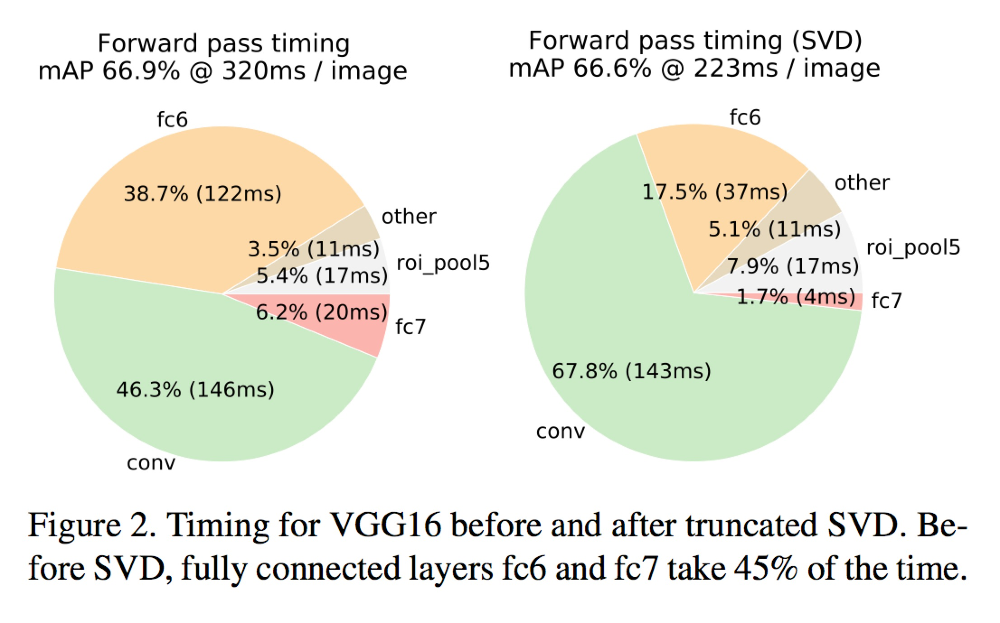
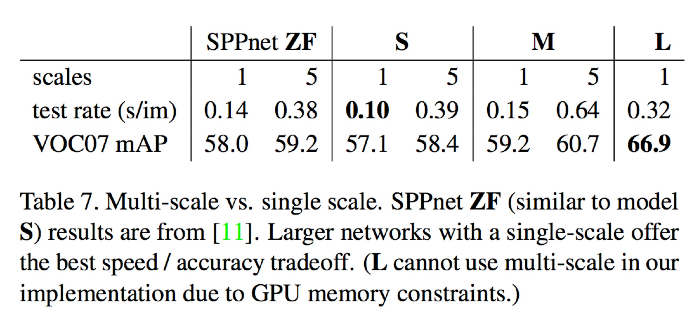
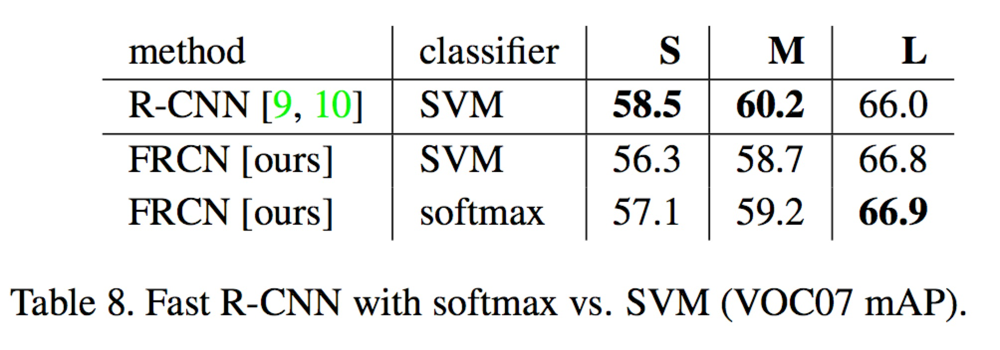

Fast R-CNN
=====

[TOC]

​        本文提出了一种快速的**基于Region**的卷积网络方法(Fast R-CNN)用于目标检测。Fast R-CNN建立在以前使用的深卷积网络**有效地分类目标proposals**的成果上。相比于之前的工作，Fast R-CNN使用了很多创新，**提升了训练和测试速度**，同时也**提高检测精度**。Fast R-CNN**训练**非常深的VGG16网络比R-CNN**快9倍**，**测试快213倍**，并在PASCAL VOC上得到更高的精度。与**SPPnet相比**，Fast R-CNN**训练**VGG16网络比它**快3倍**，**测试速度快10倍**，并且**更准确**。Fast R-CNN的Python和C ++(使用Caffe)实现,以MIT开源许可证发布在: https://github.com/rbgirshick/fast-rcnn。

Fast R-CNN论文地址：<https://arxiv.org/pdf/1504.08083.pdf>。

依赖知识
--------

    a ) 已经熟悉R-CNN

    b )  了解预训练、迁移学习

​    c )  了解奇异值分解(SVD)

知识点
------

###  ROI

 ROI(region of interest)，感兴趣区域。机器视觉、图像处理中，从被处理的图像以方框、圆、椭圆、不规则多边形等方式勾勒出需要处理的区域，称为感兴趣区域，ROI。

### end-to-end

  端到端指的是输入是原始数据，输出是最后的结果。细分有端到端训练和端到端模型。

参考：<https://www.zhihu.com/question/51435499/answer/129379006>

### Spatial Pyramid Pooling

     Spatial Pyramid Pooling
空间金字塔池化。传统CNN中的全连接层需要输入是固定大小。在图像处理中，原始图片大小不一；经过卷积后大小还是不同，这样没有办法直接接入全连接层。

这是一个传统的网络架构模型，5层卷积层，这里的卷积层叫做convolution和pooling层的联合体，统一叫做卷积层，后面跟随全连接层。我们这里需要处理的就是在网络的全连接层前面加一层金字塔pooling层解决输入图片大小不一的情况。我们可以看到这里的spatital pyramid pooling layer就是把前一卷积层的feature maps的每一个图片上进行了3个卷积操作。最右边的就是原图像，中间的是把图像分成大小是4的特征图，最右边的就是把图像分成大小是16的特征图。那么每一个feature map就会变成16+4+1=21个feature maps。这不就解决了特征图大小不一的状况了吗？

详见：[空间金字塔池化阅读笔记](http://blog.csdn.net/liyaohhh/article/details/50614380)

论文：[Spatial Pyramid Pooling in Deep Convolutional Networks.pdf](https://arxiv.org/pdf/1406.4729.pdf)

## 1. 介绍

​        最近，深度卷积网络[14,16]已经显著提高了图像分类[14]和目标检测[9,19]的准确性。与图像分类相比，目标检测是一个更具挑战性的任务，需要更复杂的方法来解决。由于这种复杂性，当前的方法(如，[9,11,19,25])采用多阶段pipeline的方式训练模型，又慢又不优雅。

​        复杂性的产生是因为检测需要目标的精确定位，这就导致两个主要的挑战。首先，必须处理大量候选目标定位(通常称为“proposals”)。 第二，这些候选框仅提供粗略定位，其必须提炼以实现精确定位。 这些问题的解决方案经常会影响速度，准确性或简单性。

​       在本文中，我们简化了最先进的基于卷积网络的目标检测器的训练过程[9,11]。我们提出一个单阶段训练算法，联合学习object proposals分类和改善他们的空间位置。

​        由此产生的方法可以训练非常深的检测网络(VGG16[20]) , 比R-CNN[9]快9倍，比SPPnet[3]快3倍。在运行时，检测网络在PASCAL VOC 2012数据集上实现最高精度，其中mAP为66％(vs R-CNN的62％)，每张图像处理时间为0.3秒，不包括候选框的生成(所有的时间都是使用一个超频875MHz的Nvidia K40 GPU测试的)。

### 1.1. R-CNN和SPPnet

​        

​       基于Region的卷积网络方法(RCNN)通过使用深度卷积网络来分类目标proposals，获得了非常好的目标检测精度。然而，R-CNN具有显着的缺点：

1. **训练过程是多阶段pipeline。**R-CNN首先在目标proposals上对卷积神经网络使用log损失进行精调。然后，它将卷积神经网络得到的特征送入SVM。 这些SVM作为目标检测器，替代通过精调学习的softmax分类器。 在第三个训练阶段，学习边框回归器。
2. **训练在时间和空间上是的开销很大。**对于SVM和边框回归训练，从每个图像中的每个目标proposal提取特征，并写入磁盘。对于非常深的网络，如VGG16，对于VOC07 trainval上的5k个图像，这个过程在单个GPU上需要2.5天。这些特征需要数百GB的存储空间。
3. **目标检测速度很慢。**在测试时，从每个测试图像中的每个目标候选框提取特征。用VGG16网络检测目标每个图像需要47秒(在单GPU上)。

​        R-CNN很慢是因为它为每个目标proposal进行卷积神经网络正向传递，而没有共享计算。SPPnet[11]通过共享计算加速R-CNN。SPPnet[11]计算整个输入图像的卷积特征图，然后使用从共享特征图提取的特征向量来对每个候选框进行分类。通过最大池化将候选框内的特征图转化为固定大小的输出(例如，6X6)来提取针对候选框的特征。多个输出尺寸被池化，然后连接成空间金字塔池[15]。SPPnet在测试时将R-CNN加速10到100倍。由于更快的候选框特征提取，训练时间也减少3倍。          

​        SPP网络也有显著的缺点。像R-CNN一样，训练过程是一个多阶段pipeline，涉及提取特征，使用log损失对网络进行精调，训练SVM分类器，最后拟合边框回归。特征也写入磁盘。但与R-CNN不同，在[11]中提出的精调算法不能更新在空间金字塔池化层之前的卷积层。不出所料，这限制(固定的卷积层)限制了深层网络的精度。

### 1.2. 贡献

​        我们提出一种新的训练算法，解决R-CNN和SPPnet的不足之处，同时提高它们速度和精度 。因为它能比较快地进行训练和测试，我们称之为Fast R-CNN。Fast RCNN方法有以下几个优点：

1. 比R-CNN和SPPnet具有更高的检测精度(mAP)。
2. 训练是使用多任务损失(multi-task)的单阶段过程。
3. 训练可以更新所有网络层参数。
4. 不需要磁盘空间缓存特征。

​       Fast R-CNN使用Python和C++(Caffe[13])语言编写，以MIT开源许可证发在：<https://github.com/rbgirshick/fast-rcnn>。

## 2.Fast R-CNN 架构和训练

​        图figure 1 展示了Fast R-CNN的结构。Fast R-CNN网络将整个图像和一组目标proposals作为输入。网络首先使用几个卷积层(conv)和最大池化层来处理整个图像，以产生卷积特征图。然后，对于每个目标proposal，RoI池化层从特征图中提取固定长度的特征向量。每个特征向量被送入一系列全连接(fc)层中，其最终分支成两个同级输出层 ：一个输出K个类别加上1个背景类别的Softmax概率估计，另一个为K个类别的每一个类别输出四个实数值。每个4值组编码了改善K个类别中一个类别的边框定位。

### 2.1.  RoI 池化层

​        RoI池化层使用最大池化将**任何有效的RoI内**的**特征**转换成**H×W**(例如，7×7)的**固定空间范围**的小特征图，其中H和W是层的超参数，独立于任何特定的RoI。在本文中，RoI是卷积特征图中的一个**矩形窗口**。 每个RoI由指定其**左上角(r,c)**及其**高度**和**宽度**(h,w)的**四元组(r,c,h,w)**定义。

​       RoI最大池化通过将大小为h×w的RoI窗口分割成H×W个网格子窗口，子窗口大小约为h/H×w/W，然后对每个子窗口执行最大池化，并将最大值输出到相应的输出网格单元中。同标准的最大池化一样，池化操作独立应用于每个特征图通道。RoI层只是SPPnets[11]中使用的空间金字塔池层的特殊情况，其**只有一个金字塔层**。 我们使用[11]中给出的池化子窗口计算方法。

### 2.2. 从预训练网络初始化

​        我们实验了三个预训练的ImageNet[4]网络，每个网络有5个最大池化层和5~13个卷积层(网络详细信息，请参见4.1节)。当预训练网络初始化fast R-CNN网络时，其经历3个转换。

​       首先，最后的最大池化层由RoI层代替，其将H和W设置为与网络的第一个全连接层兼容的配置(例如，对于VGG16，H=W=7)。

​       然后，网络的最后1个全连接层和Softmax(被训练用于1000类ImageNet分类)被替换为前面描述的两个同级层(1个全连接层和K+1个类别的Softmax以及类别相关的边框回归器)。

​       最后，网络被修改为接收两个数据输入：图像列表和这些图像的RoI列表。

### 2.3. 检测精调

​        用反向传播训练**所有网络权重**是Fast R-CNN的重要能力。首先，让我们阐明为什么SPPnet**无法更新**低于空间金字塔池化层的权重。

​        根本原因是当每个训练样本(即RoI)来**自不同的图像时**，通过SPP层的反向传播是**非常低效**的，这正是训练R-CNN和SPPnet网络的方法。低效源于每个RoI可能具有**非常大的感受野**，通常跨越**整个输入图像**。由于正向传播必须处理整个感受野，训练输入很大(通常是整个图像)。

​        我们提出了一种更有效的训练方法，利用训练期间的**特征共享**。在Fast RCNN网络训练中，随机梯度下降(SGD)的小批量是被**分级采样**的，首先采样**N个图像**，然后从每个图像采样**R/N个 RoI**。关键的是，来自同一图像的RoI在向前和向后传播中**共享计算和内存**。减小N，就减少了mini-batch的计算。例如，当N=2和R=128时，我们提出的训练方式比从**128张不同的图像**采样一个RoI(即R-CNN和SPPnet的策略)**大概快64倍**。

​        这个策略的一个令人担心的问题是它可能**导致训练收敛变慢**，因为**来自相同图像的RoI是相关的**。这个问题似乎在**实际情况下并不存在**，当N=2和R=128时，我们使用**比R-CNN更少的SGD迭代**就获得了很好的效果。

​        除了分级采样，Fast R-CNN使用了一个简化的训练过程，在精调阶段**联合优化** S**oftmax分类器**和**边框回归器**，而不是分别在三个独立的阶段训练softmax分类器，SVM和回归器[9,11]。下面将详细描述该过程(损失，mini-batch采样策略，通过RoI池化层的反向传播和SGD超参数)。

#### 多任务损失

​         Fast R-CNN网络具有两个同级输出层。 第一个输出在K+1个类别上的离散概率分布(每个RoI)，p=(p0,…,pK)。 通常，通过在全连接层的K+1个输出上使用Softmax来计算p。第二个输出层输出边框回归偏移，$t^k=(t_x^k,t_y^k,t_w^k,t_h^k)$ ， 对于K个类别中的任一个，由k索引。 我们使用[9]中给出的$t^k$的参数化，其中$t^k$指定相对于候选框的**尺寸不变平移**和**对数空间高度/宽度移位**。

​        每个训练的RoI用**groud-truth类别u**和**groud-truth边框回归目标v**标记。我们对每个标记的RoI使用多任务损失LL以联合训练分类和检测框回归： 
$$
L(p,u,t^u,v)=L_{cls}(p,u) + \lambda[u \ge 1]L_{loc}(t^u,v) ,\tag 1
$$

​      $L_{cls}(p,u)=-logp_u$ 是ground-truth类别u的对数损失函数。第二个损失$L_{loc}$是定义在ground-truth类别u上边框回归目标元组$v=(v_x,v_y,v_w,v_y)$和预测元组$t^u=(t_x^u,t_y^u,t_w^u,t_h^u)$上的损失。 艾佛森括号指示函数[u≥1]当u≥1的时候为值1，否则为0。按照惯例，背景类标记为u=0。对于背景RoI，没有ground-truth边框，因此$L_{loc}$被忽略。对于检测框回归，我们使用损失:
$$
L_{loc}=\sum_{i \in \{x,y,w,h\}} smooth_{L1}(t_i^u - vi) \tag 2
$$
 其中：
$$
smooth_{L1}(x)=\begin{cases}
0.5x^2 \ \ \ if \ |x|<1 \\
|x|-0.5 \ \ \  otherwise  \tag 3
\end{cases}
$$
是鲁棒的L1损失，对于噪声没有R-CNN和SPPnet中使用的L2损失那么敏感。当回归目标无界时，L2损失的训练可能需要仔细调整学习速率，以防止爆炸梯度。公式(3)消除了这种敏感度。

​        公式(1)中的超参数λ控制两个任务损失之间的平衡。我们将ground-truch回归目标$v_i$归一化为具有零均值和单位方差。所有实验都使用λ=1。

​        我们注意到[6]使用相关损失来训练一个类别无关的目标proposal网络。 与我们的方法不同的是[6]倡导一个分离定位和分类的双网络系统。OverFeat[19]，R-CNN[9]和SPPnet[11]也训练分类器和边框定位器，但是这些方法使用分阶段训练，这对于Fast RCNN来说不是最好的选择(见5.1节)。

#### Mini-batch采样

​        在精调期间，每个SGD mini-batch由N=2个图像构成，均匀地随机选择(如通常的做法，我们实际上迭代数据集的排列)。 我们使用大小为R=128的mini-batch，从每个图像采样64个RoI。 如在[9]中，我们从目标proposals中获取25％的RoI，这些proposals与ground-truth的IoU至少为0.5。 这些RoI只包括用前景对象类标记的样本，即u≥1。 剩余的RoI从与ground-truth的最大IoU在区间[0.1,0.5)上的proposal 中采样; 这些是背景样本，并用u=0标记。0.1的阈值下限作为困难负样本挖掘的启发式采样[8]。 在训练期间，图像以0.5概率水平翻转。没有使用其他数据增强。

#### 通过RoI池化层的反向传播

​        反向传播通过RoI池化层。为了清楚起见，我们假设每个mini-batch(N=1)只有一个图像，扩展到N>1是显而易见的，因为前向传播独立地处理所有图像。

​        令$x_i \in \Bbb R$是到RoI池化层的第i个激活输入，并且令$y_{rj}$是来自第r个RoI层的第j个输出。RoI池化层计算$y_{rj}=x_{i*(r,j)}$，其中$x_{i*(r,j)}=argmax\ _{i^′ \in \cal R(i,j)}\ x_{i^′} $。$\cal R(i,j)$是输出单元最大池化的子窗口中的输入的索引集合。单个$x_i$可以被分配给几个不同的输出$y_{rj}$。
$$
\frac {\partial L} {\partial x_i} = \sum_r \sum_j [i = i *(r,j)] \frac {\partial L} {\partial y_{rj}}   \tag 4
$$
​       换句话说，对于每个mini-batch, RoI r和对于每个池化输出单元$y_{rj}$，如果i是$y_{rj}$通过最大池化argmax选择的，则将这个偏导数$\partial L/\partial y_{rj}$积累下来。在反向传播中，偏导数$\partial L/\partial y_{rj}$已经由RoI池化层顶部的层的反向传播函数计算。

#### SGD超参

​        Softmax分类和检测框回归使用的全连接层的权重,分别使用具有方差0.01和0.001的零均值高斯分布初始化。偏置初始化为0。所有层的权重学习率为1倍的全局学习率，偏置为2倍的全局学习率，全局学习率为0.001。 当对VOC07或VOC12 trainval训练时，我们运行SGD进行30k次mini-batch迭代，然后将学习率降低到0.0001，再训练10k次迭代。当我们训练更大的数据集，我们运行SGD更多的迭代，如下文所述。 使用0.9的动量和0.0005的参数衰减(权重和偏置)。

### 2.4. 尺寸不变性

​        我们探索两种实现尺寸不变对象检测的方法：(1)通过“brute force”学习和(2)通过使用图像金字塔。 这些策略遵循[11]中的两种方法。 在“brute force”方法中，在训练和测试期间以**预定义的像素大小**处理每个图像。网络必须**直接从训练数据学习**尺寸不变性目标检测。

​        相反，多尺寸方法通过图像金字塔向网络提供近似尺寸不变性。 在测试时，图像金字塔用于大致缩放-规范化每个候选框。 在多尺寸训练期间，我们**每次随机采样**金字塔尺寸的**一张图像**，遵循[11]，作为数据增强的一种方式。由于GPU内存限制，我们只对较小的网络进行多尺寸训练。

## 3. Fast R-CNN detection

​        一旦Fast R-CNN网络精调完成，检测相当于运行前向传播(假设候选框是预先计算的)。网络将图像(或图像金字塔，编码为图像列表)和R个候选框的列表作为输入来打分。在测试的时候，R通常在2000左右，虽然我们将考虑将它变大(约45k)的情况。当使用图像金字塔时，每个RoI被缩放，使其最接近[11]中的$224^2$个像素。

​        对于每个测试的RoI r，正向传播输出类别后验概率分布p和相对于r的预测的检测框偏移集合(K个类别都又自己的修正检测框预测)。对于每个对象类别k，我们使用估计的概率$Pr(class=k|r)≜p_k$作为r的检测置信度。然后，我们使用R-CNN中算法的设置对每个类别独立执行非最大抑制[9]。

 

### 3.1. 用Truncated SVD 来更快检测

​        对于整个图像分类，与卷积层相比，计算全连接层花费的时间较小。相反，对于检测，由于要处理的RoI的数量很大，接近一半的正向传播时间用于计算全连接层(参见图 Fig 2)。大的全连接层容易通过用Truncateed SVD压缩来加速[5,23]。

​       在这种技术中，在这种技术中，由u×v权重矩阵W参数化的层近似因式分解为：
$$
W≈U \Sigma_tV^T \tag 5
$$

​       在这种分解中，U是一个u×t的矩阵，包括W前t个左奇异向量，$\Sigma_t$是t×t对角矩阵，其包含W前t个奇异值，V是v×t矩阵，包括W的前t个右奇异向量。Truncated SVD将参数计数从uv减少到t(u+v)个，如果t远小于min(u,v)，则SVD可能是重要的。 为了压缩网络，对应于W的单个全连接层由两个全连接层替代，在它们之间没有非线性。这些层中的第一层使用权重矩阵$\Sigma_t V^T$(没有偏置)，第二层使用U(其中原始偏差与W相关联)。当RoI的数量大时，这种简单的压缩方法获得很好的加速效果。

## 4. 主要成果

三个主要成果支持本文的贡献：

1. VOC07，2010和2012的最高的mAP。
2. 相比R-CNN，SPPnet，快速训练和测试。
3. 精调VGG16中卷积层提升了mAP。

### 4.1. 实验装置

​        我们的实验使用了三个经过预训练的ImageNet网络模型，这些模型可以在线获得(<https://github.com/BVLC/caffe/wiki/Model-Zoo>)。第一个是来自R-CNN[9]的CaffeNet(实质上是AlexNet[14])。 我们将这个CaffeNet称为模型**S**，即小模型。第二网络是来自[3]的VGG_CNN_M_1024，与**S**的深度相同，但是更宽。 我们把这个网络模型称为**M**，即中等模型。最后一个网络是来自[20]的非常深的VGG16模型。由于这个模型是最大的，我们称之为**L**。在本节中，所有实验都使用单尺寸训练和测试(s=600，详见5.2节)。

### 4.2. VOC 2010 和 2012 上结果

 

​      如上表(Table 2，Table 3)所示，在这些数据集上，我们比较Fast R-CNN(简称FRCN)和公共排行榜中comp4(外部数据)上的主流方法。对于NUS_NIN_c2000和BabyLearning，由于没有对外公布，目前无法获知其卷积网络架构的确切信息，它们是Network-in-Network的变体[17]。所有其他方法使用相同的预训练VGG16网络初始化。

​       Fast R-CNN在VOC12上获得最好的效果，mAP为65.7％(加上额外数据为68.4％)。它也比其他方法快两个数量级，这些方法都基于比较“慢”的R-CNN 管道方式。在VOC10上，SegDeepM [25]获得了比Fast R-CNN更高的mAP(67.2％对比66.1％)。SegDeepM使用VOC12 trainval训练集训练并添加了分割的标注，它被设计为通过使用马尔可夫随机场来推理R-CNN检测和来自O$\small 2$P[1]的语义分割方法的分割来提高R-CNN精度。Fast R-CNN可以替换SegDeepM中使用的R-CNN，这可以导致更好的结果。当使用放大的07++12训练集(见Table 2标题)时，Fast R-CNN的mAP增加到68.8％，超过了SegDeepM。

### 4.3. VOC 2007 上结果

​        在VOC07数据集上，我们比较Fast R-CNN与R-CNN和SPPnet的mAP。 所有方法从相同的预训练VGG16网络开始，并使用边框回归。 VGG16 SPPnet结果由[11]的作者提供。SPPnet在训练和测试期间使用5种尺寸。Fast R-CNN对SPPnet的改进表明，即使Fast R-CNN使用单尺寸训练和测试，精调卷积层很大的提升了mAP(从63.1％到66.9％)。R-CNN的mAP为66.0％。 还有一小点，SPPnet在PASCAL中没有使用被标记为“困难”的样本进行训练。 除去这些样本，Fast R-CNN 的mAP为68.1％。 所有其他实验都使用被标记为“困难”的样本。

### 4.4. 训练和预测耗时

​         快速的训练和测试是我们的第二个主要成果。Table 4比较了Fast RCNN，R-CNN和SPPnet之间的训练时间(小时)，测试速率(每张图像用多少秒)和VOC07上的mAP。对于VGG16，没有使用TruncatedSVD的Fast R-CNN处理图像比R-CNN快146倍，带Truncated SVD的比R-CNN快213倍。训练时间减少9倍，从84小时减少到9.5小时。与SPPnet相比，没有Truncated SVD的Fast RCNN训练VGG16网络比SPPnet快2.7倍(9.5小时对25.5小时)，测试时间快7倍，带Truncated SVD的Fast RCNN比的SPPnet快10倍。 Fast R-CNN还不需要数百GB的磁盘存储，因为它不缓存特征。

#### Truncated SVD

​       Truncated SVD可以将检测时间减少30％以上，同时在mAP中只有很小(0.3个百分点)的下降，并且无需在模型压缩后执行额外的精调。

​       图Fig 2展示了，如何使用来自VGG16的fc6层中的25088×4096矩阵的顶部256个奇异值和来自fc7层的4096×4096矩阵的顶部256个奇异值减少运行时间，mAP只有少许损失。如果在压缩之后再次精调，则可以在mAP更小的下降的情况下进一步加速。

### 4.5. 精调哪些层

​        对于在SPPnet论文[11]中考虑的不太深的网络，仅精调全连接层似乎足以获得良好的精度。我们假设这个结果不适用于非常深的网络。为了验证精调卷积层对于VGG16的重要性，我们使用Fast R-CNN精调，但冻结十三个卷积层，以便只有全连接层学习。这种消融模拟单尺寸SPPnet训练，将mAP从66.9％降低到61.4％(表5)。这个实验验证了我们的假设：通过RoI池化层的训练对于非常深的网是重要的。

## 5. 设计评估

​        我们进行了实验，以了解Fast R-CNN与R-CNN和SPPnet的比较，以及评估设计决策。遵循最佳实践，我们在PASCAL VOC07数据集上进行了这些实验。

### 5.1 多任务训练有帮助吗？

​        多任务训练是方便的，因为它避免管理顺序训练任务的pipeline。但它也有可能改善效果，因为任务通过共享的表示(ConvNet)[2]相互影响。多任务训练能提高Fast R-CNN中的目标检测精度吗？

​        为了测试这个问题，我们训练仅使用公式(1)中的分类损失$L_{cls}$(即设置λ=0)的基准网络。这些基线是Table 6中每组的第一列。请注意，这些模型没有边框回归。接下来(每组的第二列)，是我们采用多任务损失(公式(1)(1)，λ=1)训练的网络，但是我们在测试时禁用边框回归。这隔离了网络的分类准确性，并允许与基准网络的同类的比较。

​        在所有三个网络中，我们观察到多任务训练相对于单独的分类训练提高了纯分类精度。改进范围从+0.8到+1.1 个mAP点，显示了多任务学习一致的积极的影响。

​        最后，我们采用基线模型(仅使用分类损失进行训练)，加上边框回归层，并使用$L_{loc}$训练它们，同时保持所有其他网络参数冻结。每组中的第三列显示了这种逐级训练方案的结果：mAP相对于第一列改进，但逐级训练表现不如多任务训练(每组第四列)。

### 5.2. 尺寸不变性：暴力破解还是使用技巧？

​        我们比较实现尺寸不变物体检测的两种策略：brute-force(单尺寸)和图像金字塔(多尺寸)。在任一情况下，我们将图像的尺寸s定义为其最短边的长度。

​        所有单尺寸实验使用s=600像素，对于一些图像，s可以小于600，因为我们缩放图像时保持长宽比，并限制其最长边为1000像素。选择这些值使得VGG16在精调时不至于GPU内存不足。较小的模型占用显存更少，所以可受益于较大的s值。然而，每个模型的优化不是我们的主要的关注点。我们注意到PASCAL图像是384×473像素的，因此单尺寸设置通常以1.6倍上采样图像。因此，RoI池化层的平均步长实际上为约10像素。

​        在多尺寸设置中，我们使用[11]中相同的五个尺寸(s∈{480,576,688,864,1200})以方便与SPPnet进行比较。但是，最长边不超过2000像素，避免GPU内存不足。

​        Table 7显示了当使用一个或五个尺寸进行训练和测试时的模型S和M的结果。也许在[11]中最令人惊讶的结果是单尺寸检测几乎与多尺寸检测一样好。我们的研究结果能证实了他们的结论：深度卷积网络擅长直接学习尺寸不变性。多尺寸方法消耗大量的计算时间仅带来了很小的mAP增加(Table 7)。在VGG16(模型L)的情况下，我们受限于实施细节仅能使用单尺寸。然而，它得到了66.9％的mAP，略高于R-CNN的66.0％[10]，尽管R-CNN名义上使用“无限的”尺寸，因为每个候选区域被缩放为标准大小。

​        由于单尺寸处理提供速度和精度之间的最佳折衷，特别是对于非常深的模型，本小¬节以外的所有实验使用单尺寸训练和测试，s=600像素。

### 5.3. 需要更多数据吗？

​        当提供更多的训练数据时，好的目标检测器应该会得到改善。 Zhu et al.[24]发现DPM[8]mAP在只有几百上千个训练样本的时候就饱和了。在这里我们使用VOC12 trainval增广VOC07 trainval训练集，大约增加到三倍的图像，数量达到16.5k，以评估Fast R-CNN。扩大训练集提高了VOC07测试的mAP，从66.9％到70.0％(Table 1)。 当对这个数据集进行训练时，我们使用60k次mini-batch迭代而不是40k。

​        我们对VOC10和2012进行类似的实验，我们用VOC07 trainval，test和VOC12 trainval构造了21.5k图像的数据集。当训练这个数据集时，我们使用100k次SGD迭代, 每40k次迭代(而不是每30k次)降低学习率10倍。对于VOC10和2012，mAP分别从66.1％提高到68.8％和从65.7％提高到68.4％。

### 5.4. SVMs比softmax好？

​        Fast R-CNN在精调期间使用softmax分类器学习，而不是像R-CNN和SPPnet中训练线性SVM。为了理解这种选择的影响，我们在Fast R-CNN中实施了带困难负采样挖掘的SVM训练。使用与R-CNN中相同的训练算法和超参数。

​       Table 8显示，对于所有三个网络，Softmax略优于SVM，mAP分别提高了0.1和0.8个点。这种影响很小，但是它表明与先前的多阶段训练方法相比，“一次性”精调是足够的。我们注意到Softmax，不像SVM那样，在分类RoI时引入类间的竞争。

### 5.5. 更多proposals总是更好么？

​       存在(广义地)两种类型的目标检测器：使用候选框(object proposals)的稀疏集合(例如，selective search[21])和使用密集集合(例如DPM[8])。分类稀疏提议框是级联的一种类型[22]，其中提议机制首先拒绝大量候选者，留下很小一部分集合让分类器来评估。当应用于DPM检测时，这种级联提高了检测精度[21]。我们发现提议框分类器级联也提高了Fast R-CNN的精度。

​        使用selective search的质量模式，每个图像扫描1k到10k个候选框，每次重新训练和重新测试模型M.如果候选框扮演纯粹计算的角色，增加每个图像的候选框数量不应该损害mAP。

​        我们发现mAP上升，然后随着提议框数量增加而略微下降(Fig3，蓝色实线)。这个实验表明，用更多提议框对于深度分类起没有帮助，甚至稍微损害精度。

​        如果不实际运行实验，这个结果很难预测。最先进的度量提议框质量的技术是平均召回率(AR)[12]。当对每个图像使用固定数量的提议框时，在所有几种R-CNN的方法中，AR与mAP相关性很好。图Fig 3示出了当每个图像的候选区域数量变化时，AR(红色实线)与mAP不相关。AR必须小心使用，由于更多的提议框有更高的AR并不意味着mAP会增加。幸运的是，使用模型M的训练和测试需要不到2.5小时。因此，Fast R-CNN能够高效地，直接地评估提议框mAP，这比代理度量要好。

​        我们还研究了Fast R-CNN使用密集生成边框(在尺寸，位置和宽高比上)，大约每张图45k个框。这个密集集合足够丰富，当每个selective search边框被其接近的(在IoU上)密集边框替换时，mAP只降低1个点(到57.7％，图Fig 3，蓝色三角形)。(说明selective search边框质量更高)

​        密集边框的统计与selective search框的统计不同。从2k个selective search边框开始，我们在中随机添加1000×{2,4,6,8,10,32,45}个密集边框，测试mAP。对于每个实验，我们重新训练和重新测试模型M。当添加这些密集边框时，mAP比添加更多selective search边框时下降得更多，最终达到53.0％。

​        我们还训练和测试Fast R-CNN只使用密集边框(45k/图像)。此时的mAP为52.9％(蓝色菱形)。最后，我们检查带困难样本挖掘的SVM是否需要密集边框分布。 SVM做得更糟：49.3％(蓝色圆圈)。

### 5.6. MS COCO上初步效果

​        我们将fast R-CNN(使用VGG16)应用于MS COCO数据集[18]，以建立初步基线。我们对80k图像训练集进行了240k次迭代训练，并使用评估服务器对“test-dev”集进行评估。 PASCAL标准下的mAP为35.9％;。新的COCO标准下(也在IoU阈值上平均)为19.7％。

## 6. 总结

​        本文提出Fast R-CNN，一个对R-CNN和SPPnet干净，快速的更新。 除了报告state-of-the-art的检测结果之外，我们还提供了详细的实验，希望提供新的见解。 特别值得注意的是，稀疏目标提议框似乎提高了检测器的质量。 过去探索这个问题过于昂贵(在时间上)，但Fast R-CNN使其变得可能。当然，可能存在尚未发现的技术，使得密集边框像稀疏提议框一样表现好。这样的方法一旦发现，可以帮助进一步加速目标检测。

## 参考文献

1. [1]  J. Carreira, R. Caseiro, J. Batista, and C. Sminchisescu. Se- mantic segmentation with second-order pooling. In ECCV, 2012. 5 
2. [2]  R. Caruana. Multitask learning. Machine learning, 28(1), 1997. 6 
3. [3]  K. Chatfield, K. Simonyan, A. Vedaldi, and A. Zisserman. Return of the devil in the details: Delving deep into convo- lutional nets. In BMVC, 2014. 5 
4. [4]  J. Deng, W. Dong, R. Socher, L.-J. Li, K. Li, and L. Fei- Fei. ImageNet: A large-scale hierarchical image database. In CVPR, 2009. 2 
5. [5]  E. Denton, W. Zaremba, J. Bruna, Y. LeCun, and R. Fergus. Exploiting linear structure within convolutional networks for efficient evaluation. In NIPS, 2014. 4 
6. [6]  D. Erhan, C. Szegedy, A. Toshev, and D. Anguelov. Scalable object detection using deep neural networks. In CVPR, 2014. 3 
7. [7]  M.Everingham,L.VanGool,C.K.I.Williams,J.Winn,and A. Zisserman. The PASCAL Visual Object Classes (VOC) Challenge. IJCV, 2010. 1 
8. [8]  P. Felzenszwalb, R. Girshick, D. McAllester, and D. Ra- manan. Object detection with discriminatively trained part based models. TPAMI, 2010. 3, 7, 8 
9. [9]  R. Girshick, J. Donahue, T. Darrell, and J. Malik. Rich fea- ture hierarchies for accurate object detection and semantic segmentation. In CVPR, 2014. 1, 3, 4, 8 
10. [10]  R. Girshick, J. Donahue, T. Darrell, and J. Malik. Region- based convolutional networks for accurate object detection and segmentation. TPAMI, 2015. 5, 7, 8 
11. [11]  K.He,X.Zhang,S.Ren,andJ.Sun.Spatialpyramidpooling in deep convolutional networks for visual recognition. In ECCV,2014. 1,2,3,4,5,6,7 
12. [12]  J. H. Hosang, R. Benenson, P. Dolla ́r, and B. Schiele. What makes for effective detection proposals? arXiv preprint arXiv:1502.05082, 2015. 8 
13. [13]  Y.Jia,E.Shelhamer,J.Donahue,S.Karayev,J.Long,R.Gir- shick, S. Guadarrama, and T. Darrell. Caffe: Convolutional architecture for fast feature embedding. In Proc. of the ACM International Conf. on Multimedia, 2014. 2 
14. [14]  A. Krizhevsky, I. Sutskever, and G. Hinton. ImageNet clas- sification with deep convolutional neural networks. In NIPS, 2012. 1, 4, 6 
15. [15]  S. Lazebnik, C. Schmid, and J. Ponce. Beyond bags of features: Spatial pyramid matching for recognizing natural scene categories. In CVPR, 2006. 1 
16. [16]  Y. LeCun, B. Boser, J. Denker, D. Henderson, R. Howard, W. Hubbard, and L. Jackel. Backpropagation applied to handwritten zip code recognition. Neural Comp., 1989. 1 
17. [17]  M. Lin, Q. Chen, and S. Yan. Network in network. In ICLR, 2014. 5 
18. [18]  T. Lin, M. Maire, S. Belongie, L. Bourdev, R. Girshick, J. Hays, P. Perona, D. Ramanan, P. Dolla ́r, and C. L. Zit- nick. Microsoft COCO: common objects in context. arXiv e-prints, arXiv:1405.0312 [cs.CV], 2014. 8
19. [19]P. Sermanet, D. Eigen, X. Zhang, M. Mathieu, R. Fergus, and Y. LeCun. OverFeat: Integrated Recognition, Localiza- tion and Detection using Convolutional Networks. In ICLR, 2014. 1, 3 
20. [20] K. Simonyan and A. Zisserman. Very deep convolutional networks for large-scale image recognition. In ICLR, 2015. 1, 5
21. [21] J. Uijlings, K. van de Sande, T. Gevers, and A. Smeulders. Selective search for object recognition. IJCV, 2013. 8 
22. [22] P.ViolaandM.Jones.Rapidobjectdetectionusingaboosted cascade of simple features. In CVPR, 2001. 8 
23. [23] J. Xue, J. Li, and Y. Gong. Restructuring of deep neural network acoustic models with singular value decomposition. In Interspeech, 2013. 4
24. [24] X. Zhu, C. Vondrick, D. Ramanan, and C. Fowlkes. Do we need more training data or better models for object detec- tion? In BMVC, 2012. 7
25.  [25] Y. Zhu, R. Urtasun, R. Salakhutdinov, and S. Fidler. segDeepM: Exploiting segmentation and context in deep neural networks for object detection. In CVPR, 2015. 1, 5 

## 关键点

     Proposal RoI投影计算方法 $$x^‘ = \lfloor \frac x S\rfloor  $$  ; 其中$$x^‘$$是ROI在特征图Feature Map中的横坐标，x时RoI在原图中的横坐标;S是所有卷积层和池化层步长strides的乘积，纵坐标也是同样的计算方法。ROI在Feature Map中对应的区域后，就做RoI 最大池化转为固定长度的特征向量。

疑问点
------

1：4.4节中“Further speed-ups are possi- ble with smaller drops in mAP if one fine-tunes again after compression. ”。 压缩后再精调会加快检查速度么？

 

 

## 关于我们

我司正招聘文本挖掘、计算机视觉等相关人员，欢迎加入我们；也欢迎与我们在线沟通任何关于数据挖掘理论和应用的问题；

在长沙的朋友也可以线下交流, 坐标: 长沙市高新区麓谷新长海中心 B1栋8A楼09室

公司网址：http://www.embracesource.com/

Email: mick.yi@embracesource.com 或 csuyzt@163.com

