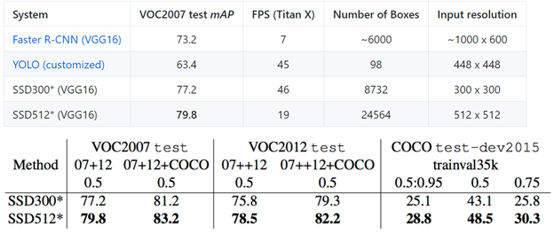
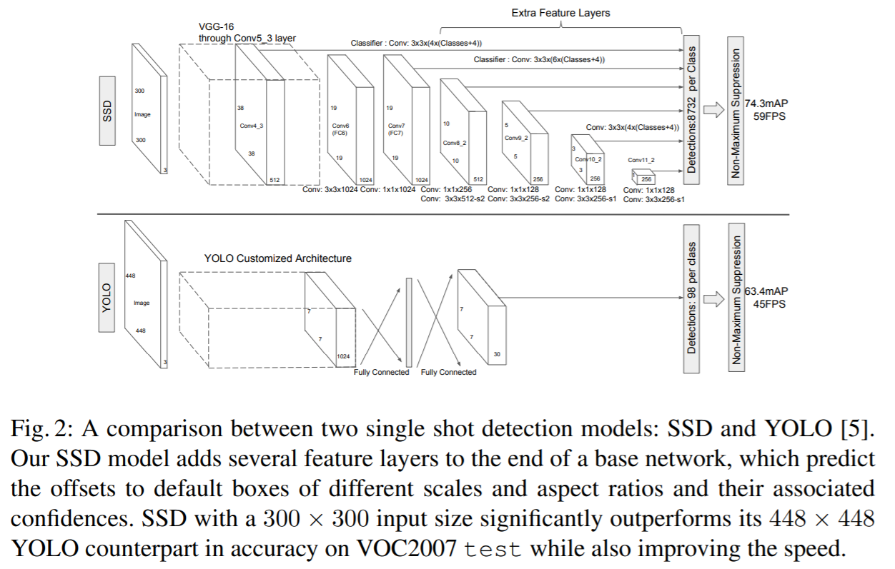
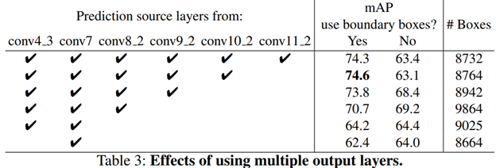

SSD-Single Shot MultiBox Detector
=================================

[TOC]

           

​         本文使用单个深度神经网络来做目标检测。我们的方法称为SSD;将bounding
boxes输出离散化为在每个feature
map上的一组不同长宽比及不同尺寸的一组默认边框。相对于需要对象提议的方法，SSD非常简单，因为它完全消除了提案生成和随后的像素或特征重新采样阶段，并将所有计算封装在单个网络中。

           在 prediction 阶段：计算出每一个 default box
中的物体，其属于每个类别的可能性，即 score，得分。如对于 PASCAL VOC
数据集，总共有 20 类，那么得出每一个 bounding box 中物体属于这 20
个类别的每一种的可能性。同时，要对这些 bounding boxes 的 shape
进行微调，以使得其符合物体的
外接矩形。还有就是，为了处理相同物体的不同尺寸的情况，SSD 结合了不同分辨率的
feature maps 的 predictions。

           相对于那些需要 object proposals 的检测模型，本文的 SSD 方法完全取消了
proposals generation、pixel resampling 或者 feature resampling
这些阶段。这样使得 SSD 更容易去优化训练，也更容易地将检测模型融合进系统之中。

           在 PASCAL VOC、MS COCO、ILSVRC 数据集上的实验显示，SSD
在保证精度的同时，其速度要比用 region proposals 的方法要快很多。SSD
相比较于其他单结构模型（YOLO），SSD
取得更高的精度，即是是在输入图像较小的情况下。如输入 300×300 大小的 PASCAL VOC
2007 test 图像，在 Titan X 上，SSD 以 58 帧的速率，同时取得了 72.1% 的
mAP。如果输入的图像是 500×500，SSD 则取得了 75.1% 的 mAP，比目前最 state-of-art
的 Faster R-CNN 要好很多。

 

 

参考：[Understanding SSD MultiBox — Real-Time Object Detection In Deep
Learning](https://towardsdatascience.com/understanding-ssd-multibox-real-time-object-detection-in-deep-learning-495ef744fab) 、[SSD:Single Shot MultiBox Detector深度学习笔记之SSD物体检测模型](http://www.sohu.com/a/168738025_717210)

论文地址:  <https://arxiv.org/pdf/1512.02325.pdf>

工程地址：<https://github.com/weiliu89/caffe/tree/ssd>

 

依赖知识
--------

1：熟悉图像分类网络

2：熟悉目标检测技术：Faster R-CNN, YOLO

 

网络结构
--------

### 基础网络

      本文的 Base network 是基于VGG16，在ILSVRC CLS-LOC数据集上进行了预训练。

a) 将VGG中的 FC6 layer、FC7 layer 转成为卷积层，并从模型的 FC6、FC7
上的参数，进行下采样得到这两个卷积层的参数。

b) 将Pool5 layer的参数，从 2×2−s2 转变成
3×3−s1;但是这样变化后，会改变感受野（receptive field）的大小。因此，采用了atrous
convolution(就是[空洞卷积](/confluence/pages/createpage.action?spaceKey=tybbdbsrp&title=FCN%26&linkCreation=true&fromPageId=10485860))的技术。

c) 并删除fc8 layer和所有的dropout层。

d) 增加了4个卷积层。

e) 使用用SGD 精调；学习率 0.001 , momentum 0.9 ,  weight decay 0.0005, batch
size 32

### 多尺寸特征图检测

      使用不同的卷积层来预测；卷积层的大学逐步减少，可以在不同的scales上预测。

### 卷积器检测

      可以使用一系列 convolutional filters，去产生一系列固定大小的
predictions。对于一个大小为  m×n  ，具有 p 通道的特征层，使用的 convolutional
filters 就是  3×3×p 的 kernels来预测类别和边框值。

### Default boxes-默认边框

     将一组默认边框default box与不同层的feature map cell关联。假设每个feature
map cell有k个default box，那么对于每个default
box都需要预测c个类别score和4个offset，那么如果一个feature
map的大小是m×n，也就是有m\*n个feature map cell，那么这个feature
map就一共有（c+4)\*k\*m\*n 个输出。

     注：default box与Faster R-CNN中的anchor类似。不过SSD将default
box应用在多个feature map上

### 训练过程

#### 匹配策略

      a) 对每个ground truth box找jaccard
overlap(就是[IOU-交并比](/confluence/pages/viewpage.action?pageId=9773751#YOLO工程测试-youonlylookonce-IoU))最高的default
box。

      b) default boxes如果在任一个ground truth box的jaccard overlap大于阈值0.5。

      以上两种情况可以匹配的default boxes就是候选的样本;其中完全匹配ground
truth的是正样本，其它是负样本。

#### 训练目标

$$
L(x,c,l,g) = \frac 1 N (L_{conf}(x,c) + \alpha L_{loc}(x,l,g)) \ \ \ \ (1) \\
L_{loc}(x,l,g) = \sum^N_{i \in Pos} \sum_{m \in \{cx,cy,w,h\}} x^k_{ij} smooth_{L1}(l^m_i - \hat g^m_i) \\
\hat g^{cx} = (g^{cx}_j - d^{cx}_i)/d^w_i \ \ \ \ \ \  \hat g^{cy} = (g^{cy}_j - d^{cy}_i)/d^h_i \\
\hat g^w_j = log( \frac {g^w_j} {d^w_i}) \ \ \ \ \ \  \hat g^h_j = log(\frac {g^h_j} {d^h_j}) \\
\ \ \\
L_{conf}(x, c) = - \sum^N_{i \in Pos} x^p_{ij}log(\hat c^p_i) \ \ \ where \ \ \  \hat c^p_i = \frac {exp(c^p_i)} {\sum_p exp(c^p_i)}
$$

#### 困难负样本挖掘

 在匹配策略完成后，产生的负样本会远远大于正样本；使用负样本中分类置信度损失函数最高的那些样本作为真正的负样本；选择的数目使得正负样本比例1：3。

### 预测过程

     对生成大量的 bounding boxes，首先通过设置 confidence
的阈值为  0.01  ，我们可以过滤掉大多数的 boxes；然后对每一类使用jaccard
overlap阈值0.45 来做Non-maximum
suppression（NMS）；对每张图片保留最佳的200个检测结果。

关键点
------

### default boxes尺寸和长宽比

a) 尺寸

       那么default box的scale（大小）和aspect
ratio（横纵比）要怎么定呢？假设我们用m个feature maps做预测，那么对于每个featuer
map而言其default box的scale是按以下公式计算的

$s_k = s_{min} + \frac {s_{max} -s_{min}} {m - 1}(k -1), \ \ k \in [1, m]$

这里smin是0.2，表示最底层的scale是0.2；smax是0.9，表示最高层的scale是0.9。

b) 长宽比

aspect ratio，用ar表示为下式：注意这里一共有5种aspect ratio；

$a_r \in \{1, 2, 3, 1/2 , 1/3 \}$

; 宽度

$w^a_k = s_k \sqrt a_r$

；高度

$h^a_k = s_k / \sqrt a_r$

。另外当aspect ratio为1时，作者还增加一种scale的default box：

$s^‘_k = \sqrt{s_k s_{k+1}}$

。

这样对于么个feature map cell有6中可选的default box。

 

c) 中心

每个 的中心坐标为$(\frac {i+0.5} {|f_k|}, \frac {j+0.5} {|f_k|})$

；$|f_k|$

是方形feature map的尺寸大小，$i,j \in [0, |f_k|)$

最后会得到（38\*38\*4 + 19\*19\*6 + 10\*10\*6 + 5\*5\*6 + 3\*3\*4 +
1\*1\*4）= 8732个boxes；不是所有层feature map都使用6种default boxes。

### 数据增广

每一张训练图像，随机的进行如下几种选择采样：

-   使用原始的图像

-   随机采样一个 patch(CropImage)，与物体之间最小的 jaccard overlap
    为：0.1，0.3，0.5，0.7 或 0.9。(这里的物体ojbects是? GT还是图片？)

-   随机采样一个 patch(CropImage)

采样的 patch 是原始图像大小比例是 [0.1，1.0]，aspect ratio 在 0.5 到 2之间。当
groundtruth box 的 中心（center）在采样的 patch 中时，我们保留重叠部分。

 

最后，将采样resize到固定大小，并以0.5的概率水平翻转。

实验结果
--------

### 数据增广非常关键

        mAP有8.8%的提升。

### 更多 default box形状效果更佳

      从上图Table 2看效果。

### Atrous 卷积更快

         atrous空洞卷积能够加快20%的速度

### 不同分辨率的输出层效果更佳

疑问点
------

      1) 在困难负样本挖掘中“Instead of using all the negative examples, we sort
them using the highest confidence loss for each default box and pick the top
ones so that the ratio between the negatives and positives is at most
3:1”。使用分类置信度损失函数排序，这里是训练阶段损失函数的参数还为得到，如何排序？是使用的交叉进行的方式么？

困难负样本挖掘的前向传播过程参数是单独训练的，其参数与后面进行的prior
box回归与分类参数无关。困难负样本挖掘是在独立为match步骤后的default
box做正负样本分类，进行一次前向传播，将负样本按loss贡献排序，优先选择loss贡献大的负样本，使得正负样本比例是1:3。

      2）没有明确说明何为正样本论文， “For example, we have matched two default
boxes with the cat and one with the dog, which are treated as positives and the
rest as negatives”；匹配是怎样的？

论文章节2.2Matching strategy 中提到下文：

*We begin by matching each ground truth box to the default box with the best jaccard overlap (as in MultiBox [7]). Unlike MultiBox, we then match default boxes to any ground truth with jaccard overlap higher than a threshold (0.5). This simplifies the learning problem, allowing the network to predict high scores for multiple overlapping default boxes rather than requiring it to pick only the one with maximum overlap.*

意思是，先从groudtruth出发，将与groudtruth**最匹配**的default
box放入**候选正样本集；**再从default box出发，将与ground
truthIOU **\>0.5** 的default box放入**候选正样本集。**

Faster RCNN中正样本选取也是利用的该方法，论文中原文描述如下：

We assign a positive label to two kinds of anchors: (i) the anchor/anchors with
the highest Intersection-overUnion(IoU)overlapwithaground-truthbox,or(ii)an
anchor that has an IoU overlap higher than 0.7 with any ground-truth box.

 

 

