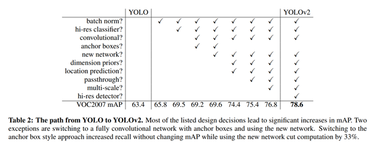
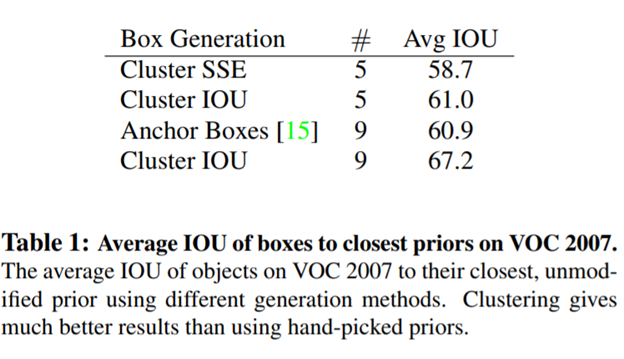
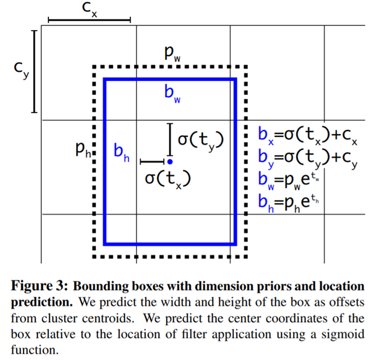
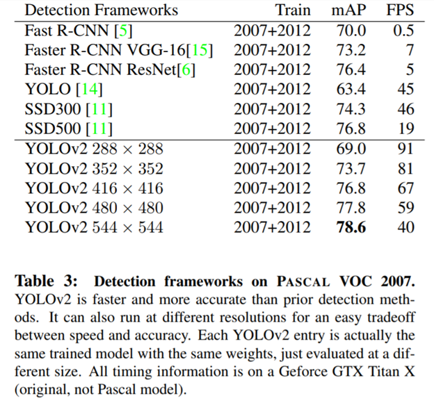
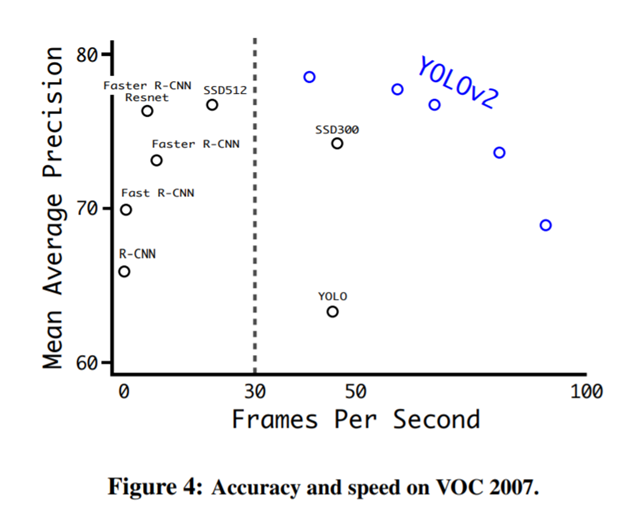
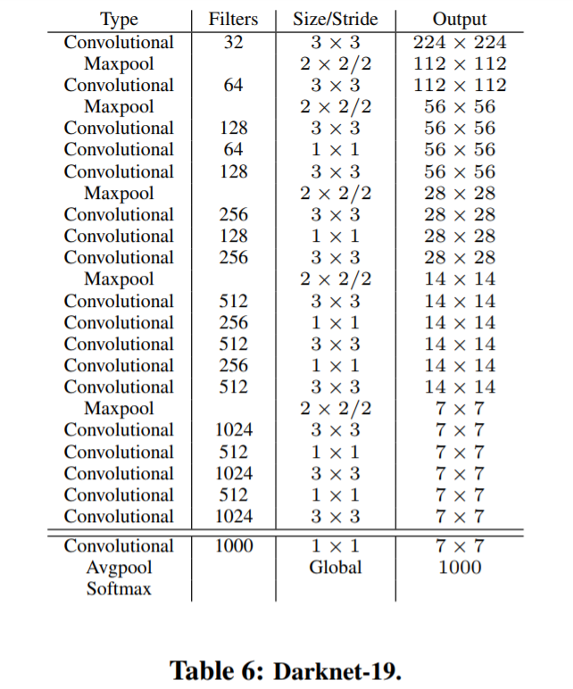

YOLO9000 Better Faster Stronger
===============================

[TOC]

        

​          YOLO 是一个最先进的实时对象检测系统。 在一个Titan X GPU上，它以40-90
FPS的速度处理图像，在数据集VOC 2007的mAP值为78.6％，在数据COCO
test-dev上的mAP值为48.1％。

1.  YOLO9000是可以检测超过9000种类别的实时检测系统。首先，作者在YOLO基础上进行了一系列的改进，产生了YOLOv2。YOLOv2在PASCAL
    VOC和COCO数据集上获得了目前最好的结果（state of the art）。

2.  然后，采用多尺度训练方法，YOLOv2可以根据速度和精确度需求调整输入尺寸。67FPS时，YOLOv2在VOC2007数据集上可以达到76.8mAP；40FPS，可以达到78.6mAP，比目前最好的Faster
    R-CNN和SSD精确度更高，检测速度更快。

3.  最后提出了目标检测和分类的共训练方法。采用该方法，作者分别在COCO目标检测数据集和ImageNet分类数据集上训练了YOLO9000。联合训练使YOLO9000可以预测没有labelled的目标检测数据。YOLO9000在ImageNet验证集（200类）上获得了19.7mAP。其中，156类没有出现在COCO训练集中，YOLO9000获得了16.0mAP。YOLO9000可以实时识别超过9000类别。

| **Model**      | **Train**     | **Test** | **mAP** | **FLOPS** | **FPS** |
| -------------- | ------------- | -------- | ------- | --------- | ------- |
| Old YOLO       | VOC 2007+2012 | 2007     | 63.4    | 40.19 Bn  | 45      |
| SSD300         | VOC 2007+2012 | 2007     | 74.3    | \-        | 46      |
| SSD500         | VOC 2007+2012 | 2007     | 76.8    | \-        | 19      |
| YOLOv2         | VOC 2007+2012 | 2007     | 76.8    | 34.90 Bn  | 67      |
| YOLOv2 544x544 | VOC 2007+2012 | 2007     | 78.6    | 59.68 Bn  | 40      |
| Tiny YOLO      | VOC 2007+2012 | 2007     | 57.1    | 6.97 Bn   | 207     |
|                |               |          |         |           |         |
| SSD300         | COCO trainval | test-dev | 41.2    | \-        | 46      |
| SSD500         | COCO trainval | test-dev | 46.5    | \-        | 19      |
| YOLOv2 608x608 | COCO trainval | test-dev | 48.1    | 62.94 Bn  | 40      |
| Tiny YOLO      | COCO trainval | \-       | \-      | 7.07 Bn   | 200     |

 

 

官网地址：<https://pjreddie.com/darknet/yolo/>

论文地址：<https://arxiv.org/pdf/1612.08242.pdf>

参考：[YOLO9000 -
PR023](https://www.slideshare.net/JinwonLee9/pr12-yolo9000)、[YOLO升级版：YOLOv2和YOLO9000解析](https://zhuanlan.zhihu.com/p/25052190)

 

简介
----

目标检测系统要求快速，准确以及能识别大范围种类数量。但是，目前基于深度神经网络方法的目前检测系统能识别的物品种类较少。其原因在于：相对于物品分类数据集，目标检测数据集中的物品种类较少。标记目标识别数据集所耗费的精力远大于标记物品分类数据集。物品分类数据集包含成千上万种超过数百万张图片，而目标识别数据集就很小了。

本文中，作者提出了一种结合不同类型数据集的方法。基于该方法，作者提出了一种新的联合训练方法，结合目前物品分类数据集的优点，将其应用于训练目标检测模型。模型可以从目标检测数据集中学会准确定位目标，同时从物品分类数据集中学会识别更多的种类，增强模型的鲁棒性。

采用该方法，作者训练了可以识别超过9000种物品的实时目标检测与识别系统-YOLO9000。首先，作者在YOLO的基础上进行了改进，产生了YOLOv2（获得了state
of the
art）。然后，作者采用数据集结合方法和联合训练方法，采用ImageNet和COCO数据集训练该模型，使该模型可以识别和检测
超过9000种类别。

Better-更好
-----------

YOLO一代有很多缺点，作者希望改进的方向是:改善recall，提升定位的准确度，同时保持分类的准确度。   
       
目前计算机视觉的趋势是更大更深的网络，更好的性能表现通常依赖于训练更大的网络或者把多种model综合到一起。但是YOLO
v2则着力于简化网络。具体的改进见下表：

### Batch Normalization-批标准化

        使用Batch
Normalization对网络进行优化，让网络提高了收敛性，同时还消除了对其他形式的正则化（regularization）的依赖。通过对YOLO的每一个卷积层增加Batch
Normalization，最终使得mAP提高了2%，同时还使model正则化。使用Batch
Normalization可以从model中去掉Dropout，而不会产生过拟合。

### High Resolution Classifier-高分辨率分类器

 

目前业界标准的检测方法，都要先把分类器（classifier）放在ImageNet上进行预训练。从Alexnet开始，大多数的分类器都运行在小于256\*256的图片上。而现在YOLO从224\*224增加到了448\*448，这就意味着网络需要适应新的输入分辨率。   
        为了适应新的分辨率，YOLO
v2的分类网络以448\*448的分辨率先在ImageNet上进行Fine Tune，Fine
Tune10个epochs，让网络有时间调整他的滤波器（filters），好让其能更好的运行在新分辨率上，还需要调优用于检测的Resulting
Network。最终通过使用高分辨率，mAP提升了4%。

### Convolutional With Anchor Boxes

       YOLO采用全连接层来直接预测bounding boxes，而Fast
R-CNN采用人工选择的bounding boxes。Fast R-CNN中的 region proposal
network仅采用卷积层来预测固定的boxes（anchor boxes）的偏移和置信度。

       作者去除了YOLO的全连接层，采用固定框（anchor boxes）来预测bounding
boxes。首先，去除了一个pooling层来提高卷积层输出分辨率。然后，修改网络输入尺寸：由448×448改为416，使特征图只有一个中心。物品（特别是大的物品）更有可能出现在图像中心。YOLO的卷积层下采样率为32，因此输入尺寸变为416,输出尺寸为13×13。

       采用anchor boxes，提升了精确度。YOLO每张图片预测98个boxes，但是采用anchor
boxes，每张图片可以预测超过1000个boxes。YOLO模型精确度为69.5mAP，recall为81%；采用anchor
boxes方法后，结果为69.2mAP，recall为88%。

### Dimension Clusters-维度聚类

          之前Anchor
Box的尺寸是手动选择的，所以尺寸还有优化的余地，如果人工选择更好的boxes，可以让模型更加容易学习。
为了优化，在训练集（training set）Ground Truth
Boxes上跑了一下k-means聚类，来找到一个比较好的值。 如果我们用标准的欧式距离的k-means，尺寸大的框比小框产生更多的错误。因为我们的目的是提高IOU分数，这依赖于Box的大小，所以距离度量的使用： 

$d(box,centroid) = 1 - IOU(box,centroid)$。

          通过分析实验结果（Figure 2），左图：在model复杂性与high
recall之间权衡之后，选择聚类分类数K=5。右图：是聚类的中心，大多数是高瘦的Box。   
Table1是说明用K-means选择Anchor Boxes时，当Cluster IOU选择值为5时，AVG
IOU的值是61，这个值要比不用聚类的方法的60.9要高。选择值为9的时候，AVG
IOU更有显著提高。总之就是说明用聚类的方法是有效果的。

### Direct location prediction

        用Anchor
Box的方法，会让model变得不稳定，尤其是在最开始的几次迭代的时候。大多数不稳定因素产生自预测Box的（x,y）位置的时候；由于没有约束所以anchor
box可以是图像中任何点。按照之前YOLO的方法，网络不会预测偏移量，而是根据YOLO中的网格单元的位置来预测坐标，这就让Ground
Truth的值介于0到1之间。而为了让网络的结果能落在这一范围内，网络使用一个 Logistic
Activation来对于网络预测结果进行限制，让结果介于0到1之间。

       网络在每一个网格单元Grid Cell 中预测出5个Bounding Boxes，每个Bounding
Boxes有五个坐标值tx，ty，tw，th，t0，他们的关系见下图（Figure3）。假设一个网格单元对于图片左上角的偏移量是cx，cy，Bounding
Boxes Prior的宽度和高度是pw，ph，那么预测的结果见下图右面的公式： 

 因为使用了限制让数值变得参数化，也让网络更容易学习、更稳定。 采用聚类方法选择boxes维度和直接预测bounding
boxes中心位置提高YOLO将近5%准确率。

$$
    b_x = \sigma(t_x) + c_x \\
    b_y = \sigma(t_y) + c_y \\
    b_w = p_w e^{t_w} \\
    b_h = p_h e^{t_h} \\
    P_r(object) * IOU(b,object) = \sigma(t_o)
$$

### Fine-Grained Features-细粒度特征

        YOLO修改后的Feature
Map大小为13\*13，这个尺寸对检测图片中尺寸大物体来说足够了，同时使用这种细粒度的特征对定位小物体的位置可能也有好处。Faster
F-CNN、SSD都使用不同尺寸的Feature
Map来取得不同范围的分辨率，而YOLO采取了不同的方法，YOLO加上了一个Passthrough
Layer来取得之前的某个26\*26分辨率的层的特征。

        这个Passthrough
layer能够把高分辨率特征与低分辨率特征联系在一起，联系起来的方法是把相邻的特征堆积在不同的Channel之中，这一方法类似与Resnet的Identity
Mapping，从而把26\*26\*512变成13\*13\*2048。YOLO中的检测器位于扩展后（expanded
）的Feature Map的上方，所以他能取得细粒度的特征信息，这提升了YOLO 1%的性能。

### Multi-Scale Training-多尺度训练

 

       最初的YOLO输入尺寸为448×448，加入anchor
boxes后，输入尺寸为416×416。模型只包含卷积层和pooling
层，因此可以随时改变输入尺寸。

 训练时，每隔几轮便改变模型输入尺寸，以使模型对不同尺寸图像具有鲁棒性。每个10batches，模型随机选择一种新的输入图像尺寸（320,352,...608，32的倍数，因为模型下采样因子为32）最小320\*320，最大608\*608，改变模型输入尺寸，继续训练。

 该训练规则强迫模型取适应不同的输入分辨率。模型对于小尺寸的输入处理速度更快，因此YOLOv2可以按照需求调节速度和准确率。在低分辨率情况下（288×288），YOLOv2可以在保持和Fast
R-CNN持平的准确率的情况下，处理速度可以达到90FPS。在高分辨率情况下，YOLOv2在VOC2007数据集上准确率可以达到state
of the art（78.6mAP），如Table-3所示。

 

Faster-更快
-----------

大部分检测框架是基于VGG-16作为特征提取网络，但是VGG-16比较复杂，耗费计算量大；YOLO完成一次前向过程只用8.52
billion
运算，而VGG-16要30.69billion。YOLO框架使用了类似GoogLeNet的网络结构，计算量比VGG-16小，但YOLO精度只是稍低于VGG-16。

### Darknet-19

        YOLO v2基于一个新的分类model，有点类似与VGG。YOLO
v2使用3\*3filter，每次Pooling之后都增加一倍Channels的数量。YOLO
v2使用全局平均Pooling，使用Batch
Normilazation来让训练更稳定，加速收敛，使model规范化。   
       
最终的model:Darknet19，有19个卷积层和5个maxpooling层，处理一张图片只需要5.58
billion次运算，在ImageNet上达到72.9%top-1精确度，91.2%top-5精确度。

### 分类训练

        网络训练在 ImageNet
1000类分类数据集，训练了160epochs，使用随机梯度下降，初始学习率为0.1，
polynomial rate decay with a power of 4, weight decay 0.0005， momentum 0.9
。训练期间使用标准的数据增广方法：随机裁剪、旋转、变换颜色（hue）、变换饱和度（saturation），
变换曝光度（exposure shifts）。   
        在训练时，先在224 ×
224的图像上初始训练，然后把整个网络在更大的448\*448分辨率上Fine Turnning 10个
epoches，初始学习率设置为0.001，这种网络达到达到76.5%top-1精确度，93.3%top-5精确度。

### 检测训练

 网络去掉了最后一个卷积层，而加上了三个3\*3卷积层，每个卷积层有1024个Filters，每个卷积层紧接着一个1\*1卷积层，
Filter个数为预测需要输出数。对于VOC数据，网络预测出每个网格单元预测五个Bounding
Boxes，每个Bounding
Boxes预测5个坐标和20类，所以一共125个Filters，增加了Passthough层来获取前面层的细粒度信息。

       网络训练了160epoches，初始学习率0.001，分隔为10 ，60 和90
个epochs，weight decay  0.0005 ，momentum
0.9，数据增广方法相同，对COCO与VOC数据集的训练策略相同。

Stronger-更强健
---------------

 作者提出了将分类数据和检测数据综合的联合训练机制。该机制使用目标检测标签的数据训练模型学习定位目标和检测部分类别的目标；再使用分类标签的数据取扩展模型对多类别的识别能力。在训练的过程中，混合目标检测和分类的数据集。当网络接受目标检测的训练数据，反馈网络采用YOLOv2
loss函数；当网络接受分类训练数据，反馈网络只更新部分网络参数。

 这类训练方法有一定的难度。目标识别数据集仅包含常见目标和标签（比如狗，船）；分类数据集包含更广和更深的标签。比如狗，ImageNet上包含超过100种的狗的类别。如果要联合训练，需要将这些标签进行合并。

 大部分分类方法采用softmax输出所有类别的概率。采用softmax的前提假设是类别之间不相互包含（比如，犬和牧羊犬就是相互包含）。因此，我们需要一个多标签的模型来综合数据集，使类别之间不相互包含。

 

### Hierarchical classification-层次分类

       ImageNet的标签的来源是WordNet(一个语言数据库)。WordNet是由directed
struct组成，但是directed
struct较为复杂，这里采用另一个方式表示WordTree。WordTree是一种多层级的Tree结构，数据来源于WordNet。在ImageNet中一个类别的标签在WordNet中到根节点的路径，如果存在多条则选择最短的一条。遍历将所有的类别标签都提取，最终得到WordTree，使用链式法则计算任意节点的概率值。

      创建层次树的步骤是：

-   遍历ImageNet的所有视觉名词

-   对每一个名词，在WordNet上找到从它所在位置到根节点（“physical
    object”）的路径。 许多同义词集只有一条路径。所以先把这些路径加入层次树结构。

-   然后迭代检查剩下的名词，得到路径，逐个加入到层次树。路径选择办法是：如果一个名词有两条路径到根节点，其中一条需要添加3个边到层次树，另一条仅需添加一条边，那么就选择添加边数少的那条路径。

       最终结果是一颗 WordTree
（视觉名词组成的层次结构模型）。用WordTree执行分类时，预测每个节点的条件概率。例如左图：
在“terrier”节点会预测： 

       果要预测某个节点的绝对概率，将所有路径概率相乘即可，例如右图：Norfolk
terrier节点的概率  

$$
P r(Norfolk terrier|terrier) \\
P r(Yorkshire terrier|terrier) \\
P r(Bedlington terrier|terrier) \\
... \\\\
P r(Norfolk terrier) = P r(Norfolk terrier|terrier) \\
∗P r(terrier|hunting dog) \\
∗ . . .∗ \\
∗P r(mammal|P r(animal) \\
∗P r(animal|physical object) \\
$$

       分类时假设图片包含物体：Pr(physical object) =
1。为了验证这种方法作者在WordTree（用1000类别的ImageNet创建）上训练了Darknet-19模型。为了创建WordTree1k作者添加了很多中间节点，把标签由1000扩展到1369。

        训练过程中ground
truth标签要顺着向根节点的路径传播。例如:如果一张图片被标记为“Norfolk
terrier”它也被标记为“dog”
和“mammal”等。为了计算条件概率，模型预测了一个包含1369个元素的向量，并基于所有“同义词集”计算softmax，其中“同义词集”是同一概念的下位词。  

使用相同的训练参数，层次式Darknet-19获得71.9%的top-1精度和90.4%top-5精度。尽管添加了369个额外概念，且让网络去预测树形结构，精度只有略微降低。按照这种方式执行分类有一些好处，当遇到新的或未知物体类别
这种方法的好处是在对未知或者新的物体进行分类时，性能降低的很优雅（gracefully）。例如：如果网络看到一张狗的图片，但是不确定狗的类别，网络预测为狗的置信度依然很高，但是，狗的下位词（哈士奇/金毛）的置信度就比较低。

### WordTree组合数据集

有了这种映射机制，WordTree就可以将不同的数据集结合起来，由于WordTree本身的多样性，所以可以将大多数的数据集结合起来。采用wordtree组合ImageNet和COCO数据集如下图：

### 联合分类和检测

 使用WordTree混合了COCO与ImageNet数据集后，混合数据集对应的WordTree包含9418类。由于ImageNet数据集跟COCO比太大了，产生了样本倾斜的问题，因此作者将COCO过采样，使得COCO与ImageNet的比例为1:
4。

     YOLO9000中prior boxes有5个变为3个，减少输出；正常地反方向传播。

 在分类时反向传播所有的上位概念节点；在该类别对应的所有boundingbox中找到一个置信度最高的（作为预测坐标），同样只反向传播该类及其路径以上对应节点的类别损失。反向传播objectness损失基于如下假设：预测box与ground
truth box的重叠度至少0.3 IOU。

 采用这种联合训练，YOLO9000从COCO检测数据集中学习如何在图片中寻找物体，从ImageNet数据集中学习更广泛的物体分类。

难点
----

### 维度聚类

      a) 维度聚类是对Ground
Truth聚类。使用的IOU大小来定义距离，IOU越大距离越小；最终聚类后得到的k个中心点，就是k个boxes；使用的其实只是boxes的维度，即长和宽。

      b) k个boxes的长和宽使用，都是量化的的，如最后的Feature Map是7 \*
7;就是说Image的长宽量化为7；boxes的长宽值也是对应比例缩小；就是Figure3的p_h和p_w。

### Direct location prediction

      a）boxes定位回归是在最终的Feature Map(7 \* 7)的每个Grid
Cell上做的；如有k个prior boxes；最终的bounding boxes个数就是7 \* 7 \*
k个。每个Grid Cell上的prior boxes最终的定位不会落在此Grid
Cell的外面；Sigmoid函数保证了这点。

      b)  bounding boxes长宽的预测也是相对prior boxes长宽的一个伸缩。

总结
----

       YOLO v2
代表着目前最先进物体检测的水平，在多种检测数据集中都要快过其他检测系统，并可以在速度与精确度上进行权衡。

      YOLO 9000
的网络结构允许实时地检测超过9000种物体分类，这归功于它能同时优化检测与分类功能。使用WordTree来混合来自不同的资源的训练数据，并使用联合优化技术同时在ImageNet和COCO数据集上进行训练，YOLO9000进一步缩小了检测数据集与识别数据集之间的大小代沟。

       文章还提出了WordTree，数据集混合训练，多尺寸训练等全新的训练方法。

 

## 关于我们

我司正招聘文本挖掘、计算机视觉等相关人员，欢迎加入我们；也欢迎与我们在线沟通任何关于数据挖掘理论和应用的问题；

在长沙的朋友也可以线下交流, 坐标: 长沙市高新区麓谷新长海中心 B1栋8A楼09室

公司网址：http://www.embracesource.com/

Email: mick.yi@embracesource.com 或 csuyzt@163.com

