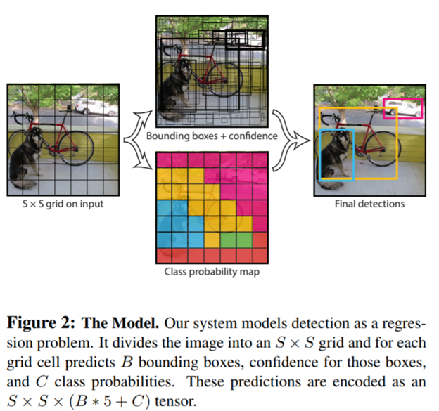
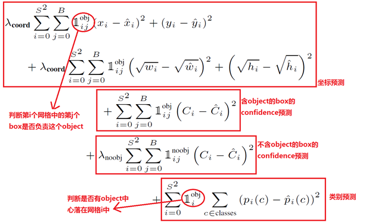
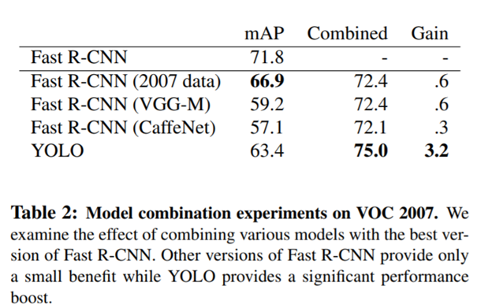
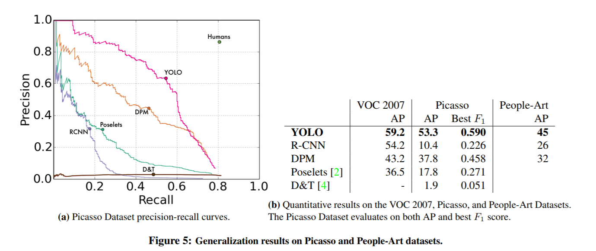

You Only Look Once Unified Real-Time Object Detection
=====================================================

[TOC]

       本文提出了一个新的物体检测的方法：You Only Look
Once（YOLO）。之前的物体检测方法通常都转变为了一个分类问题，如 R-CNN、Fast R-CNN
等等。YOLO将检测看作一个 regression problem，YOLO 从输入的图像，仅仅经过一个
neural network，直接预测 bounding boxes 以及每个 bounding box
所属类别的概率。正因为整个的检测过程仅仅有一个网络，所以它可以直接 end-to-end
的优化。

       YOLO 结构十分的快，标准的 YOLO 版本每秒可以实时地处理 45
帧图像。一个较小版本：Fast YOLO，可以每秒处理 155 帧图像，它的 mAP（mean Average
Precision） 依然可以达到其他实时检测算法的两倍。同时相比较于其他的 state-of-art
detection systems。尽管 YOLO 的定位更容易出错，这里的 定位出错，即是指
coordinate errors。但是 YOLO 在背景预测上有更少的
false-positive(即是背景而预测为某种对象的错误情况较少)。

        最后，YOLO可以学习到物体的更加泛化的特征，在将 YOLO
用到其他领域的图像时（如 artwork 的图像上），其检测效果要优于 DPM、R-CNN
这类方法。

论文地址：<https://arxiv.org/abs/1506.02640>

参考：[论文阅读笔记：You Only Look Once: Unified, Real-Time Object
Detection](http://blog.csdn.net/tangwei2014/article/details/50915317)

 

依赖条件
--------

1：熟悉目标检测技术Faster R-CNN

网络结构
--------

### Unified Detection-统一检测

       YOLO的核心思想就是利用整张图作为网络的输入，直接在输出层回归bounding
box的位置和bounding box所属的类别。

 a) 将一幅图像分成SxS个网格(grid cell)，如果某个object的中心
落在这个网格中，则这个网格就负责预测这个object。 

 b) 每个网格要预测B个bounding box，每个bounding
box除了要回归自身的位置之外，还要附带预测一个Confidence值。

c) Confidence代表了所预测的box中含有object的置信度和这个box预测的有多准两重信息；计算公式Confidence=$P_r(Object) * IOU^{truth}_{pred}​$

; 所以在gird
cell中没有对象,那么Confidence为0；如果有对象就是与GT的IOU值。(注：Confidence代表bounding
box与任意的GT box的IOU)。

d) 每个bounding box要预测(x, y, w, h)和confidence共5个值。

e) 每个网格还要预测一个class类别信息$P_r(Class_i|Object)$

；这是一个条件概率，在包含对象情况下，属于某类对象的概率。(注：class信息是针对每个网格的，confidence信息是针对每个bounding
box的）

        对于SxS个网格，每个网格要预测B个bounding
box还要预测C个categories。输出就是S x S x (5\*B+C)的一个tensor。

### 网络设计

 

        YOLO 仍是 CNN 的经典形式，开始是 convolutional layers 提取特征，再是
fully connected layers 进行 predict 结果：probabilities 以及 coordinates。

 

        YOLO 的 CNN 结构受GoogLeNet图像分类的启发. YOLO 有24
个卷积层，随后就是全连接层。不像 GoogLeNet 中使用的 inception modules，YOLO
类似Network in Network，在3×3 卷积层之后，跟着一个 1×1 的卷积层。这个 YOLO 先在
ImageNet classification
任务上进行预训练（以一半的图像尺寸： 224×224  ），然后再将图像尺寸变为  448×448  ，用于
detection 任务。

        还有一个 Fast YOLO 版本。Fast YOLO
的网络结构中，只有 9 个卷积层，filters 也更少。

### training-训练

**预训练**

        YOLO 在 ImageNet 1000-class 的分类任务数据集 上进行
pretraining。预训练的网络是 Figure 3 中网络的前 20 层卷积层，加上一个
average-pooling layer，最后是一个 fully connected layer。

        这个预训练的网络，本文训练了大约一个星期，在 ImageNet 2012 的 validation
dataset 上的 top-5 精度为88%，本文的 training 以及 inference 都是用 Darknet
卷积网络框架完成的。

**精调 **

      之后就把预训练的 model 用于 detection，《Object Detection Networks on
Convolutional Feature Maps》论文指出了在预训练的 model 上增加 convolution layer
以及 connected layer 可以增加 model 的 performance。因此，在预训练的 model
上，本文增加了 4 个 convolutional layers 以及 2 个 connected
layers，这新加的层的参数是随机初始化的。因为要用于 detection，本文在 detection
的 fine-grained 阶段，将图像的输入分辨率从 224×224 调整至 448×448。

       最后输出的为 class probabilities 以及 bounding box
coordinates。但在输出时，根据图像的 width、height 将 bounding box 的
width、height 进行归一化，将值归一化到 0\~1 的区间。同样将 bounding box
中的坐标 (x ,y)   通过 grid cells 的 offset 归一化到 0\~1 之间。

**损失函数**

 

    a) YOLO使用 sum-squared error 来作为优化目标，因为sum-squared error
较容易优化，但是对于本问题，直接使用 sum-squared error
却不是那么合适。主要有两个问题

-   localization error和classification error的权重一样，不是理想结果。

-   每一张图像中，很多 grid cells 并没不包含物体，使得这些 cells 的 confidence
    置为 0，这些不包含物体的 grid cells
    的梯度更新，将会以压倒性的优势，覆盖掉包含物体的 grid cells
    进行的梯度更新。这些问题会使得模型不稳定，甚至造成网络的发散。

     为了避免上述的问题，将 localization error 以及 classification error 的 loss
重新用权重衡量。以平衡上述的失衡问题。简单的说，就是增加 bounding box coordinate
的 loss，减少不包含物体 grid cells 的 confidence 的 loss；增加两个参数λcoord = 5
和λnoobj = 0.5。

      b) Sum-squared error loss 中还将 large box 与 small box 的 loss
同等对待。因为 box 与 groundtruth 的小的偏离，
对于较大的box，结果的影响较小；对小的box影响较大。为了解决这个问题，用了一个很巧妙的
trick，即最后并不是直接输出 bounding box 的 width、height，而是 width、height
的square root，平方根。

 

       c) 每个 grid cell 预测多个 bounding
box，但在网络模型的训练中，每一个物体，只想要一个 bounding box predictor
来负责预测。因此， 当前哪一个 predictor 预测的 prediction 与 groundtruth 的 IoU
最大 ，这个 predictor 就负责 predict object。因此只有在当 bounding box predictor
对 groundtruth box 负责的时候，才会对 bounding box coordinate error 进行惩罚。

        d) loss function 在只有当一个 grid cell 中存在 object 时，才会对
classification error 进行惩罚。

 

**参数及其它设置**

**   **a) 学习率：在最初的epochs中，learning rate 逐渐从 10−3 增加到
10−2。如果训练时从一个较大的 learning rate
开始，通常因为不稳定的梯度，而使得模型发散。之后，保持 learning rate 为
10−2 75 轮epoch; 再接下的 30 轮 epoch，learning rate 为 10−3；最后 30 轮
epoch，learning rate 为 10−4。

   b) 为了避免 overfitting，使用了 dropout 技术，在第一层全连接层后面增加了一个
dropout layer，随机置零的 rate=0.5。

   c)
数据增广：最多图片尺寸20%的缩放和翻转；最多1.5的factor因子随机调整图片的曝光度和饱和度。

### inference-预测

$Pr(Class_i|Object) * Pr(Object) *IOU^{truth}_{pred} = P_r(Class_i) * IOU^{truth}_{pred}$

     在预测的时候将类别条件概率和bounding box
的置信度confidence评分相乘；即一个类别相关的置信度。这样就同时enconding了
bounding box 中预测的 class 的 probability，以及 bounding box 与 object
契合的有多好。

     每一张图像得到 98 个 bounding boxes，以及每个 bounding box 的所属类别概率。

     当图像中的物体较大，或者处于 grid cells 边界的物体，可能在多个 cells
中被定位出来。可以用Non-Maximal Suppression（NMS，非极大值抑制）
进行去除重复检测的物体，可以使最终的 mAP 提高2−3%，相比较于 NMS 对于 DPM、R-CNN
的提高，不算大。

### YOLO的缺陷

 

      a)  因为每个 grid cell 中只能预测两个
boxes，以及有一个类别。这种太强的空间约束，限制了 YOLO
对于相邻物体的检测能力，一旦相邻的物体数量过多，YOLO
就检测不好了。如对于一群鸟儿，这种相邻数量很多，而且又太小的物体，YOLO
难以进行很好的检测。

 

      b)  对于图像中，同一类物体出现新的、不常见的长宽比时，YOLO
的泛化能力较弱。

 

      c) 最后，loss functions 中对于 small bounding boxes，以及 large bounding
boxes 的误差，均等对待。尽管正如前面提到的，大尺寸 bounding box 的 error
与小尺寸 bounding box 的
error，其影响是不同的。即使用了平方根的技巧优化了这个问题，但是这个问题还得得到更好的解决。YOLO
中最主要的误差仍是定位不准造成的误差。

实验结果
--------

### 与其它实时系统比较

       Faster YOLO更快，同时mAP好两倍

### VOC 2007错误分析

**分类说明：**

-   Correct: 分类正确 ， IOU \> 0.5

-   Localization: 分类正确, 0.1 \< IOU \< 0.5

-   Similar: 分类接近, IOU \> 0.1

-   Other: 分类错误, IOU \> 0.1

-   Background: 对任何对象IOU \< 0.1 

**结果分析：**

**       ** a) YOLO在定位准确做的不好

        b) Fast R-CNN对背景的预测不好；相比YOLO背景的错误率有接近3倍。

 

### 组合Fast R-CNN 和 YOLO

       由于YOLO在背景的错误率较低，因子组合Fast R-CNN和YOLO，在Fast
R-CNN上使用YOLO预测背景。对Fast R-CNN预测的bounding
boxes，看YOLO是否有预测类似的bounding boxes;如果有组合两种预测来boost结果。

### 更加泛化的特征

        YOLO在艺术画的测试中表现要更佳

 

疑问点
------

 

 

 

## 关于我们

我司正招聘文本挖掘、计算机视觉等相关人员，欢迎加入我们；也欢迎与我们在线沟通任何关于数据挖掘理论和应用的问题；

在长沙的朋友也可以线下交流, 坐标: 长沙市高新区麓谷新长海中心 B1栋8A楼09室

公司网址：http://www.embracesource.com/

Email: mick.yi@embracesource.com 或 csuyzt@163.com

